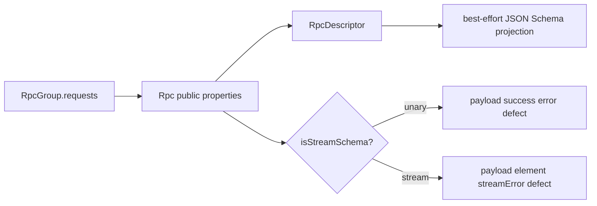
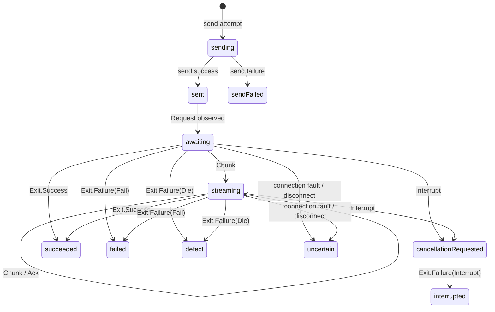
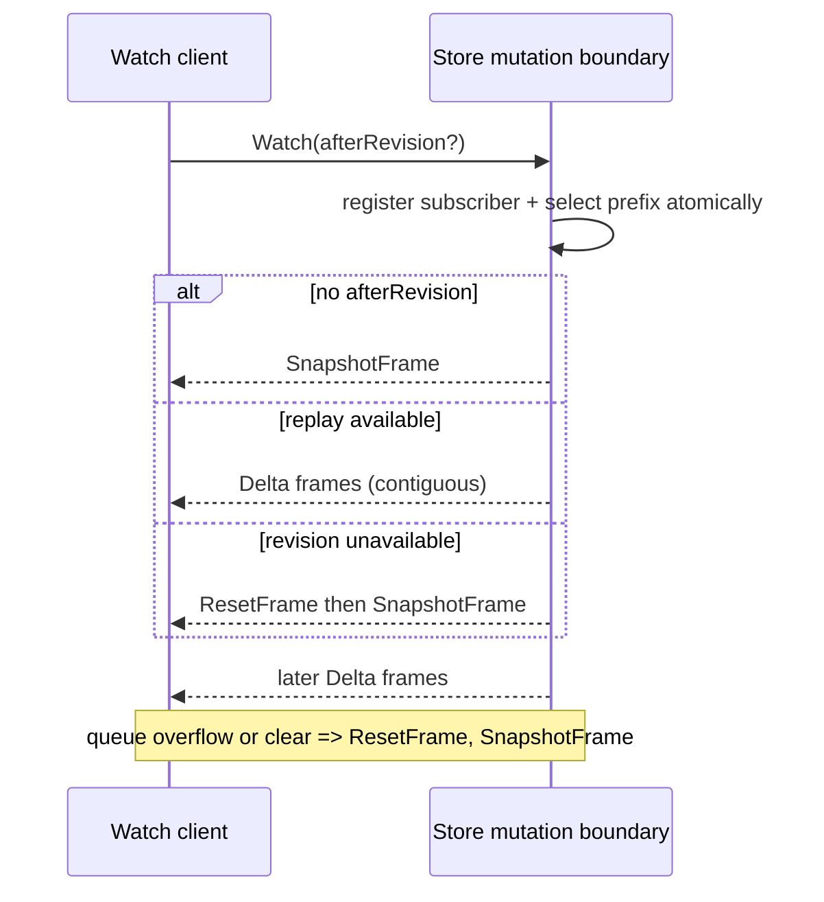

# Effect RPC Explorer Core Spec

This document specifies `@overeng/effect-rpc-explorer`. It builds on
[requirements.md](./requirements.md) and the parent
[specification](../spec.md).

Status: **Draft**

## Scope

This specification defines public core APIs, public Effect 4 seam usage,
descriptor construction, normalized lifecycle records, capture policy,
retention, NDJSON inspector transport, and telemetry. It does not define React
components or an application transport binding.

## Requirement Trace

| Section                      | Requirements      |
| ---------------------------- | ----------------- |
| Public API and descriptors   | RPCX.CORE-R01–R07 |
| Public-seam observation      | RPCX.CORE-R08–R11 |
| Correlation/state machine    | RPCX.CORE-R12–R16 |
| Capture policy/normalization | RPCX.CORE-R17–R23 |
| Store and inspector stream   | RPCX.CORE-R24–R29 |
| Telemetry                    | RPCX.CORE-R30–R32 |
| Verification                 | RPCX.CORE-R33–R35 |

## Public API

```text
@overeng/effect-rpc-explorer
├── descriptor      RpcGroup -> RpcDescriptor[]
├── policy          policies, annotations, normalizer
├── middleware      decoded server observation
├── protocol        public Client/Server Protocol decorators
├── model/store     Event/Record/Frame Schemas and bounded store
├── inspector       excluded RpcGroup: snapshot, watch, and clear history
└── telemetry       explorer meter/tracer integration
```

The host constructs one scoped explorer from its application RPC group:

```ts
type ExplorerConfig = {
  readonly instanceId: string
  readonly bounds: ExplorerBounds
  readonly capture?: CapturePolicies
  readonly clock?: ExplorerClock
  readonly connectionId?: (identity: ExplorerConnectionIdentity) => string
  readonly telemetry: Omit<ExplorerTelemetryOptions, 'readRetainedCounts'>
}

const makeExplorer: <Rpcs extends Rpc.AnyWithProps>(options: {
  readonly group: RpcGroup.RpcGroup<Rpcs>
  readonly config: ExplorerConfig
}) => Effect.Effect<ExplorerServices, ExplorerTelemetryRegistrationError, Scope.Scope>
```

Each client or server decorator takes named options containing its concrete
Protocol. The host may supply `encodedDecodersByTag`, a map from exact RPC tag
to per-channel `EncodedValueDecoder` functions. It binds this map to that
Protocol's active `codecFor`; the same RPC group can use different codecs on
different transports. Decoders are optional, and their absence cannot weaken
the fail-closed capture policy. Server options additionally select whether
decoded middleware or Protocol owns request observation.

`ExplorerServices` contains application descriptors, the bounded store, server
middleware, client/server Protocol decorators, the excluded inspector group and
handler Layer, and telemetry. The constructor returns a scoped Effect instead
of a Layer because it produces a plain service value rather than a Context
service identifier. Host telemetry registration failures fail construction;
observation-time telemetry faults cannot affect application RPCs. Inspector
descriptors participate in exclusion lookup but never appear in UI descriptors.
The sole mutating inspector operation clears completed explorer history,
obsolete replay state, and events unreferenced by active records. It preserves
active records. No API accepts an arbitrary event write or raw payload storage
callback.

## Descriptors



Descriptor construction iterates `group.requests.values()`. For each public
`Rpc.AnyWithProps`, it records `key`, `_tag`, `payloadSchema`, `successSchema`,
`errorSchema`, `defectSchema`, and Context annotations. It calls public
`RpcSchema.isStreamSchema(rpc.successSchema)`. On true, it reads the narrowed
public `.success` and `.error` schemas; on false, success is `successSchema`
and typed failure is `errorSchema`. `Rpc.exitSchema(rpc)` is used only for a
terminal schema projection. No implementation imports `RpcSchema.getStreamSchemas`
or traverses Schema ASTs.

```ts
type RpcDescriptor = {
  readonly descriptorId: string // stable `rpc:<rpc.key>`, package-owned grammar
  readonly key: string
  readonly tag: string
  readonly title?: string
  readonly summary?: string
  readonly description?: string
  readonly deprecated?: boolean
  readonly kind: 'unary' | 'stream'
  readonly observe: 'include' | 'exclude'
  readonly channels: Readonly<Record<CaptureChannel, DescriptorChannel>>
}
type DescriptorChannel = {
  readonly schema?: JsonSchemaDocument
  readonly projection: 'available' | 'unavailable' | 'bestEffort'
}
```

A descriptor ID is a package-local reference, not a routing key. Its canonical
form is `rpc:` plus the exact non-empty public `rpc.key`; keys containing
control characters are rejected at construction. It appears in UI models but
never telemetry attributes. If a transport envelope lacks an RPC tag or maps
through a host multiplexing layer, `mapLogicalRpc` receives only physical
identity and returns one known descriptor ID. The store records an
`UnknownDescriptor` observation when mapping fails.

Schema annotations are resolved by public `Schema.resolveAnnotations`; JSON
Schema uses `Schema.toJsonSchemaDocument`. The projection is marked
`bestEffort` whenever generated. A projection exception leaves the descriptor
usable with `projection: "unavailable"` and a bounded warning; no event
capture depends on JSON Schema.
RPC documentation comes only from the RPC's own Context annotations:
`OpenApi.Title`, `OpenApi.Summary`, `OpenApi.Description`, and
`OpenApi.Deprecated`. Unset fields are absent from the inspector wire
descriptor; explicit `deprecated: false` remains distinct from absence.
Neither the tag nor root/channel Schema annotations supply RPC documentation.

## Observation at Public Effect Seams

```text
server RpcMiddleware: decoded payload + headers + terminal handler Cause
client Protocol:       outgoing Request/Ack/Interrupt, incoming response run
server Protocol:       incoming Request/Ack/Interrupt, outgoing response send
                         \______________ correlation model ______________/
```

The server middleware surrounds the actual handler effect. It emits a decoded
request/headers event before running and one terminal event by observing the
handler `Exit`. For a stream, this terminal covers the stream's handler
lifetime, not each chunk. Client middleware may emit decoded dispatch context
but does not define terminal response behavior and cannot observe Ack or
Interrupt.

Protocol decorators are object wrappers. `run` wraps the callback to observe a
message immediately before forwarding it. `send` emits an attempted-send event,
runs the delegated effect unchanged, then emits sent or send-failed based on
its Exit before reproducing that Exit. All other fields are copied as identical
references or forwarded methods. The wrapper never changes codec selection,
transferables, protocol capability, cancellation, error, scheduling, or
backpressure semantics.

`Protocol.disconnects` is an exclusive work queue consumed by `RpcServer.make`.
The decorator forwards the exact original queue and does not take from it.
An unsolicited server-side disconnect therefore cannot be observed through
the current public seam. Explicit client-side EOF and connection faults still
produce connection events; server-side EOF does not (see the classification
below). Passive disconnect observation requires an upstream non-destructive
hook; polling `clientIds` or relaying the queue is not equivalent.

The decorator classifies envelopes from the public encoded vocabulary:

| Envelope/fact                    | Model action                                                              |
| -------------------------------- | ------------------------------------------------------------------------- |
| `Request`                        | allocate/correlate `RequestKey`; capture payload and headers              |
| `Chunk(values)`                  | add one envelope and `values.length` stream values                        |
| `Ack`                            | transition or annotate acknowledgement                                    |
| `Interrupt`                      | transition to cancellation-requested unless terminal                      |
| `Exit.Success`                   | terminal success; stream data remains prior chunks                        |
| `Exit.Failure`                   | terminal typed failure, defect, or interruption from each flat cause item |
| send success/failure             | set attempt fact; failure does not imply handler state                    |
| client EOF / disconnect          | standalone connection event plus active request uncertainty               |
| server EOF                       | transport fact: no event, in-flight requests untouched                    |
| `Defect` / client protocol error | standalone uncorrelated connection fault plus active request uncertainty  |

An observer receives a host-derived opaque `connectionId`. On the client it is
one client-protocol instance plus client ID; on the server it is one
server-protocol instance plus client ID. IDs never cross an explorer lifetime.
The original `RequestId` is stored as the tagged union below, so number `1` and
string `"1"` cannot collide.

```ts
type RequestIdentity = {
  readonly observerSide: 'client' | 'server'
  readonly connectionId: string
  readonly direction: 'clientToServer' | 'serverToClient'
  readonly requestId:
    | { readonly _tag: 'String'; readonly value: string }
    | { readonly _tag: 'Number'; readonly value: number }
}
```

## Event and Record State Machine



`notificationSent` is terminal immediately after a notification's successful
Request send. A notification may retain subsequent local observation facts,
but absence of an Exit is not an anomaly. `sendFailed`, `succeeded`, `failed`,
`defect`, `interrupted`, `uncertain`, and `notificationSent` are terminal.
Late terminal events after a terminal state are retained only as content-free
`LateEvent` anomalies and do not replace the initial terminal outcome.

```ts
type ExplorerEvent = {
  readonly eventId: number
  readonly revision: number
  readonly at: { readonly monotonicNanos: string; readonly wallClockMillis: number }
  readonly _tag: EventTag
  readonly request?: RequestIdentity
  readonly connectionId?: string
  readonly descriptorId?: string
  readonly trace?: TraceContext
  readonly channelOutcomes?: ReadonlyArray<ChannelObservation>
  readonly details: EventDetails // closed, content-free facts
}

type RpcRecord = {
  readonly key: RequestIdentity
  readonly descriptor: DescriptorRef
  readonly state: RecordState
  readonly notification: boolean
  readonly startedAt: Timestamp
  readonly lastAt: Timestamp
  readonly trace?: TraceContext
  readonly send: 'unobserved' | 'attempted' | 'sent' | 'failed'
  readonly chunkEnvelopes: number
  readonly streamValues: number
  readonly retainedStreamValues: number
  readonly events: ReadonlyArray<number>
  readonly evidence: ReadonlyArray<RecordEvidence>
}
```

`EventDetails` contains only fixed enums, bounded counts, error classifications,
and request-independent timestamps. Application error values appear only in a
`ChannelObservation.captured` field whose outcome is `Captured`; omitted and
policy-fault outcomes have no content/value field.

A flat `Exit.Failure.cause` can yield several classified channel observations
but causes one terminal state selected with precedence `Die > Fail > Interrupt`.
Only a bounded prefix of observations and classifications is retained; the
terminal selection scans all cause tags without retaining their values. This
does not recreate an unsupported Cause tree.

## Capture Policy and Normalization

```text
raw callback value
  -> resolve (host > RPC > root schema > omit)
  -> omit OR reveal normalize OR redact transform then normalize
  -> detached ChannelObservation
  -> event/store/delta/snapshot
```

```ts
type CaptureChannel =
  | 'requestPayload'
  | 'success'
  | 'typedFailure'
  | 'defect'
  | 'streamElement'
  | 'streamError'
  | 'headers'
type CapturePolicy<T = unknown> =
  | { readonly _tag: 'omit' }
  | { readonly _tag: 'reveal' }
  | { readonly _tag: 'redact'; readonly transform: (value: T) => unknown }
type CapturePolicies = Readonly<Partial<Record<CaptureChannel, CapturePolicy>>>
```

Package helpers attach a namespaced `Context.Reference<CapturePolicies>` to an
`Rpc` and a custom `rpcExplorerCapture` Schema annotation to a root channel
Schema. Internally, the resolver uses `Context.getOrUndefined` so the absence
of a Rpc annotation stays distinguishable from an explicit policy. Helpers that
combine policy maps merge individual channel fields before attaching a Context
value; raw Context merge is not assumed to deep-merge maps.

For every channel, host config has first priority, then an RPC policy, then a
policy on that channel's root schema, then `{ _tag: "omit" }`. Headers lack a
schema root and go directly RPC-to-default. A policy is never inferred from a
field name, JSON Schema's `readOnly`/`writeOnly`, or a `description` annotation.
`redact` is a root-level projection transform, not a promise of generic nested
annotation walking.

Encoded protocol holes are not decoded middleware values. The observer may
normalize an encoded hole only through a per-protocol, per-channel decoder
bound by the host to the active codec and the channel's concrete Schema and
decoding services. The decoder must be synchronous and inert. An absent or
failed decoder produces a content-free policy fault; it never falls back to
normalizing raw encoded data. In particular, a JSON codec's decoded
`Schema.Redacted` wrapper is replaced by a placeholder before retention.
The decorator does not synchronously run arbitrary Schema decoders: their
service requirements are erased by `Schema.Top`, and asynchronous decoders
could continue running after a synchronous observer returns.

The normalizer accepts the transform result and recursively constructs a new
`NormalizedValue`; it never stores the input. It has configurable maximum depth,
entries, and encoded bytes. It detects Effect `Redacted` before generic object
handling and emits `{ _tag: "Redacted", label? }` without retaining the wrapper.
It does not call `Redacted.value`, `Schema.toCodecJson`, custom `toJSON`,
getters, or arbitrary iterators. Plain arrays, records with enumerable data
properties, primitive values, and `Uint8Array` are supported. Other inputs are
`Unsupported`; circular encounter, limit hit, or normalization defect returns a
content-free policy fault. The encoder uses only the normalized algebra.

The policy executor is the sole caller allowed to receive raw content. It must
complete before calling the store mutation function. Store inputs are typed as
`ChannelObservation`, whose `captured` field is absent unless policy selected
`Captured`, not `unknown`, making raw insertion unrepresentable at the main API
boundary.

## Retention and Store

```text
serialized mutation
  -> apply event + record projection
  -> apply per-value / stream limits
  -> expire active/completed/deltas
  -> revision += 1; append delta
  -> enqueue subscribers
```

```ts
type ExplorerBounds = {
  readonly completed: { readonly maxCount: number; readonly maxAge: Duration }
  readonly active: { readonly maxCount: number; readonly maxAge: Duration }
  readonly streamValuesPerRecord: number
  readonly normalized: {
    readonly maxDepth: number
    readonly maxEntries: number
    readonly maxBytes: number
  }
  readonly deltas: { readonly maxCount: number; readonly maxAge: Duration }
  readonly subscriberQueue: number
}
```

The store is one scoped service containing state plus a serialized mutation
queue. A mutation applies its event and aggregate update, enforces every bound,
calculates content-free eviction/truncation evidence, increments revision
exactly once, appends exactly one `DeltaFrame`, and enqueues it to subscribers
before the next mutation. A duplicate or rejected event produces no revision.

A record's age is its idle time: the current event time minus the record's
`lastAt`, which every admitted event advances. Active and completed `maxAge`
both use this age, so a long-lived stream that keeps emitting stays active while
a silent or abandoned record still expires
([0006](../.decisions/0006-active-retention-ages-by-idle-time.md)). Active
overflow or age expiry changes the active record to `uncertain` with
`retentionExpired` evidence, then moves it through ordinary completed eviction.
Completed eviction removes the record and associated retained events. Per-record
event references are bounded by `deltas.maxCount`; excess references are dropped
before insertion. Stream value limits retain aggregate counts and coalesce
content-free `valuesTruncated` evidence while dropping excess content before
insertion. Delta eviction only limits replay; it does not change a snapshot's
current state. All counters and reasons are content-free.

## Inspector Protocol



The inspector group declares `GetSnapshot`, streaming `Watch`, and
`ClearHistory`. `ClearHistory` clears only completed explorer history, obsolete
replay state, and events unreferenced by active records under the same mutation
boundary. It preserves active records, returns its new revision, and changes
neither application state nor in-flight RPC behavior. Its schemas encode these
NDJSON frames:

```ts
type SnapshotFrame = {
  readonly _tag: 'Snapshot'
  readonly protocolVersion: 'rpc-explorer.v1'
  readonly instanceId: string
  readonly revision: number
  readonly descriptors: ReadonlyArray<RpcDescriptorWire>
  readonly active: ReadonlyArray<RpcRecord>
  readonly completed: ReadonlyArray<RpcRecord>
  readonly counters: RetentionCounters
}
type DeltaFrame = {
  readonly _tag: 'Delta'
  readonly protocolVersion: 'rpc-explorer.v1'
  readonly fromRevision: number
  readonly toRevision: number
  readonly operations: ReadonlyArray<Insert | Update | Remove>
}
type ResetFrame = {
  readonly _tag: 'Reset'
  readonly protocolVersion: 'rpc-explorer.v1'
  readonly reason: 'behind' | 'overflow' | 'cleared' | 'instanceChanged'
  readonly revision: number
}
```

Every frame is one canonical JSON object followed by LF (`\n`). Producers never
emit blank frames or concatenate multiple JSON values on a line. A consumer
rejects an unknown protocol major before applying operations. IDs in operations
are tagged/structured values, never string-concatenated request identifiers.

Within the mutation boundary, Watch registers its bounded queue and chooses
its prefix. A Watch without `afterRevision` enqueues a Snapshot as its first
frame. An `afterRevision` that remains in the replay window receives all later
deltas in revision order. An unavailable requested revision receives `Reset`
then a snapshot at the selected revision. Only afterward can future publication
append to that queue. If queue capacity would be exceeded, buffered deltas are
replaced by `Reset(overflow)` and a fresh snapshot; ClearHistory similarly sends
`Reset(cleared)` then a snapshot to current subscribers. No old/new delta mix is
sent. The snapshot and replay share a model revision, so UI clients can assert
`frame.fromRevision === localRevision` before applying a delta.

## Telemetry

Core receives a tracer/meter derived from host configuration but does not build
a Resource. It copies request trace fields into record data only when supplied
by the encoded Request or current execution context. It does not make an RPC
span, span event, or log per observation. Pipeline fault handling is guarded to
avoid recursive instrumentation: it may emit a new root
`rpc.explorer.pipeline.fault` span for an internal invariant break, with fixed
`span.label = "rpc explorer fault"`, closed-enum
`rpc.explorer.fault.kind`, `rpc.explorer.observer.side`, and
`rpc.explorer.event.kind`, and a link to the observed trace when valid. Its own
fault cannot cause another explorer event.

Metric names, instruments, and allowed enum attributes are exactly those in the
[parent specification](../spec.md#opentelemetry). Four synchronous instruments
use the host's Effect metric context. Effect 4's public Metric API has neither
an observable gauge callback nor a histogram unit option, so the host supplies
two scoped meter capabilities: register the retained-count observable gauge and
register the normalization histogram with unit `s`. The explorer supplies
fixed instrument names, bounded labels, histogram boundaries, and a cleanup
function for gauge registration. Registration failure is typed and fails
explorer construction; measurement failures cannot affect the application.
Every update rejects unlisted attribute keys and values before recording.
Normalization duration uses monotonic elapsed time and records only a closed
success/failure outcome after policy-safe content is produced, never a message
or raw value. Delta replay eviction emits a content-free count through the
store's callback.

## Verification

Core tests use deterministic clock, queue, and public in-memory Protocols. They
assert public descriptor discovery, no-internal-API imports, all lifecycle
transitions, numeric/string identity separation, chunk batch counts, terminal
precedence, notification behavior, send failure, fault fan-out, seven-channel
precedence, raw-secret absence through every retained surface, Redacted
replacement, limits, exact revision stream continuity, reset behavior,
recursive inspector exclusion, tracer restraint, and metric attribute allowlist.

The shared in-memory public-seam conformance suite runs unary success, typed
failure, stream batch/Ack, cancellation, send failure, and uncorrelated fault
against the generic model. Each adopter runs one focused real-transport smoke
for its selected integration. Effect release upgrades rerun the disposable
probes described in [../.experiments/0001-effect4-public-seams-rc115.md](../.experiments/0001-effect4-public-seams-rc115.md)
and
[../.experiments/0002-capture-policy-rc115.md](../.experiments/0002-capture-policy-rc115.md).
