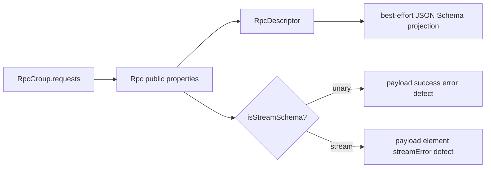
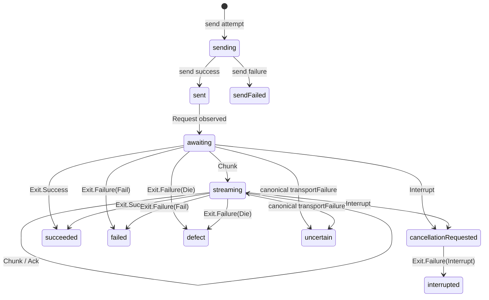
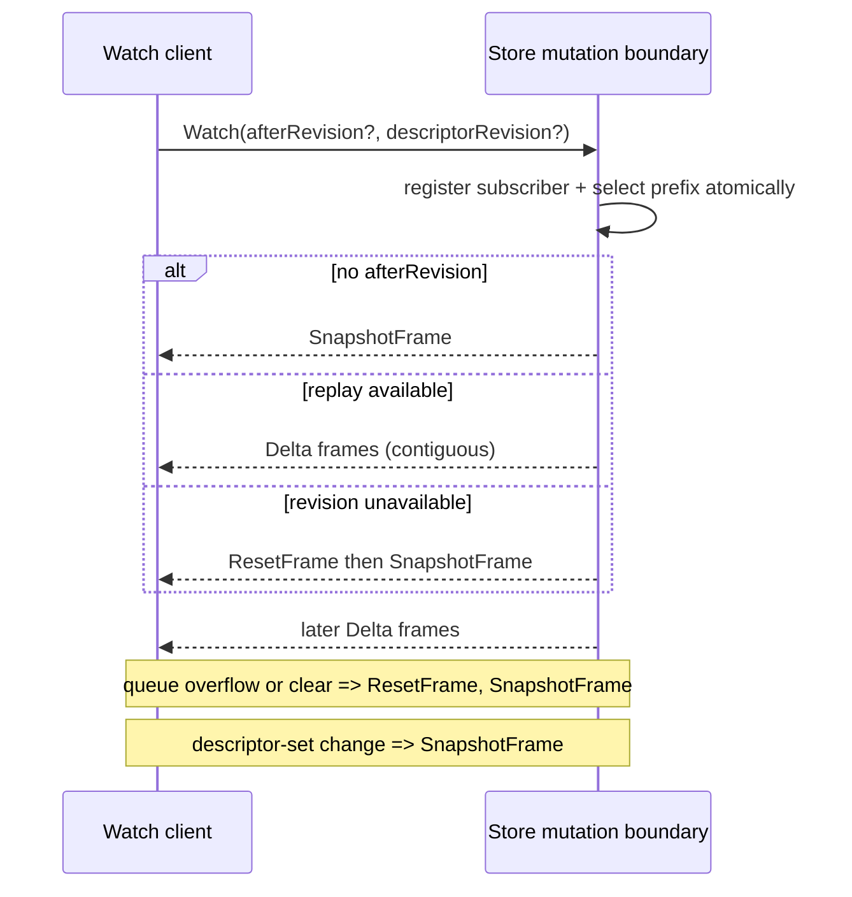

# Effect RPC Explorer Core Spec

This document specifies `@overeng/effect-rpc-explorer`. It builds on
[requirements.md](./requirements.md) and the parent
[specification](../spec.md).

Status: **Draft**

## Scope

This specification defines public core APIs, public Effect 4 seam usage,
descriptor construction, normalized lifecycle records, capture policy,
retention, NDJSON inspector transport, and telemetry. It does not define React
components or an application transport binding.

## Requirement Trace

| Section                      | Requirements      |
| ---------------------------- | ----------------- |
| Public API and descriptors   | RPCX.CORE-R01–R07 |
| Public-seam observation      | RPCX.CORE-R08–R11 |
| Correlation/state machine    | RPCX.CORE-R12–R16 |
| Capture policy/normalization | RPCX.CORE-R17–R23 |
| Store and inspector stream   | RPCX.CORE-R24–R29 |
| Telemetry                    | RPCX.CORE-R30–R32 |
| Verification                 | RPCX.CORE-R33–R35 |

## Public API

```text
@overeng/effect-rpc-explorer
├── descriptor      RpcGroup -> RpcDescriptor[]
├── policy          policies, annotations, normalizer
├── protocol        makeCaptureSink policy adapter for shared observer callbacks
├── model/store     Event/Record/Frame Schemas and bounded store
├── inspector       excluded RpcGroup: snapshot, watch, and clear history
└── telemetry       explorer meter/tracer integration
```

The host constructs one scoped explorer from its application RPC group:

```ts
type ExplorerConfig = {
  readonly instanceId: string
  readonly bounds: ExplorerBounds
  readonly capture?:
    CapturePolicies | ((descriptor: ExplorerCaptureDescriptor) => CapturePolicies | undefined)
  readonly telemetry: Omit<ExplorerTelemetryOptions, 'readRetainedCounts'>
}

const makeExplorer: <Rpcs extends Rpc.AnyWithProps>(options: {
  readonly group: RpcGroup.RpcGroup<Rpcs>
  readonly config: ExplorerConfig
}) => Effect.Effect<ExplorerServices, ExplorerTelemetryRegistrationError, Scope.Scope>
```

`ExplorerServices.makeCaptureSink({ side, encodedDecodersByTag? })` builds a
capture-enabled sink for `@overeng/effect-rpc-observer`. The optional map binds
each exact RPC tag's channel decoders to the concrete transport's `codecFor`.
Different transports may use different maps. Absent decoders cannot weaken the
fail-closed capture policy. The shared observer owns scoped construction,
connection naming, clocks, decoration, and decoded server middleware.

Standalone client composition remains a scoped Effect; hosts close its scope
with the transport, rather than rebuilding observation in place:

```ts
import { Effect } from 'effect'
import { RpcClient } from 'effect/rpc'
import { makeExplorer } from '@overeng/effect-rpc-explorer'
import { decorateClientProtocol, makeProtocolObserver } from '@overeng/effect-rpc-observer'

const makeObservedClient = ({ group, explorerConfig, protocol, connectionId }) =>
  Effect.gen(function* () {
    const explorer = yield* makeExplorer({ group, config: explorerConfig })
    const observer = yield* makeProtocolObserver({
      side: 'client',
      capacity: explorerConfig.bounds.active.maxCount,
      connectionId,
      sinks: [
        {
          capture: true,
          sink: explorer.makeCaptureSink({ side: 'client' }),
        },
      ],
    })
    const client = yield* RpcClient.make(group).pipe(
      Effect.provideService(RpcClient.Protocol, decorateClientProtocol({ protocol, observer })),
    )
    return { client, explorer }
  })
```

Without codec-bound decoders this example remains metadata-only under the
default omission policy. Revealed encoded channels require the host decoder
map; decoded middleware channels do not.

`ExplorerServices` contains the application descriptor set, runtime descriptor
registration, bounded store, capture-sink factory, excluded inspector group and
handler Layer, and telemetry. The constructor returns a scoped Effect instead
of a Layer because it produces a plain service value rather than a Context
service identifier. Host telemetry registration failures fail construction;
observation-time telemetry faults cannot affect application RPCs. Inspector
descriptors participate in exclusion lookup but never appear in UI descriptors.
The sole mutating inspector operation clears completed explorer history,
obsolete replay state, and events unreferenced by active records. It preserves
active records. No API accepts an arbitrary event write or raw payload storage
callback.

## Descriptors


```mermaid
flowchart LR
  G[RpcGroup.requests] --> R[Rpc public properties]
  R --> D[RpcDescriptor]
  R --> S{isStreamSchema?}
  S -->|unary| U[payload success error defect]
  S -->|stream| T[payload element streamError defect]
  D --> J[best-effort JSON Schema projection]
```

Descriptor construction iterates `group.requests.values()`. For each public
`Rpc.AnyWithProps`, it records `key`, `_tag`, `payloadSchema`, `successSchema`,
`errorSchema`, `defectSchema`, and Context annotations. It calls public
`RpcSchema.isStreamSchema(rpc.successSchema)`. On true, it reads the narrowed
public `.success` and `.error` schemas; on false, success is `successSchema`
and typed failure is `errorSchema`. `Rpc.exitSchema(rpc)` is used only for a
terminal schema projection. No implementation imports `RpcSchema.getStreamSchemas`
or traverses Schema ASTs.

```ts
type RpcDescriptor = {
  readonly descriptorId: string // stable `rpc:<rpc.key>`, package-owned grammar
  readonly key: string
  readonly tag: string
  readonly title?: string
  readonly summary?: string
  readonly description?: string
  readonly deprecated?: boolean
  readonly kind: 'unary' | 'stream'
  readonly observe: 'include' | 'exclude'
  readonly channels: Readonly<Record<CaptureChannel, DescriptorChannel>>
}
type DescriptorChannel = {
  readonly schema?: JsonSchemaDocument
  readonly projection: 'available' | 'unavailable' | 'bestEffort'
}
```

A descriptor ID is a package-local reference, not a routing key. Its canonical
form is `rpc:` plus the exact non-empty public `rpc.key`; keys containing
control characters are rejected at construction. It appears in UI models but
never telemetry attributes. If a transport envelope lacks an RPC tag or maps
through a host multiplexing layer, `mapLogicalRpc` receives only physical
identity and returns one known descriptor ID. The store records an
`UnknownDescriptor` observation when mapping fails.

Schema annotations are resolved by public `Schema.resolveAnnotations`; JSON
Schema uses `Schema.toJsonSchemaDocument`. The projection is marked
`bestEffort` whenever generated. A projection exception leaves the descriptor
usable with `projection: "unavailable"` and a bounded warning; no event
capture depends on JSON Schema.
RPC documentation comes only from the RPC's own Context annotations:
`OpenApi.Title`, `OpenApi.Summary`, `OpenApi.Description`, and
`OpenApi.Deprecated`. Unset fields are absent from the inspector wire
descriptor; explicit `deprecated: false` remains distinct from absence.
Neither the tag nor root/channel Schema annotations supply RPC documentation.

### Runtime descriptor registration

A host that mounts RPC groups after construction (for example, per-app
providers) registers each group's descriptors with the existing explorer rather
than constructing a second explorer:

```ts
type RegisterDescriptorsOptions = {
  readonly group: RpcGroup.Any
  readonly owner: string // stable mount identity, such as `<app>/<version>/<provider>`
}
readonly registerDescriptors: (
  options: RegisterDescriptorsOptions,
) => Effect.Effect<void, never, Scope.Scope>
readonly descriptors: DescriptorSet // { current(): { revision, descriptors }, subscribe }
```

Registration builds descriptors with the same group enumeration as construction
and holds them for the caller's Scope. Registering an owner again replaces that
owner's descriptors, and closing the replaced registration's Scope changes
nothing, so a remount never duplicates a descriptor. Construction-group tags
keep their construction descriptors. A runtime tag stays resolvable while any
live registration holds it; the most recent holder supplies its descriptor.
When the last holder releases a tag, later observations of it record
`UnknownDescriptor`, and retained records that referenced it keep their
descriptor ID without wire metadata. The descriptor-set revision starts at 0
and increases only when the effective set changes. The host `capture` selector
resolves once per descriptor, at construction or at its registration.

## Observation at Public Effect Seams

```text
public Protocol + server middleware
             |
    effect-rpc-observer coordinator
             |
    transient CaptureSink callbacks
             |
    explorer policy -> normalized events -> store
```

The [shared observer](../../devtools/03-rpc-observer/spec.md) owns lifecycle
correlation, deduplication, send sequencing, disconnect observation, and
terminal classification. Explorer does not wrap a Protocol or install its own
middleware/coordinator. A host registers its explorer sink with `capture: true`
on the same scoped observer used by the decorators and server middleware.

Lifecycle callbacks alone produce `RequestObserved`, `ChunkObserved`, and
`TerminalObserved`. Raw `payload` maps to explorer `requestPayload`; encoded
attachments use host codec-bound decoders, decoded attachments do not. A
stream descriptor maps typed failures to `streamError` and omits a stream's
terminal success value. The adapter normalizes only remaining retained stream
elements and at most `normalized.maxEntries` terminal attachments.

`onMessage` supplies send/control evidence, not a second lifecycle. Its
coordinator-resolved connection ID and timestamp preserve custom host identity
without another identity callback. A Request envelope arrives before the
canonical request; the sink retains only extracted trace fields and an
attempted-send flag until that callback, never an envelope or payload. Capture
metadata is bounded by `captureCapacity`; `makeExplorer` uses its active bound.

| Observer fact                | Explorer model action                                      |
| ---------------------------- | ---------------------------------------------------------- |
| Request                      | descriptor inclusion, policy, normalized request event     |
| Chunk                        | full envelope/value counts, bounded normalized values      |
| Success/failure/interruption | matching terminal event                                    |
| Transport failure            | terminal uncertainty, not an application error             |
| Request send attempt/result  | send evidence; failed send remains `sendFailed`            |
| Notification send success    | `notificationSent`, no redundant terminal or late event    |
| Ack / Interrupt envelope     | acknowledgement / cancellation-requested evidence          |
| Fault                        | content-free side/connection-scoped connection event       |
| Capacity / sendFailure fault | evidence only; canonical terminal identifies affected call |

Connection faults include optional `observerSide` for side-specific settlement.
Canonical fault terminals arrive first; capacity and send-failure evidence
never settles other active calls sharing a connection. Inspector exclusion
suppresses lifecycle, control/send, and inspector-only connection faults before
normalization. Unknown tags use `UnknownDescriptorId`, never retain wire tags.

The shared observer receives a host-derived opaque `connectionId`, distinct for
each transport lifetime, and passes it unchanged to the capture sink.
The original `RequestId` is stored as the tagged union below, so number `1` and
string `"1"` cannot collide.

```ts
type RequestIdentity = {
  readonly observerSide: 'client' | 'server'
  readonly connectionId: string
  readonly direction: 'clientToServer' | 'serverToClient'
  readonly requestId:
    | { readonly _tag: 'String'; readonly value: string }
    | { readonly _tag: 'Number'; readonly value: number }
}
```

## Event and Record State Machine


```mermaid
stateDiagram-v2
  [*] --> sending: send attempt
  sending --> sent: send success
  sending --> sendFailed: send failure
  sent --> awaiting: Request observed
  awaiting --> streaming: Chunk
  streaming --> streaming: Chunk / Ack
  awaiting --> cancellationRequested: Interrupt
  streaming --> cancellationRequested: Interrupt
  awaiting --> succeeded: Exit.Success
  streaming --> succeeded: Exit.Success
  awaiting --> failed: Exit.Failure(Fail)
  streaming --> failed: Exit.Failure(Fail)
  awaiting --> defect: Exit.Failure(Die)
  streaming --> defect: Exit.Failure(Die)
  cancellationRequested --> interrupted: Exit.Failure(Interrupt)
  awaiting --> uncertain: canonical transportFailure
  streaming --> uncertain: canonical transportFailure
```

`notificationSent` is terminal immediately after a notification's successful
Request send. A notification may retain subsequent local observation facts,
but absence of an Exit is not an anomaly. `sendFailed`, `succeeded`, `failed`,
`defect`, `interrupted`, `uncertain`, and `notificationSent` are terminal.
Late terminal events after a terminal state are retained only as content-free
`LateEvent` anomalies and do not replace the initial terminal outcome.

```ts
type ExplorerEvent = {
  readonly eventId: number
  readonly revision: number
  readonly at: { readonly monotonicNanos: string; readonly wallClockMillis: number }
  readonly _tag: EventTag
  readonly request?: RequestIdentity
  readonly connectionId?: string
  readonly descriptorId?: string
  readonly trace?: TraceContext
  readonly channelOutcomes?: ReadonlyArray<ChannelObservation>
  readonly details: EventDetails // closed, content-free facts
}

type RpcRecord = {
  readonly key: RequestIdentity
  readonly descriptor: DescriptorRef
  readonly state: RecordState
  readonly notification: boolean
  readonly startedAt: Timestamp
  readonly lastAt: Timestamp
  readonly trace?: TraceContext
  readonly send: 'unobserved' | 'attempted' | 'sent' | 'failed'
  readonly chunkEnvelopes: number
  readonly streamValues: number
  readonly retainedStreamValues: number
  readonly events: ReadonlyArray<number>
  readonly evidence: ReadonlyArray<RecordEvidence>
}
```

`EventDetails` contains only fixed enums, bounded counts, error classifications,
and request-independent timestamps. Application error values appear only in a
`ChannelObservation.captured` field whose outcome is `Captured`; omitted and
policy-fault outcomes have no content/value field.

A flat `Exit.Failure.cause` can yield several classified channel observations
but causes one terminal state selected with precedence `Die > Fail > Interrupt`.
Only a bounded prefix of observations and classifications is retained; the
terminal selection scans all cause tags without retaining their values. This
does not recreate an unsupported Cause tree.

## Capture Policy and Normalization

```text
raw callback value
  -> resolve (host > RPC > root schema > omit)
  -> omit OR reveal normalize OR redact transform then normalize
  -> detached ChannelObservation
  -> event/store/delta/snapshot
```

```ts
type CaptureChannel =
  | 'requestPayload'
  | 'success'
  | 'typedFailure'
  | 'defect'
  | 'streamElement'
  | 'streamError'
  | 'headers'
type CapturePolicy<T = unknown> =
  | { readonly _tag: 'omit' }
  | { readonly _tag: 'reveal' }
  | { readonly _tag: 'redact'; readonly transform: (value: T) => unknown }
type CapturePolicies = Readonly<Partial<Record<CaptureChannel, CapturePolicy>>>
```

`RpcExplorerCapture` is a namespaced `Context.Reference<CapturePolicies |
undefined>` attached with `Rpc.annotate(RpcExplorerCapture, policies)`; a
custom `rpcExplorerCapture` Schema annotation attaches policies to a root
channel Schema. The descriptor builder reads the RPC annotation with
`Context.getOrUndefined`, keeping absence distinct from an explicit policy
map. Combining policies merges individual channel fields before attaching a
Context value; raw Context merge does not deep-merge maps.

The host's `capture` may be one static map or a function receiving only
`ExplorerCaptureDescriptor` identity (`descriptorId`, `key`, `tag`, `kind`).
The function returns a sparse map or `undefined` and runs exactly once for
each RPC descriptor when constructing the explorer, never per request and
never with captured values. Encoded and decoded capture callbacks use the same
resolved per-descriptor host map.

For every channel, host config has first priority, then an RPC policy, then a
policy on that channel's root schema, then `{ _tag: "omit" }`. Headers lack a
schema root and go directly RPC-to-default. A policy is never inferred from a
field name, JSON Schema's `readOnly`/`writeOnly`, or a `description` annotation.
`redact` is a root-level projection transform, not a promise of generic nested
annotation walking.

Encoded protocol holes are not decoded middleware values. The capture sink may
normalize an encoded hole only through a per-protocol, per-channel decoder
bound by the host to the active codec and the channel's concrete Schema and
decoding services. The decoder must be synchronous and inert. An absent or
failed decoder produces a content-free policy fault; it never falls back to
normalizing raw encoded data. In particular, a JSON codec's decoded
`Schema.Redacted` wrapper is replaced by a placeholder before retention.
The capture sink does not synchronously run arbitrary Schema decoders: their
service requirements are erased by `Schema.Top`, and asynchronous decoders
could continue running after a synchronous capture callback returns.

The normalizer accepts the transform result and recursively constructs a new
`NormalizedValue`; it never stores the input. It has configurable maximum depth,
entries, and encoded bytes. It detects Effect `Redacted` before generic object
handling and emits `{ _tag: "Redacted", label? }` without retaining the wrapper.
It does not call `Redacted.value`, `Schema.toCodecJson`, custom `toJSON`,
getters, or arbitrary iterators. Plain arrays, records with enumerable data
properties, primitive values, and `Uint8Array` are supported. Other inputs are
`Unsupported`; circular encounter, limit hit, or normalization defect returns a
content-free policy fault. The encoder uses only the normalized algebra.

The policy executor is the sole caller allowed to receive raw content. It must
complete before calling the store mutation function. Store inputs are typed as
`ChannelObservation`, whose `captured` field is absent unless policy selected
`Captured`, not `unknown`, making raw insertion unrepresentable at the main API
boundary.

## Retention and Store

```text
serialized mutation
  -> apply event + record projection
  -> apply per-value / stream limits
  -> expire active/completed/deltas
  -> revision += 1; append delta
  -> enqueue subscribers
```

```ts
type ExplorerBounds = {
  readonly completed: { readonly maxCount: number; readonly maxAge: Duration }
  readonly active: { readonly maxCount: number; readonly maxAge: Duration }
  readonly streamValuesPerRecord: number
  readonly normalized: {
    readonly maxDepth: number
    readonly maxEntries: number
    readonly maxBytes: number
  }
  readonly deltas: { readonly maxCount: number; readonly maxAge: Duration }
  readonly subscriberQueue: number
}
```

The store is one scoped service containing state plus a serialized mutation
queue. A mutation applies its event and aggregate update, enforces every bound,
calculates content-free eviction/truncation evidence, increments revision
exactly once, appends exactly one `DeltaFrame`, and enqueues it to subscribers
before the next mutation. A duplicate or rejected event produces no revision.

A record's age is its idle time: the current event time minus the record's
`lastAt`, which every admitted event advances. Active and completed `maxAge`
both use this age, so a long-lived stream that keeps emitting stays active while
a silent or abandoned record still expires
([0006](../.decisions/0006-active-retention-ages-by-idle-time.md)). Active
overflow or age expiry changes the active record to `uncertain` with
`retentionExpired` evidence, then moves it through ordinary completed eviction.
Completed eviction removes the record and associated retained events. Per-record
event references are bounded by `deltas.maxCount`; excess references are dropped
before insertion. Stream value limits retain aggregate counts and coalesce
content-free `valuesTruncated` evidence while dropping excess content before
insertion. Delta eviction only limits replay; it does not change a snapshot's
current state. All counters and reasons are content-free.

## Inspector Protocol


```mermaid
sequenceDiagram
  participant U as Watch client
  participant S as Store mutation boundary
  U->>S: Watch(afterRevision?, descriptorRevision?)
  S->>S: register subscriber + select prefix atomically
  alt no afterRevision
    S-->>U: SnapshotFrame
  else replay available
    S-->>U: Delta frames (contiguous)
  else revision unavailable
    S-->>U: ResetFrame then SnapshotFrame
  end
  S-->>U: later Delta frames
  Note over U,S: queue overflow or clear => ResetFrame, SnapshotFrame
  Note over U,S: descriptor-set change => SnapshotFrame
```

The inspector group declares `GetSnapshot`, streaming `Watch`, and
`ClearHistory`. `ClearHistory` clears only completed explorer history, obsolete
replay state, and events unreferenced by active records under the same mutation
boundary. It preserves active records, returns its new revision, and changes
neither application state nor in-flight RPC behavior. Its schemas encode these
NDJSON frames:

```ts
type SnapshotFrame = {
  readonly _tag: 'Snapshot'
  readonly protocolVersion: 'rpc-explorer.v1'
  readonly instanceId: string
  readonly revision: number
  readonly descriptorRevision: number
  readonly descriptors: ReadonlyArray<RpcDescriptorWire>
  readonly active: ReadonlyArray<RpcRecord>
  readonly completed: ReadonlyArray<RpcRecord>
  readonly counters: RetentionCounters
}
type DeltaFrame = {
  readonly _tag: 'Delta'
  readonly protocolVersion: 'rpc-explorer.v1'
  readonly fromRevision: number
  readonly toRevision: number
  readonly operations: ReadonlyArray<Insert | Update | Remove>
}
type ResetFrame = {
  readonly _tag: 'Reset'
  readonly protocolVersion: 'rpc-explorer.v1'
  readonly reason: 'behind' | 'overflow' | 'cleared' | 'instanceChanged'
  readonly revision: number
}
```

Every frame is one canonical JSON object followed by LF (`\n`). Producers never
emit blank frames or concatenate multiple JSON values on a line. A consumer
rejects an unknown protocol major before applying operations. IDs in operations
are tagged/structured values, never string-concatenated request identifiers.

Within the mutation boundary, Watch registers its bounded queue and chooses
its prefix. A Watch without `afterRevision` enqueues a Snapshot as its first
frame. An `afterRevision` that remains in the replay window receives all later
deltas in revision order. An unavailable requested revision receives `Reset`
then a snapshot at the selected revision. Only afterward can future publication
append to that queue. If queue capacity would be exceeded, buffered deltas are
replaced by `Reset(overflow)` and a fresh snapshot; ClearHistory similarly sends
`Reset(cleared)` then a snapshot to current subscribers. No old/new delta mix is
sent. The snapshot and replay share a model revision, so UI clients can assert
`frame.fromRevision === localRevision` before applying a delta.

Snapshots carry the descriptor set current when they are sent, with its
`descriptorRevision`. When the descriptor set changes, each Watch drains its
queued store frames and then sends one fresh Snapshot at the current store
revision, so no Delta is skipped or repeated. A Watch whose
`descriptorRevision` is older than the current set sends that Snapshot after
its replay prefix; this covers a registration between a client's GetSnapshot
and its Watch.

## Telemetry

Core receives a tracer/meter derived from host configuration but does not build
a Resource. It copies request trace fields into record data only when supplied
by the encoded Request or current execution context. It does not make an RPC
span, span event, or log per observation. Pipeline fault handling is guarded to
avoid recursive instrumentation: it may emit a new root
`rpc.explorer.pipeline.fault` span for an internal invariant break, with fixed
`span.label = "rpc explorer fault"`, closed-enum
`rpc.explorer.fault.kind`, `rpc.explorer.observer.side`, and
`rpc.explorer.event.kind`, and a link to the observed trace when valid. Its own
fault cannot cause another explorer event.

Metric names, instruments, and allowed enum attributes are exactly those in the
[parent specification](../spec.md#opentelemetry). Four synchronous instruments
use the host's Effect metric context. Effect 4's public Metric API has neither
an observable gauge callback nor a histogram unit option, so the host supplies
two scoped meter capabilities: register the retained-count observable gauge and
register the normalization histogram with unit `s`. The explorer supplies
fixed instrument names, bounded labels, histogram boundaries, and a cleanup
function for gauge registration. Registration failure is typed and fails
explorer construction; measurement failures cannot affect the application.
Every update rejects unlisted attribute keys and values before recording.
Normalization duration uses monotonic elapsed time and records only a closed
success/failure outcome after policy-safe content is produced, never a message
or raw value. Delta replay eviction emits a content-free count through the
store's callback.

## Verification

Core tests use deterministic clock, queue, and public in-memory Protocols. They
assert public descriptor discovery, no-internal-API imports, all lifecycle
transitions, numeric/string identity separation, chunk batch counts, terminal
precedence, notification behavior, send failure, fault fan-out, seven-channel
precedence, raw-secret absence through every retained surface, Redacted
replacement, limits, exact revision stream continuity, reset behavior,
recursive inspector exclusion, tracer restraint, and metric attribute allowlist.

The shared in-memory public-seam conformance suite runs unary success, typed
failure, stream batch/Ack, cancellation, send failure, and uncorrelated fault
against the generic model. Each adopter runs one focused real-transport smoke
for its selected integration. Effect release upgrades rerun the disposable
probes described in [../.experiments/0001-effect4-public-seams-rc115.md](../.experiments/0001-effect4-public-seams-rc115.md)
and
[../.experiments/0002-capture-policy-rc115.md](../.experiments/0002-capture-policy-rc115.md).
