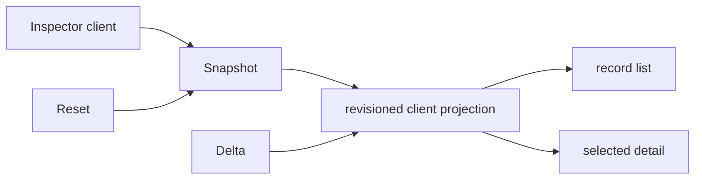

# Effect RPC Explorer React UI Spec

This document specifies `@overeng/effect-rpc-explorer-react`. It builds on
[requirements.md](./requirements.md) and consumes the core inspector contract
from [../01-core/spec.md](../01-core/spec.md).

Status: **Draft**

## Scope

This specification defines the React client projection, dense explorer layout,
interaction and accessibility behavior, StyleX ownership, and Storybook
contract. It does not define core capture, Effect Protocol integration, or host
routing.

## Requirement Trace

| Section                                  | Requirements    |
| ---------------------------------------- | --------------- |
| Client projection                        | RPCX.UI-R01–R03 |
| Layout and information model             | RPCX.UI-R04–R08 |
| Accessibility and responsive interaction | RPCX.UI-R09–R12 |
| Storybook and tests                      | RPCX.UI-R13–R16 |

## Client Projection



The package accepts an `ExplorerClient` with `getSnapshot()`, `watch()`, and
`clearHistory()`; this is the only live-data dependency. It parses every frame
through the core public Schema. Local state is a
`useSyncExternalStore`-compatible immutable projection keyed by the structured
record key, not by a stringified request ID.

On `Snapshot`, the client atomically replaces descriptors, records, counters,
and local revision. On `Delta`, it first requires
`frame.fromRevision === state.revision`, applies every operation to a copied
projection, and sets `toRevision` only after all operations succeed. A mismatch,
unknown operation target, or malformed frame suspends delta application and
requests a fresh snapshot. A `Reset` marks the model stale and waits for the
core's immediately following Snapshot. List/detail never read different
revisions.

Network/transport adapters live outside the React package. A host may adapt the
core inspector's Effect client, a WebSocket, an IPC stream, or tests, as long as
it supplies exactly the `ExplorerClient` contract.

## Layout and Information Model

```text
┌ Explorer header: active/completed counts · filters · connection state ┐
├──────────────────────────────┬───────────────────────────────────────┤
│ Record collection             │ Selected record                       │
│ side  RPC  state  age stream  │ summary + status text                  │
│ ...                           │ lifecycle timeline                     │
│                               │ content / policy / schema / trace tabs │
└──────────────────────────────┴───────────────────────────────────────┘
```

The header announces inspector connection state, current revision, active and
completed counts, and content-free retention/reset indicators. Its filters use
closed enum controls for state, side, direction, descriptor, and a text search
that matches only descriptor key/tag and status labels already in the model. It
does not search content or emit search input to telemetry.

`Clear diagnostic history` is an explicit toolbar action using `clearHistory()`.
Its confirmation states that it removes completed explorer history while keeping
active observed calls correlatable; it does not cancel, retry, or otherwise
affect application RPCs. On success the UI waits for `Reset(cleared)` and its
following Snapshot before re-enabling delta application.

The primary list is a React Aria collection with one stable key per structured
record identity. Each row contains:

| Field          | Rendering rule                                              |
| -------------- | ----------------------------------------------------------- |
| RPC            | descriptor key/tag or `Unknown descriptor`                  |
| side/direction | text label plus compact symbol with accessible name         |
| lifecycle      | text status badge plus icon; no color-only state            |
| timing         | relative start and duration/ongoing duration                |
| stream         | `envelopes / values`, with retained-value truncation marker |
| trace          | `trace linked` or `no trace`                                |
| fault          | explicit uncertain/anomaly marker when present              |

Active rows precede completed rows in distinct labelled sections. New active
items may be visually highlighted without stealing focus or announcing every
row. The list virtualizes row rendering when item count warrants it while
preserving the collection's logical keyboard order and selected item semantics.

Detail has Summary, Timeline, Content, Descriptor, and Trace tabs. Summary
contains state, typed identity display, notification/send facts, duration,
stream counts, and bounded retention evidence. Timeline shows ordered typed
events with relative monotonic order and wall-clock display time. Descriptor
shows kind and each channel's JSON Schema projection plus clear `best effort` or
`unavailable` warning. Trace shows actual IDs only when present and renders
`No trace context observed` otherwise.

Content displays each channel observation separately. It derives labels from
outcome metadata and renders `captured` only when the outcome is `Captured`:

| Channel outcome/value      | UI text                                    |
| -------------------------- | ------------------------------------------ |
| `Omitted`                  | `Not captured — <policy source> policy`    |
| `Captured/reveal`          | `Captured` then normalized tree            |
| `Captured/redact`          | `Redacted projection` then normalized tree |
| `PolicyFault`              | `Not captured — capture policy fault`      |
| `NormalizedValue.Redacted` | `Redacted value` (no value expansion)      |
| `Unsupported`              | `Unsupported value type: <type>`           |
| `Truncated`                | `Value truncated: <reason>`                |

The tree renders only normalized model nodes. `ChannelContentPanel` reuses
`@overeng/react-inspector` when its public API accepts this normalized value
algebra without live-object inspection; otherwise it owns a minimal renderer
over that algebra. Host-specific actions remain outside this package. Copy
controls are present only for safe structured identifiers, trace IDs, descriptor
keys, and already-rendered normalized text; omitted/redacted placeholders
cannot be expanded or copied as source data. `uncertain` records show a
connection-fault reference and explain that the protocol provided no
request-level attribution.

## Accessibility and Responsive Behavior

The implementation uses React Aria collection/selection, `TabList`/`TabPanel`,
button, disclosure, tooltip, and dialog primitives. Every state badge has a
visible text label. Icons are decorative when adjacent text exists; otherwise
they have an accessible name. Tooltip content is supplemental, never the only
source of status or control meaning.

Live updates use a polite status region for aggregate changes and reset/expiry
notices. It does not announce every chunk or row. If the selected record remains
in the new projection, selection and focus stay on its stable key. If a filter
hides it, focus remains on the filter with `Selected record is filtered out`;
if retention evicts it, focus moves to the record collection and announces
`Selected record expired from bounded history`.

At wide width the list and detail are a resizable split layout with a semantic
minimum width for each pane. At narrow width selection navigates to a detail
view with a labelled Back button returning focus to the originating list row.
Filters remain available on both views. Keyboard behavior is:

| Input               | Outcome                                                     |
| ------------------- | ----------------------------------------------------------- |
| Arrow keys/Home/End | collection navigation                                       |
| Enter/Space         | select current record/open detail on narrow layout          |
| Escape              | close a disclosure/dialog; in narrow detail, return to list |
| Tab/Shift+Tab       | normal, visible focus order through controls and tabs       |
| text filter         | filters label/key only and retains focus in the filter      |

StyleX defines package-local semantic tokens for canvas, panel, border, text,
muted text, success, failure, warning, fault, focus ring, density, and motion.
States use tokenized borders/icons/text in addition to hue. `prefers-reduced-motion`
disables attention animation. High-contrast mode preserves visible borders,
focus, and status text; host themes may supply token values but cannot remove
semantic labels.

## Components

```text
RpcExplorer
├── ExplorerToolbar
├── ExplorerStatusRegion
├── ExplorerFilters
├── RpcRecordCollection
│   └── RpcRecordRow
└── RpcRecordDetail
    ├── RecordSummary
    ├── LifecycleTimeline
    ├── ChannelContentPanel
    ├── DescriptorPanel
    └── TracePanel
```

`RpcExplorer` receives `client`, optional initial filters, and presentation
options. It owns client projection/selection state through the established React
state convention; it exposes only the diagnostic `clearHistory` action. Child
components receive typed view models derived from one projection revision.
`ChannelContentPanel` accepts `ChannelObservation`, not `unknown`, so it cannot
accidentally receive an uncaptured raw value.

## Storybook and Verification

Stories use fixed core-wire fixtures with stable timestamps and IDs:

| Story family   | Required states                                                                                                                                         |
| -------------- | ------------------------------------------------------------------------------------------------------------------------------------------------------- |
| lifecycle      | empty/loading, active unary, completed unary, stream batch, typed failure, defect, interruption, send failure, notification, uncertain connection fault |
| content safety | all omit/reveal/redact/policy-fault and Redacted/unsupported/truncated nodes                                                                            |
| retention      | stream-value truncation, completed eviction notice, clear-history reset, stale/reset reconnect                                                          |
| layout         | narrow drill-in/back, wide split, dense long list                                                                                                       |
| accessibility  | keyboard selection, filter, tabs/disclosure, focus preservation/eviction, status labels                                                                 |

The live-protocol story uses a real in-memory core store and inspector client. It
first supplies a snapshot, then emits deltas, clears diagnostic history while an
active record remains to exercise Reset/Snapshot recovery, and asserts that the
inspector's own Request/Chunk/Ack/Exit frames never appear in the visible record
collection. This story is the integration evidence for the UI/core boundary;
deterministic stories remain the visual regression surface.

Interaction tests assert consumer-visible outcomes: contiguous revision
application, visible lifecycle text, no-color-independent status names,
keyboard navigation, retained selection, expiry focus recovery, tabs, and the
safe content legend. They do not assert component internals, StyleX class names,
or hook wiring.
