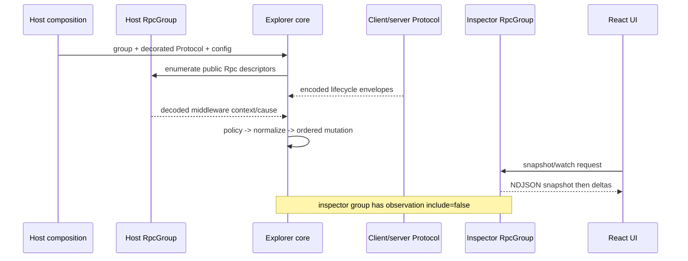

# Effect RPC Explorer Spec

This document specifies the integrated Effect RPC explorer. It builds on
[requirements.md](./requirements.md).

Status: **Draft**

## Scope

This spec defines the package boundary, shared model, identifier ownership,
integration flow, telemetry contract, and verification architecture. Detailed
capture/protocol behavior is specified by [01-core](./01-core/spec.md); detailed
presentation behavior is specified by [02-react-ui](./02-react-ui/spec.md).

It does not define an application transport, durable trace store, collector,
RPC replay tool, or RPC runtime.

## Requirement Trace

| Section                   | Requirements                 |
| ------------------------- | ---------------------------- |
| Architecture and packages | RPCX-R01, R02, R03, R04, R20 |
| Integration boundary      | RPCX-R05, R06, R10, R16      |
| Shared model              | RPCX-R07, R08, R09, R11, R17 |
| Capture safety            | RPCX-R12, R13, R14, R15      |
| Inspector stream          | RPCX-R18, R19                |
| OpenTelemetry             | RPCX-R21, R22, R23           |
| React surface             | RPCX-R24, R25, R26, R27      |
| Verification              | RPCX-R28, R29, R30           |

## Architecture and Packages

```text
host RpcGroup + Protocol services + host policy
                    |
                    v
 @overeng/effect-rpc-explorer
 + descriptors       + middleware/protocol decorators
 + bounded model     + typed inspector RpcGroup (excluded)
 + snapshot/watch    + pipeline telemetry
                    |
          typed inspector protocol
                    |
                    v
 @overeng/effect-rpc-explorer-react
 + client projection + accessible dense UI + Storybook
```

`@overeng/effect-rpc-explorer` is the only package allowed to know Effect RPC
wire messages. It has no React dependency. It exposes composable Layers and
pure descriptors/model types, but it does not start a server, select a
transport, persist events, or assign `service.name`.

`@overeng/effect-rpc-explorer-react` depends on the core protocol/model types.
It does not decorate Protocol services, decode Effect schemas, or own capture
policy.

A host chooses whether to install the explorer, supplies bounds and policy,
mounts the inspector group on an existing or dedicated transport, and supplies
the same OpenTelemetry resource identity used by the application. With no
explorer layer installed, application RPC behavior is unchanged.

## Integration Boundary



The host composes both observation seams:

1. Server `RpcMiddleware` supplies decoded payload/headers, the `Rpc` value, and
   the correlated terminal handler cause. Client middleware may enrich decoded
   dispatch metadata but is not treated as a response-lifecycle hook.
2. Public `RpcClient.Protocol` and `RpcServer.Protocol` decorators observe
   actual encoded send/run traffic, including chunks, acknowledgements,
   interrupts, exits, send failures, disconnects, and connection faults. Every
   field and capability of the wrapped Protocol is forwarded unchanged.

Neither seam is complete by itself. The model joins their complementary facts
at the ordered mutation boundary. Connection-level faults without request IDs
remain connection records and mark all active observations on that connection
`uncertain`; they are never guessed onto one request.

The explorer's inspector API is itself an Effect `RpcGroup`. Its RPCs carry the
package-owned observation annotation `exclude`. The Protocol decorator also
rejects its group key before event construction. The annotation is deliberately
independent from capture policy: exclusion controls whether an RPC produces
records; capture policy controls which content an included RPC may retain.

## Identifier and Namespace Contract

The package owns repository-public identifiers under
`@overeng/effect-rpc-explorer/*` and wire discriminators under the
`rpc-explorer.v1` protocol version. They are not externally registered.

| Identifier                    | Grammar and ownership                         | Compatibility                                               |
| ----------------------------- | --------------------------------------------- | ----------------------------------------------------------- |
| Context/Schema annotation key | exact package-owned camelCase key             | never repurposed; additions use a new key                   |
| `protocolVersion`             | exact `rpc-explorer.v1`                       | unknown major is rejected                                   |
| event `_tag`                  | ASCII PascalCase, one lifecycle meaning       | unknown tags are preserved as unsupported frames by clients |
| `connectionId`                | non-empty host-local opaque string            | meaningful only for one process lifetime                    |
| `revision`                    | non-negative monotonically increasing integer | scoped to one explorer instance                             |

Representative valid discriminators are `RequestObserved`, `ChunkObserved`,
and `ConnectionFault`. `request_observed`, an empty tag, or a tag that changes
meaning based on another field is invalid. A `_tag` identifies shape; an
`outcome` field may refine that shape but never contradict it.

## Shared Model

The wire model is defined as Effect Schemas in the core package. The following
TypeScript is the normative structural shape; readonly collections are encoded
as JSON arrays/objects.

```ts
type Side = 'client' | 'server'
type Direction = 'clientToServer' | 'serverToClient'
type RequestId =
  | { readonly _tag: 'String'; readonly value: string }
  | { readonly _tag: 'Number'; readonly value: number }

type RequestKey = {
  readonly observerSide: Side
  readonly connectionId: string
  readonly direction: Direction
  readonly requestId: RequestId
}

type TraceContext = {
  readonly traceId: string
  readonly spanId?: string
  readonly sampled?: boolean
}

type NormalizedValue =
  | { readonly _tag: 'Null' }
  | { readonly _tag: 'Boolean'; readonly value: boolean }
  | { readonly _tag: 'Number'; readonly value: number | 'NaN' | '+Infinity' | '-Infinity' }
  | { readonly _tag: 'String'; readonly value: string }
  | { readonly _tag: 'BigInt'; readonly value: string }
  | { readonly _tag: 'Bytes'; readonly base64: string; readonly byteLength: number }
  | { readonly _tag: 'Array'; readonly value: ReadonlyArray<NormalizedValue> }
  | { readonly _tag: 'Object'; readonly value: Readonly<Record<string, NormalizedValue>> }
  | { readonly _tag: 'Redacted'; readonly label?: string }
  | { readonly _tag: 'Unsupported'; readonly type: string }
  | {
      readonly _tag: 'Truncated'
      readonly reason: 'depth' | 'entries' | 'bytes'
      readonly retained?: NormalizedValue
    }

type CaptureChannel =
  | 'requestPayload'
  | 'success'
  | 'typedFailure'
  | 'defect'
  | 'streamElement'
  | 'streamError'
  | 'headers'

type PolicyOutcome =
  | { readonly _tag: 'Omitted'; readonly source: 'host' | 'rpc' | 'schema' | 'default' }
  | {
      readonly _tag: 'Captured'
      readonly mode: 'reveal' | 'redact'
      readonly source: 'host' | 'rpc' | 'schema'
    }
  | {
      readonly _tag: 'PolicyFault'
      readonly source: 'host' | 'rpc' | 'schema'
      readonly fault: 'transform' | 'normalize'
    }

type ChannelObservation = {
  readonly channel: CaptureChannel
  readonly outcome: PolicyOutcome
  readonly captured?: NormalizedValue
}
```

`ChannelObservation.captured` is present only when its outcome is `Captured`;
omission and policy fault retain only outcome metadata and have no content/value
field. Runtime objects, errors, Schemas, Causes, Redacted wrappers, functions,
symbols, transferables, and raw byte views never enter the retained model.
Unsupported values become typed placeholders. Object keys are sorted before
encoding; cycles become `Unsupported` rather than references into live objects.

A `RpcDescriptor` has stable `descriptorId`, RPC key/tag, unary-or-stream kind,
observation inclusion, and named channel schema projections. The live schema
references remain in-process only; the inspector wire carries best-effort JSON
Schema documents plus projection warnings. A host logical-RPC mapper returns a
known `descriptorId`; it cannot synthesize a second descriptor schema.

A `RpcRecord` aggregates a `RequestKey`, descriptor reference, notification
flag, first/last monotonic time, wall-clock display time, state, trace context,
send state, chunk-envelope count, stream-value count, retained event IDs, and
retention/policy evidence. The event log remains the transition authority; the
aggregate is a projection from the same ordered mutation.

## Capture Safety

Seven channels are independently resolved:

```text
requestPayload  success  typedFailure  defect
streamElement  streamError  headers
```

For each channel, the resolver chooses the first explicit whole-channel policy:

```text
host override > RPC Context annotation > channel root Schema annotation > omit
```

There is no inheritance between channels and no reveal-by-heuristic. Headers
have no Schema layer. Stream element/error use the public stream schemas;
defect uses the RPC defect schema. Root annotations apply to the entire channel
only. A `redact` transform may create a safe nested projection, but the package
does not promise generic nested field-policy traversal.

Policy is executed before event allocation. Raw input is held only on the
observer callback stack. `reveal` normalizes directly; `redact` transforms then
normalizes; either failure produces content-free `PolicyFault`; `omit` does not
call a codec or construct content. Normalization replaces every discovered
Effect `Redacted` wrapper with a placeholder without reading or storing its
backing value. Schema JSON encoding is not a sanitizer because a permissive
`Schema.Redacted` codec can reveal that value.

## Inspector Stream

The inspector group exposes snapshot/watch reads plus one diagnostic-history
operation:

```ts
interface GetSnapshot {
  readonly _tag: 'RpcExplorer.GetSnapshot'
}

interface Watch {
  readonly _tag: 'RpcExplorer.Watch'
  readonly afterRevision?: number
}

interface ClearHistory {
  readonly _tag: 'RpcExplorer.ClearHistory'
}

type ClearHistoryResult = { readonly clearedRevision: number }
type InspectorResult = SnapshotFrame | ClearHistoryResult
type WatchFrame = SnapshotFrame | DeltaFrame | ResetFrame
```

Frames are Effect-Schema encoded and NDJSON framed: exactly one JSON value plus
newline per frame. `SnapshotFrame` carries `protocolVersion`, instance ID,
revision, descriptors, active/completed records, and retention counters.
`DeltaFrame` carries consecutive `fromRevision`, `toRevision`, and ordered
insert/update/remove operations. `ResetFrame` tells a client that a requested
revision is no longer replayable, a subscriber overflowed, or diagnostic
history was cleared; it is immediately followed by a snapshot. `ClearHistory`
atomically removes completed records, obsolete replay history, and retained
events unreferenced by active records; it preserves active records, returns its
new revision, and never affects application RPCs or in-flight capture.

The core serializes mutation, revision increment, model update, delta append,
and subscriber publication in that order under one single-writer boundary.
Watch registration and initial state selection occur in the same boundary:

1. Register the subscriber without yielding.
2. Read the current revision.
3. With no `afterRevision`, enqueue a Snapshot as the first frame. With a
   replayable `afterRevision`, enqueue every later delta. With an unavailable
   `afterRevision`, enqueue Reset then a Snapshot at that revision.
4. Publish later deltas only after the selected initial prefix is complete.

Thus a mutation is either inside the snapshot/replay prefix or a later delta,
never neither or both. Slow subscribers receive content-free
`ResetFrame(overflow)` followed by a fresh snapshot. Inspector traffic is
excluded before normalization, preventing recursive deltas.

## OpenTelemetry

The explorer uses the host tracer/meter provider and resource. It never sets or
overrides `service.name`. Request trace fields are copied into `RpcRecord` when
available; absence is represented by absence, not fabricated IDs.

The explorer creates no per-call spans. Effect RPC already owns application
call spans, and duplicating them would create ambiguous duration and status.
Only an unexpected explorer pipeline invariant failure may create a new root
`rpc.explorer.pipeline.fault` span with an OpenTelemetry link to a valid
request trace. It never becomes the request's parent. Its fixed `span.label` is
`rpc explorer fault`; its only other attributes are the closed enums
`rpc.explorer.fault.kind`, `rpc.explorer.observer.side`, and
`rpc.explorer.event.kind`.

Metric instruments:

| Instrument                            | Type               | Attributes                                                                        |
| ------------------------------------- | ------------------ | --------------------------------------------------------------------------------- |
| `rpc.explorer.events`                 | counter            | `rpc.explorer.event.kind`, `rpc.explorer.observer.side`, `rpc.explorer.direction` |
| `rpc.explorer.dropped`                | counter            | `rpc.explorer.drop.reason`, optional fixed `rpc.explorer.capture.channel`         |
| `rpc.explorer.active`                 | up-down counter    | `rpc.explorer.observer.side`, `rpc.explorer.direction`                            |
| `rpc.explorer.retained`               | observable gauge   | `rpc.explorer.record.kind` (`active` or `completed`)                              |
| `rpc.explorer.normalization.duration` | histogram, seconds | `rpc.explorer.normalization.outcome`, `rpc.explorer.capture.channel`              |
| `rpc.explorer.subscriber.resets`      | counter            | `rpc.explorer.reset.reason` (`behind`, `overflow`, or `cleared`)                  |

Attribute values come only from closed enums. RPC tags, descriptor IDs,
connection/request IDs, paths, headers, payloads, normalized values, exception
messages, and stack traces are forbidden in metrics and fault-span attributes.

## React Surface

The React package renders the typed snapshot/delta projection. It offers an
active/completed split, query and closed-enum filters, stable selection, virtual
rows for bounded rendering cost, a lifecycle timeline, schema and policy
panels, trace identifiers with explicit absence, and fault/uncertainty detail.
It never exposes omitted content as an empty value or labels uncertainty as an
application failure.

The toolbar may expose `Clear diagnostic history`. It invokes only
`RpcExplorer.ClearHistory`, explains that completed explorer history will
disappear while active explorer records remain correlatable, and adopts the
resulting reset plus snapshot before accepting later deltas.

React Aria supplies collection, selection, tabs, disclosure, tooltip, and focus
semantics. StyleX supplies package tokens and responsive styles. Storybook is
the executable catalog: deterministic fixtures cover every state and policy,
while one in-memory story runs the real core inspector protocol and proves that
watch traffic does not appear as observed application traffic.

## Verification

```text
pure state/policy tests
  + public RpcGroup/schema descriptor tests
  + shared in-memory Protocol lifecycle conformance matrix
  + snapshot/watch race and slow-reader tests
  + OTEL capture assertions
  + Storybook interaction/a11y/visual states
  + one focused real-transport smoke per adopter
```

Security tests place a sentinel at every channel and nested position, inspect
the complete retained graph, and prove it is absent after `omit`, `redact`,
transform failure, normalization failure, truncation, eviction, snapshot,
delta, and telemetry export. Protocol tests preserve numeric versus string IDs,
connection scope, chunk batch/value counts, and uncorrelated fault fan-out.
The shared in-memory conformance suite exercises unary success, typed failure,
stream batch/Ack, client cancellation, send failure, and connection fault.
Each adopter runs one focused representative real-transport smoke without
changing the generic normalized contract.

Effect upgrades rerun the disposable public-seam and capture-policy probes
recorded in [.experiments](./.experiments/); those records are evidence, not
tracked automated tests.
