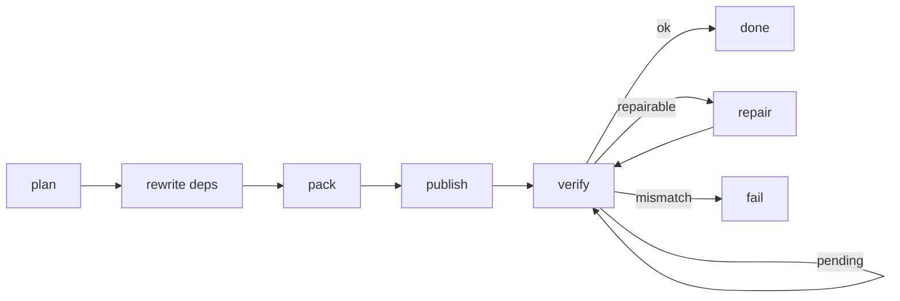

# Spec: npm-release

This document specifies how npm publication converges on a release plan. It builds on [requirements.md](./requirements.md).

## Status

Draft. The decision layer (§Classification) is implemented in `@overeng/npm-release`; the surrounding pipeline is not yet — see [.delta/DELTA-001](./.delta/DELTA-001-decision-layer-only.md).

## Scope

**Defines:** the publication pipeline and its stage order, the classification of registry state against intent, convergence and idempotency semantics, repair operations, and provenance conditions.

**Does not define:** release-plan derivation (versions, changelogs, tags, membership), credential acquisition, or registries other than npm. See [vision.md](./vision.md) §What This Is Not.

## Pipeline

One run takes a plan and converges the registry toward it. Stages are ordered; each is idempotent (R02).



| Stage        | Does                                                            | Requirements |
| ------------ | --------------------------------------------------------------- | ------------ |
| rewrite deps | Replace workspace-internal ranges with exact published versions | R16          |
| pack         | Produce the tarball and record its digest                       | T02          |
| publish      | Publish if absent; validate if present                          | R04, R15     |
| verify       | Compare registry state against intent                           | R05–R08      |
| repair       | Correct divergence npm permits correcting                       | R12, R13     |

A package already present on the registry skips `pack`/`publish` and enters `verify` directly, which is why digest agreement is conditional (T02).

## Classification

`verify` reduces registry state plus intent to one outcome. Checks evaluate in order, returning the first disagreement — an absent version makes later checks meaningless, so it is reported first rather than surfacing a confusing dist-tag complaint about a version that was never published.

| #   | Check                                 | Outcome when it disagrees |
| --- | ------------------------------------- | ------------------------- |
| 1   | version visible                       | `pending`                 |
| 2   | served version equals intended        | `mismatch`                |
| 3   | `dist.integrity` equals packed digest | `mismatch`                |
| 4   | dist-tag exists                       | `pending` (repairable)    |
| 5   | dist-tag resolves to intended version | `pending` (repairable)    |

```
ok        registry matches intent
pending   may still converge — retry within the bound (R11)
mismatch  never converges — fail now (R10)
```

**Why 4 and 5 are `pending`, not `mismatch`:** a dist-tag is a mutable pointer that legitimately lags the immutable version during propagation. Treating lag as terminal would fail releases routinely. Treating it as `pending` lets the bound decide: transient lag resolves, a tag that never moves exhausts the bound and fails — or is repaired first (R12).

**Why 3 is terminal:** the registry serving different bytes under the intended version cannot be corrected, because npm versions are immutable (A05). Retrying converts a clear failure into a silent wait.

## Convergence

There is no atomic group publish (T01), so correctness is defined by convergence rather than by transaction boundaries.

- A run is a function of the plan and current registry state, not of what a previous run did (R01). No run-to-run state is persisted.
- Re-running a completed release reaches `ok` on every package via the already-present path, performing no writes (R02).
- Resuming an interrupted release is the same code path as a first run (R03); "repair" is not a mode.
- `pending` is retried on a bounded schedule; exhausting it fails (R11). Scheduling policy belongs to the caller, which owns the runtime and the release's time budget.

## Repair

Applies only where npm permits correction (T03).

| Divergence                            | Correction                                |
| ------------------------------------- | ----------------------------------------- |
| dist-tag absent or pointing elsewhere | move the dist-tag to the intended version |
| package missing from the group        | publish it                                |
| served artifact differs               | none — terminal (R10)                     |

Repair is followed by re-verification (R13); issuing the correction is not evidence it took effect.

## Provenance

Publishing emits provenance wherever the environment can mint it (R15) — that is, on a CI provider with an OIDC identity, and never for a dry run, where it would be meaningless.

## Design questions

- **DQ1 Credential surface.** How does the caller supply registry write authority for repair (R12) — ambient environment, or an explicit capability passed in? Resolved by the first consumer that repairs from a context where ambient auth is not already present.
- **DQ2 Cross-runtime consumption.** How do consumers on a different Effect major reach the pipeline while the split persists — a subprocess boundary, or waiting for alignment? Resolved by the Effect 4 migration landing, which may dissolve the question entirely.
- **DQ3 Package concurrency.** Are group members published concurrently, and does that risk a partially-visible group for longer? Resolved by measuring publish wall-clock against group size on a real release.
