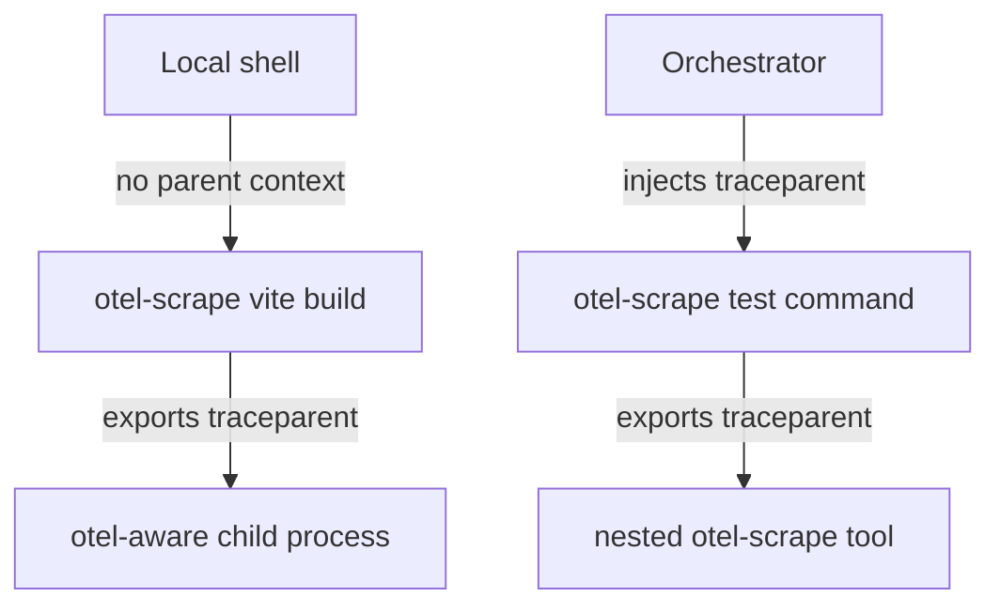

# Spec: otel-scrape

This document specifies the `otel-scrape` process wrapper and adapter contract. It builds on [requirements.md](./requirements.md).

## Status

Draft.

## Scope

**Defines:** the wrapper contract, adapter contract, event/span/metric classification, context propagation model, artifact-linking shape, and relationship to existing effect-utils packages.

**Does not define:** every adapter parser, an orchestrator, backend storage topology, dashboard layout, or profile-rendering UI.

## Package Boundary

`otel-scrape` is implemented as a dedicated Rust package under `packages/@overeng/otel-scrape`, producing a CLI binary named `otel-scrape`.

The package follows the existing `packages/@overeng/otelite` pattern: committed Cargo metadata, package-local Nix build file, flake package/app outputs, and devenv quality-gate integration. Rust owns the process wrapper mechanics; the public telemetry semantics still conform to the effect-utils contracts and VRS.

See [.decisions/0003-rust-package-boundary.md](./.decisions/0003-rust-package-boundary.md).

## Architecture

```
                      parent context? -- no --> mint root span
                            | yes
                            v
                     join parent trace
                            |
                  +---------v----------+
                  |  otel-scrape core  |
                  |  ----------------  |
   <cmd> -------> |  spawn + capture   | ---> child process
                  |  process spans     |        ^
                  |  context export ---+--------+
                  |  artifact links    |
                  +---------+----------+
                            |
                            v
                  +--------------------+
                  |  ToolAdapter       |
                  |  derived structure |
                  +---------+----------+
                            |
                            v
           OTEL spans/events/metrics       CAS profile artifacts
```

The wrapper owns the command span. An adapter enriches the tree; it does not own the command lifecycle.

## Adapter Contract

Illustrative TypeScript shape:

```ts
type AdapterEmit =
  | { readonly _tag: 'Event'; readonly event: OtelEvent }
  | { readonly _tag: 'Span'; readonly span: OtelSpanUpdate }
  | { readonly _tag: 'Metric'; readonly metric: OtelMetricSample }
  | { readonly _tag: 'Profile'; readonly profile: ProfileLink }

interface ToolAdapter {
  readonly name: string
  detect(invocation: Invocation): Effect.Effect<boolean>
  env(context: TraceContext): Effect.Effect<ReadonlyArray<readonly [string, string]>>
  parseLine(line: OutputLine): Effect.Effect<Option.Option<AdapterEmit>>
  parseArtifact(artifact: ArtifactDescriptor): Effect.Effect<ReadonlyArray<AdapterEmit>>
  finalize(outcome: RunOutcome): Effect.Effect<ReadonlyArray<AdapterEmit>>
}
```

`AdapterEmit` is deliberately a tagged union. A bare output line can only become an event unless an adapter explicitly constructs a span update or metric sample from structured data.

## Nested Adapter Ownership

Adapter parsing is owned by the leaf wrapper that directly launches the adapted tool. A parent `otel-scrape` invocation preserves passthrough stdout/stderr from nested wrapped commands, but it must not classify structured output already owned by a nested `otel-scrape` invocation.

This keeps nested wrappers compatible with root-or-join propagation without producing duplicate adapter-derived spans, events, metrics, or profile links. Parent wrappers still own their command span, observable process spans, resource facts, and passthrough behavior.

Implementation must provide an ownership or suppression protocol for nested wrappers. Downstream consumers must not be responsible for deduplicating duplicate adapter records.

Summary evidence exposes the stdout ownership decision as `adapter.ownership.stdout`:

- `this-wrapper` means this wrapper parsed captured stdout for the selected adapter.
- `child-wrapper` means the child command is another `otel-scrape` invocation, so this wrapper preserved stdout/stderr passthrough and descriptors but did not classify the child's structured adapter output.

See [.decisions/0002-leaf-wrapper-owns-adapter-parsing.md](./.decisions/0002-leaf-wrapper-owns-adapter-parsing.md).

## Classification Ladder

| Source shape                        | Classification | Example                                   |
| ----------------------------------- | -------------- | ----------------------------------------- |
| One output line, no lifecycle       | Event          | diagnostic, warning, informational line   |
| Start/end pair with stable identity | Span           | plugin transform, test case, compile unit |
| Duration-bearing structured record  | Span or metric | compile phase duration                    |
| Counter or aggregate statistic      | Metric         | diagnostics count, transformed file count |
| Native profile file                 | Profile link   | `trace.json`, `cpuprofile`, `pprof`       |

## Context Propagation



- `otel-scrape` reads W3C `traceparent` from the environment.
- If a parent exists, the command span joins it.
- If no parent exists, the command span roots the trace.
- The wrapper injects the active context into child processes.
- Context-specific facts stay on the span owned by the participant that knows them.

## Process-Tree Fidelity

`otel-scrape` must provide exact descendant process-tree spans on supported release platforms before a stable release. A prototype may start with the direct child process span only, but direct-child-only capture does not satisfy the release contract.

Best-effort or sampled descendant discovery may exist only when explicitly marked as degraded/experimental output. Release validation must include Linux and macOS ARM evidence; use `mbp2021` for macOS validation as needed.

See [.decisions/0005-exact-process-tree-fidelity.md](./.decisions/0005-exact-process-tree-fidelity.md).

## Semantic Conventions

The names below are draft conventions. Final implementation must register or export them through a generated telemetry registry consumed by both Rust and TypeScript.

The registry source owns span names, metric names, attribute keys, and profile-link wire fields. Generated outputs must be checked for drift by the repo's normal generated-file gates. Rust and TypeScript code must consume generated bindings instead of hand-authoring duplicate literals.

See [.decisions/0004-generated-telemetry-registry.md](./.decisions/0004-generated-telemetry-registry.md).

| Kind      | Name / attribute            | Notes                            |
| --------- | --------------------------- | -------------------------------- |
| Span      | `otel_scrape.command`       | One wrapper invocation           |
| Span      | `otel_scrape.process`       | Observable child process         |
| Attribute | `otel_scrape.adapter.name`  | Selected adapter                 |
| Attribute | `process.command_args_hash` | Stable hash, not raw argv        |
| Attribute | `process.exit_code`         | Exit status                      |
| Attribute | `tool.name`                 | Tool identity when detected      |
| Attribute | `tool.version`              | Tool version when cheap and safe |
| Attribute | `profile.type`              | Native profile kind              |
| Attribute | `profile.digest`            | `sha256:...` digest              |
| Attribute | `profile.uri`               | Artifact retrieval URI           |
| Attribute | `profile.ui`                | Optional viewer URI              |

Raw command arguments, local absolute paths, credentials, source text, and private payloads must not be emitted as span attributes.

## Summary Evidence

Summary JSON is local/debug evidence for tests, prototypes, and degraded-mode inspection. It is not the primary telemetry transport once OTLP export is enabled, but it must use the same privacy and identity rules as emitted telemetry.

The command summary records stable identities, not raw local inputs:

- `command.argv_hash` is a stable hash over the child argv vector.
- `command.cwd_hash` is a stable hash over the current working directory identity.
- Raw argv, cwd, local absolute paths, credentials, source text, and private payloads are not embedded.

When the wrapper captures a stream for adapter parsing, the summary records an output descriptor for that captured byte sequence:

```ts
interface OutputDescriptor {
  readonly _tag: 'ContentDescriptor'
  readonly digest: `sha256:${string}`
  readonly byteLength: number
  readonly mediaType: string
}
```

The descriptor identifies the captured bytes by digest, byte length, and media type; it does not embed the output payload and does not imply the bytes were stored in CAS. Streams inherited directly by the child are represented as unavailable for descriptor purposes because the wrapper did not observe the bytes.

Resource facts are explicit. `resources.wallMs` is always wrapper-measured. Platform facts such as `resources.cpuTimeMs` and `resources.maxRssBytes` are `null` until a backend can prove them for the release platform, with `resources.availability.* = "unavailable"` documenting the absence.

## OTLP Export Boundary

`otel-scrape` starts with a small first-party OTLP/HTTP JSON exporter boundary before adopting a full Rust OpenTelemetry SDK. The boundary exists to prove the wrapper contract, adapter/profile span events, and `otelite` E2E capture without letting SDK lifecycle or metric semantics own the first release shape.

```text
otel-scrape
  -> command span
  -> adapter events / profile-link events
  -> OTLP/HTTP JSON exporter
  -> otelite capture fixture
```

Exporter configuration:

- `--otlp-endpoint <url>` enables OTLP export for a run.
- `OTEL_EXPORTER_OTLP_ENDPOINT` is the environment fallback.
- `--service-name <name>` sets the service name for emitted resource metadata.
- `OTEL_SERVICE_NAME` is the environment fallback.
- If no OTLP endpoint and no summary path are configured, wrapper passthrough behavior stays indistinguishable from direct command execution.

Exporter failures are degraded wrapper evidence. They must not change child stdout, stderr, stdin, or exit status. Summary JSON remains local/debug evidence and must not become the primary telemetry transport.

The first OTLP slices emit the wrapper command span, adapter-derived span events, and profile-link span events using generated registry names and fields where available. Adapter metric records remain structured local records until trace correlation and OTLP metric semantics are explicit.

See [.decisions/0008-first-party-otlp-export-boundary.md](./.decisions/0008-first-party-otlp-export-boundary.md).

## Artifact Store

Profile artifacts use the reusable [content-address VRS](../content-address/spec.md) for descriptors, object paths, `cas:` retrieval URIs, and manifest pins. `otel-scrape` writes artifact bytes into a per-run CAS root using the digest-derived object path. The span carries a location-independent profile link; the run context supplies the CAS root resolver.

```ts
interface ProfileLink {
  readonly type:
    | 'pprof'
    | 'cpuprofile'
    | 'rustc-self-profile'
    | 'tsc-trace'
    | 'cargo-timings'
    | string
  readonly digest: `sha256:${string}`
  readonly uri: `cas:sha256/${string}/${string}`
  readonly ui?: string
  readonly byteLength?: number
  readonly mediaType?: string
  readonly codec?: string
  readonly schemaVersion?: number
}
```

The span carries the descriptor. The artifact bytes live outside the OTEL backend. Retrieval resolves `uri` against the run's CAS root and verifies the digest and byte length before use, following the content-address resolver contract. Local runs may keep the CAS root on disk; CI runs must upload or expose the CAS root as one artifact tree. Each run should write and pin one manifest covering the retained profile artifacts. UI/download links are optional presentation metadata and are not the retrieval identity.

See [.decisions/0006-cas-profile-artifact-uris.md](./.decisions/0006-cas-profile-artifact-uris.md) and [.experiments/0003-artifact-uri-prototypes.md](./.experiments/0003-artifact-uri-prototypes.md).

## Adapter Fleet

Initial adapters should prove the classification ladder across different source shapes before expanding the fleet.

The first implementation proves one real adapter path plus focused CAS/profile fixtures. One real adapter does not need to emit events, spans, metrics, and profile links in the same run. The implementation must still test wrapper command/process spans, adapter-derived records for the source shapes the adapter owns, and profile artifact behavior through the content-address contract.

See [.decisions/0007-first-adapter-plus-fixtures.md](./.decisions/0007-first-adapter-plus-fixtures.md).

| Adapter  | Structured source                         | Output                                    | Profile link     |
| -------- | ----------------------------------------- | ----------------------------------------- | ---------------- |
| `cargo`  | `--timings=json`, `--message-format=json` | compile spans, diagnostics metrics/events | timings artifact |
| `tsc`    | `--generateTrace`                         | checker/program phase spans               | `trace.json`     |
| `vitest` | JSON reporter / OTEL-aware tests          | suite and test spans                      | none             |
| `oxlint` | JSON formatter                            | diagnostics events/metrics                | none             |
| `vite`   | profile/debug output where stable         | plugin transform spans/events             | `cpuprofile`     |

## Relationship To Existing Packages

- `@overeng/otel-contract` owns typed OTEL values and validation. `otel-scrape` should consume those types rather than creating untyped primitives.
- `@overeng/utils` contains existing node command and OTEL helpers. The implementation should reuse those helpers where they satisfy the wrapper contract.
- `context/content-address` owns reusable artifact identity and resolver semantics; `@overeng/content-address` is the first implementation package.
- `@overeng/utils-dev` / otelite can provide local test assertions for emitted spans, events, metrics, and profile descriptors.

## Open Design Questions

**DQ1 - Adapter metric correlation:** Should adapter metrics become OTLP metric points, span events, span attributes, or remain local summary records when a run needs trace-correlated diagnostics? This is resolved when one adapter metric shape has a concrete backend query use case and an E2E proof that the chosen representation preserves correlation without faking metric semantics.
