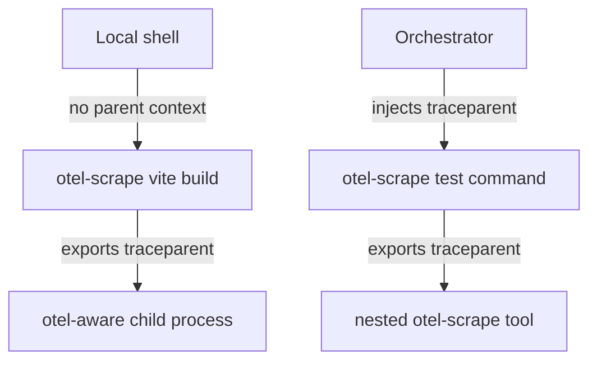

# Spec: otel-scrape

This document specifies the `otel-scrape` process wrapper and adapter contract. It builds on [requirements.md](./requirements.md).

## Status

Draft.

## Scope

**Defines:** the wrapper contract, adapter contract, event/span/metric classification, context propagation model, artifact-linking shape, and relationship to existing effect-utils packages.

**Does not define:** final package boundaries, every adapter parser, an orchestrator, backend storage topology, dashboard layout, or profile-rendering UI.

## Architecture

```
                      parent context? -- no --> mint root span
                            | yes
                            v
                     join parent trace
                            |
                  +---------v----------+
                  |  otel-scrape core  |
                  |  ----------------  |
   <cmd> -------> |  spawn + capture   | ---> child process
                  |  process spans     |        ^
                  |  context export ---+--------+
                  |  artifact links    |
                  +---------+----------+
                            |
                            v
                  +--------------------+
                  |  ToolAdapter       |
                  |  derived structure |
                  +---------+----------+
                            |
                            v
           OTEL spans/events/metrics       CAS profile artifacts
```

The wrapper owns the command span. An adapter enriches the tree; it does not own the command lifecycle.

## Adapter Contract

Illustrative TypeScript shape:

```ts
type AdapterEmit =
  | { readonly _tag: 'Event'; readonly event: OtelEvent }
  | { readonly _tag: 'Span'; readonly span: OtelSpanUpdate }
  | { readonly _tag: 'Metric'; readonly metric: OtelMetricSample }
  | { readonly _tag: 'Profile'; readonly profile: ProfileLink }

interface ToolAdapter {
  readonly name: string
  detect(invocation: Invocation): Effect.Effect<boolean>
  env(context: TraceContext): Effect.Effect<ReadonlyArray<readonly [string, string]>>
  parseLine(line: OutputLine): Effect.Effect<Option.Option<AdapterEmit>>
  parseArtifact(artifact: ArtifactDescriptor): Effect.Effect<ReadonlyArray<AdapterEmit>>
  finalize(outcome: RunOutcome): Effect.Effect<ReadonlyArray<AdapterEmit>>
}
```

`AdapterEmit` is deliberately a tagged union. A bare output line can only become an event unless an adapter explicitly constructs a span update or metric sample from structured data.

## Nested Adapter Ownership

Adapter parsing is owned by the leaf wrapper that directly launches the adapted tool. A parent `otel-scrape` invocation preserves passthrough stdout/stderr from nested wrapped commands, but it must not classify structured output already owned by a nested `otel-scrape` invocation.

This keeps nested wrappers compatible with root-or-join propagation without producing duplicate adapter-derived spans, events, metrics, or profile links. Parent wrappers still own their command span, observable process spans, resource facts, and passthrough behavior.

Implementation must provide an ownership or suppression protocol for nested wrappers. Downstream consumers must not be responsible for deduplicating duplicate adapter records.

See [.decisions/0002-leaf-wrapper-owns-adapter-parsing.md](./.decisions/0002-leaf-wrapper-owns-adapter-parsing.md).

## Classification Ladder

| Source shape                        | Classification | Example                                   |
| ----------------------------------- | -------------- | ----------------------------------------- |
| One output line, no lifecycle       | Event          | diagnostic, warning, informational line   |
| Start/end pair with stable identity | Span           | plugin transform, test case, compile unit |
| Duration-bearing structured record  | Span or metric | compile phase duration                    |
| Counter or aggregate statistic      | Metric         | diagnostics count, transformed file count |
| Native profile file                 | Profile link   | `trace.json`, `cpuprofile`, `pprof`       |

## Context Propagation



- `otel-scrape` reads W3C `traceparent` from the environment.
- If a parent exists, the command span joins it.
- If no parent exists, the command span roots the trace.
- The wrapper injects the active context into child processes.
- Context-specific facts stay on the span owned by the participant that knows them.

## Semantic Conventions

The names below are draft conventions. Final implementation must register or export them through the repo's OTEL contract surface instead of hand-authoring duplicate literals.

| Kind      | Name / attribute            | Notes                            |
| --------- | --------------------------- | -------------------------------- |
| Span      | `otel_scrape.command`       | One wrapper invocation           |
| Span      | `otel_scrape.process`       | Observable child process         |
| Attribute | `otel_scrape.adapter.name`  | Selected adapter                 |
| Attribute | `process.command_args_hash` | Stable hash, not raw argv        |
| Attribute | `process.exit_code`         | Exit status                      |
| Attribute | `tool.name`                 | Tool identity when detected      |
| Attribute | `tool.version`              | Tool version when cheap and safe |
| Attribute | `profile.type`              | Native profile kind              |
| Attribute | `profile.digest`            | `sha256:...` digest              |
| Attribute | `profile.uri`               | Artifact retrieval URI           |
| Attribute | `profile.ui`                | Optional viewer URI              |

Raw command arguments, local absolute paths, credentials, source text, and private payloads must not be emitted as span attributes.

## Artifact Store

Profile artifacts use the `@overeng/content-address` convention:

```ts
interface ProfileLink {
  readonly type:
    | 'pprof'
    | 'cpuprofile'
    | 'rustc-self-profile'
    | 'tsc-trace'
    | 'cargo-timings'
    | string
  readonly digest: `sha256:${string}`
  readonly uri: string
  readonly ui?: string
  readonly byteLength?: number
}
```

The span carries the descriptor. The artifact bytes live outside the OTEL backend. Retrieval verifies the digest before use.

## Adapter Fleet

Initial adapters should prove the classification ladder across different source shapes before expanding the fleet.

| Adapter  | Structured source                         | Output                                    | Profile link     |
| -------- | ----------------------------------------- | ----------------------------------------- | ---------------- |
| `cargo`  | `--timings=json`, `--message-format=json` | compile spans, diagnostics metrics/events | timings artifact |
| `tsc`    | `--generateTrace`                         | checker/program phase spans               | `trace.json`     |
| `vitest` | JSON reporter / OTEL-aware tests          | suite and test spans                      | none             |
| `oxlint` | JSON formatter                            | diagnostics events/metrics                | none             |
| `vite`   | profile/debug output where stable         | plugin transform spans/events             | `cpuprofile`     |

## Relationship To Existing Packages

- `@overeng/otel-contract` owns typed OTEL values and validation. `otel-scrape` should consume those types rather than creating untyped primitives.
- `@overeng/utils` contains existing node command and OTEL helpers. The implementation should reuse those helpers where they satisfy the wrapper contract.
- `@overeng/content-address` owns reusable artifact identity and fan-out path conventions.
- `@overeng/utils-dev` / otelite can provide local test assertions for emitted spans, events, metrics, and profile descriptors.

## Open Design Questions

- **DQ1 — Package boundary:** Should `otel-scrape` live in an existing package such as `@overeng/utils`, or in a dedicated package with a CLI entry?
- **DQ2 — Registry source:** Which generated contract surface owns final span, metric, and attribute names for both TypeScript and future non-TypeScript emitters?
- **DQ3 — Process-tree fidelity:** Which platforms receive exact child-process spans, and where is sampled or best-effort process discovery acceptable?
- **DQ4 — Artifact storage URI:** What URI schemes are accepted for local and CI artifact retrieval?
- **DQ5 — First-adapter proof shape:** Must one real adapter emit events, spans, metrics, and profile links in one run, or may the first implementation prove the ladder with one real adapter plus focused profile/artifact fixtures? See [.experiments/0002-e2e-prototype.md](./.experiments/0002-e2e-prototype.md).
