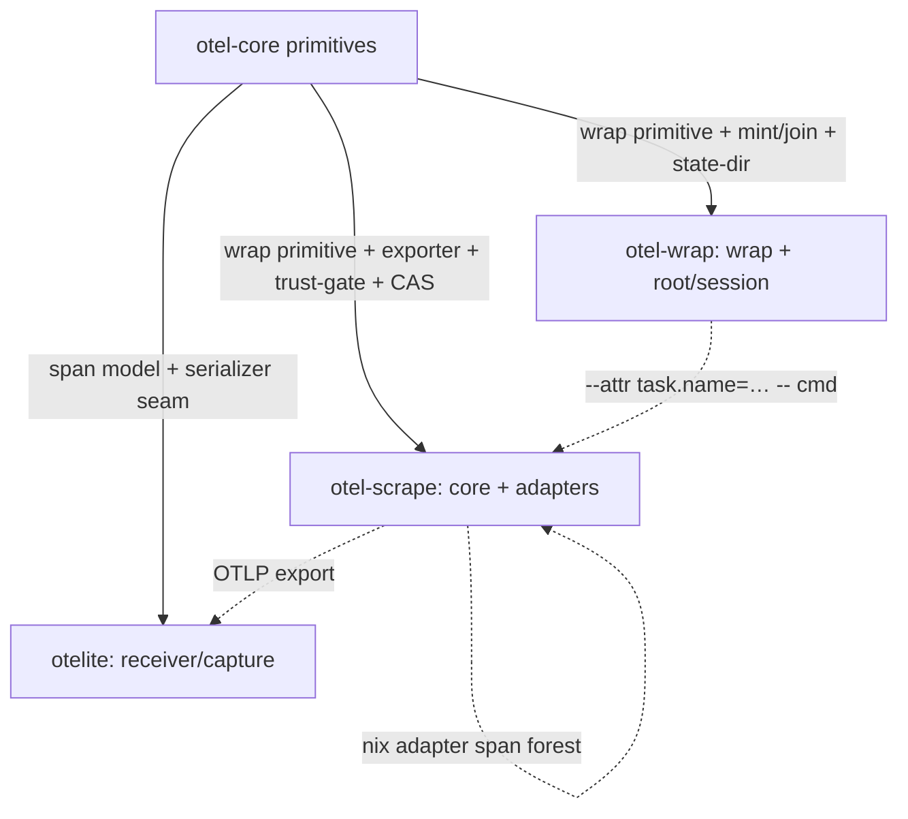

# Spec: otel-utils (family)

This document specifies the composition contract for the `otel-utils` family:
the shared primitive inventory, how the role bins compose it, and the one
state-dir contract they share. It builds on [requirements.md](./requirements.md).

## Status

Draft.

## Scope

**Defines:** the `otel-core` primitive inventory and its single-owner rule; how
`otel-wrap`, `otel-scrape`, and `otelite` compose those primitives; the shared
state-dir contract (`cas/` + `sessions/`) and the CAS-vs-session addressing
distinction; the family relationship to the top-level `content-address` contract
and the weaver telemetry seams.

**Does not define:** the internals each subsystem owns — see
[otel-core/spec.md](./otel-core/spec.md), [otel-wrap/spec.md](./otel-wrap/spec.md),
[otel-scrape/spec.md](./otel-scrape/spec.md), and [otelite/spec.md](./otelite/spec.md).
This is the single normative home for the shared primitives; subsystem specs
refine and reference them, they do not restate them.

## Composition

```
  weaver *.contract.ts seams            content-address (top-level, domain-general)
   │ genie codegen                        │ contract
   │  → constants + typed Rust encoder    │  → Rust CAS realization lives in otel-core
   ▼                                      ▼
 ┌─────────────────────────────────────────────────────────────────┐
 │ otel-core (shared Rust lib)                                       │
 │   wrap primitive · span model · OTLP/HTTP-JSON exporter +        │
 │   serializer seam · traceparent mint/join precedence · trust-    │
 │   gate · CAS · build-id · state-dir contract · trace-url         │
 │   surfacing · re-render mechanism                                 │
 └───────┬───────────────────────┬───────────────────────┬─────────┘
         │ compose               │ compose               │ compose
         ▼                       ▼                       ▼
   otel-wrap (bin)         otel-scrape (bin)        otelite (bin)
   wrap + root/session     core + adapter registry  receiver / capture
   universal floor         nix → adapter            assert/test end
```

Bins are thin: each owns a role surface and consumes primitives. No bin owns a
second copy of a primitive. `content-address` stays a top-level primitive; the
family reuses its contract and `otel-core` carries the shared Rust realization
(resolving [otel-scrape/.decisions/0009](./otel-scrape/.decisions/0009-rust-cas-module-boundary.md),
whose "second Rust consumer" trigger the family satisfies — see
[.decisions/0001](./.decisions/0001-family-composition-thin-bins.md)).

## Primitive Inventory

`otel-core` is the single owner of these primitives (requirement R02). Each has
one normative home; the referenced subsystem spec section refines the detail.

| Primitive                                     | Contract                                                                                                                         | Notes                                                                                                                                                                             |
| --------------------------------------------- | -------------------------------------------------------------------------------------------------------------------------------- | --------------------------------------------------------------------------------------------------------------------------------------------------------------------------------- |
| **Wrap primitive**                            | Spawn a child, preserve its stdout/stderr/exit, own a lifecycle span from wrapper-controlled facts, export context to the child. | The mechanic under both `otel-wrap` and `otel-scrape`. Passthrough fidelity + disabled-mode transparency are invariants.                                                          |
| **Span model**                                | The in-memory + on-disk representation of a span (identity, timing, attributes, status, parent link).                            | Reused by every bin, and reused as the shape of a _persisted open span_ (sessions store).                                                                                         |
| **OTLP/HTTP-JSON exporter + serializer seam** | First-party OTLP/HTTP-JSON hot path behind a serializer seam.                                                                    | The seam lets `opentelemetry-otlp` (metrics/logs, protobuf) slot in later without a rewrite. See [.decisions/0004](./.decisions/0004-exporter-otlp-http-json-serializer-seam.md). |
| **Traceparent mint/join precedence**          | The single rule for root-or-join and which source wins.                                                                          | Consumed by both `otel-wrap` and `otel-scrape` so their root behavior is one rule, not two. See [Mint/Join Precedence](#mintjoin-precedence).                                     |
| **Trust-gate**                                | Public-safe by default; raw identity only into a per-named sink explicitly asserted private.                                     | Same gate at every sink across the family (requirement R10).                                                                                                                      |
| **CAS**                                       | Content-addressed object store: descriptor, object path, `cas:` URI, manifest, pin.                                              | The Rust _realization_ of the top-level `content-address` contract; the contract stays top-level.                                                                                 |
| **Build-id**                                  | Stable build/version identity stamped on emitted telemetry.                                                                      | One shared identity primitive, not per-bin version strings.                                                                                                                       |
| **State-dir contract**                        | One on-disk root holding `cas/` + `sessions/`, both passive stores.                                                              | See [State-Dir Contract](#state-dir-contract).                                                                                                                                    |
| **Trace-url surfacing**                       | Terminal-only (stderr) surfacing of the trace id/URL when a bin mints the root.                                                  | Terminal is not a sink; never enters summary/OTLP. Owned as a primitive so every root-minting bin surfaces identically (otel-scrape R31).                                         |
| **Re-render mechanism**                       | When an adapter's required structured format replaces a tool's human stdout, re-present a readable summary to the terminal.      | Owned in the wrapper primitive so instrumenting never degrades interactive output (otel-scrape R30).                                                                              |

### Mint/Join Precedence

The precedence is one rule, owned by `otel-core`, consumed by every bin that can
root or join (requirement R14; it is the shared home for `otel-scrape`'s R12/R14
and `otel-wrap`'s root behavior, so they cannot diverge):

1. **Explicit join.** An inbound W3C `traceparent` (`traceparent` / `TRACEPARENT`)
   → join that trace; do not mint.
2. **Explicit root.** An explicit root request (`otel-wrap --root`,
   `otel-wrap root begin`) with no inbound traceparent → mint a root.
3. **Native root embrace.** A principled native OTEL root (devenv, coding-agent
   runtime) that already sets `traceparent` is joined under rule 1 — the floor
   does not compete with it (requirement R05).
4. **Implicit floor.** No inbound context and no explicit request → mint a root
   (the universal floor).

The highest participant owns the root; exactly one participant surfaces the
trace (requirement R06). Context export to children uses the shared env keys
(`TRACEPARENT`; `OTEL_TASK_TRACEPARENT` for task-parented sub-span emitters, per
otel-scrape decision 0018) so a nested bin re-parents correctly.

## How the Bins Compose



- **otel-wrap = wrap primitive + root/session.** The universal floor. Its two
  verbs compose the wrap primitive and the mint/join precedence; `root begin|end`
  composes the span model + state-dir (persisted open span). It subsumes the
  legacy `otel-run` and `otel-span run`. It has no standalone emit-span verb —
  emitting a structured span from tool output is an adapter concern owned by
  `otel-scrape` (requirement R03). See [otel-wrap/spec.md](./otel-wrap/spec.md).
- **otel-scrape = core + adapter registry.** Composes the wrap primitive,
  exporter, trust-gate, CAS (artifact lane), and re-render mechanism, and adds
  the adapter registry. `nix` becomes an adapter (span-forest emission) rather
  than a separate `nix-trace` stack. See [otel-scrape/spec.md](./otel-scrape/spec.md).
- **otelite = receiver.** Composes the span model + serializer seam to decode and
  normalize captured OTLP for assertions. The assert/test end of the family. See
  [otelite/spec.md](./otelite/spec.md).

Registry ownership is layered and does not contradict the registry-agnostic core
(see [.decisions/0002](./.decisions/0002-otel-core-registry-agnostic.md) and
[.decisions/0003](./.decisions/0003-weaver-native-telemetry-mandate.md)): the
exporter takes attributes as **data**; the telemetry _vocabulary_ lives in the
weaver seams and is supplied by the bins at their call sites (e.g. the
`otel_scrape` registry). `otel-core` bakes in no registry.

## State-Dir Contract

One state-dir root holds two passive stores. Both are on-disk, read and written
by short-lived processes; **no session daemon** owns them (requirement R13,
[.decisions/0007](./.decisions/0007-session-root-state-persisted-open-span.md)).

```
<state-dir>/
  cas/            content-addressed objects (immutable, hash-keyed)
  sessions/       persisted open root/session spans (mutable, identity-keyed)
```

The two stores differ in **addressing semantics**, which is why they are two
stores under one container rather than one store:

|            | `cas/`                                           | `sessions/`                                                             |
| ---------- | ------------------------------------------------ | ----------------------------------------------------------------------- |
| Address    | Content digest (`sha256:…`)                      | Session/root identity                                                   |
| Mutability | Immutable — an object never changes once written | Mutable — the open span accrues attributes/children and is closed later |
| Model      | CAS descriptor / object / manifest / pin         | The `otel-core` span model, persisted mid-flight                        |
| Lifecycle  | Write-once, retained + pinned                    | Opened by `root begin`, mutated, closed by `root end`                   |
| Reuse      | Reuses the top-level `content-address` contract  | Reuses the span model primitive — **not** CAS                           |

A session/root is a **persisted open span**: the same span-model primitive,
written to `sessions/` while still open so that `begin` and `end` can be separate
process invocations. It is deliberately not content-addressed — an open span's
identity is stable while its content changes, the opposite of CAS's write-once
digest identity. `root begin|end` is therefore a **stateless process pair** whose
only shared state is the `sessions/` file; that persisted open span _is_ the
"no daemon" realization — there is no resident process holding the root open.

## Relationship To Top-Level Primitives

- **content-address (top-level, domain-general).** The family reuses the
  [content-address contract](../content-address/spec.md) for `cas/`. `otel-core`
  supplies the shared Rust realization (the family is the "second Rust consumer"
  that [otel-scrape decision 0009](./otel-scrape/.decisions/0009-rust-cas-module-boundary.md)
  named as the trigger to promote the Rust CAS out of a wrapper-private module).
  The contract is not absorbed into the family; it stays a top-level primitive
  other domains reuse.
- **weaver `*.contract.ts` seams.** The telemetry vocabulary. The family authors
  its telemetry there and consumes generated constants + a generated typed Rust
  encoder (requirement R07/R08). No family bin defines a bespoke registry.
- **`@overeng/otel-contract`.** The typed TS validation/encoding layer; TS
  consumers conform to it rather than defining a parallel schema.

## Open Design Questions

- **DQ1 — nix adapter namespace.** The `nix.*` telemetry namespace is already
  owned by `packages/@overeng/megarepo/src/nix.contract.ts` (an attrs-only
  weaver seam), and SC-R09 enforces namespace uniqueness at registry aggregation.
  When the nix adapter lands in `otel-scrape`, its span-forest attributes must
  either **extend that existing seam** or take a **distinct namespace** — it
  cannot silently re-declare `nix.*`. Resolved when the nix adapter's attribute
  set is authored against `nix.contract.ts` and the uniqueness gate passes. See
  [open-questions.md](./open-questions.md).
- **DQ2 — metrics/logs coverage.** Traces are the primary signal now; the
  exporter's serializer seam is designed to admit `opentelemetry-otlp`
  (metrics/logs, protobuf) later without a rewrite. Open: whether the seam and
  the weaver Rust encoder together leave room for metrics/logs attribute
  encoding without a second seam. Resolved when one metric or log signal is
  encoded end-to-end through the seam. See [open-questions.md](./open-questions.md).
