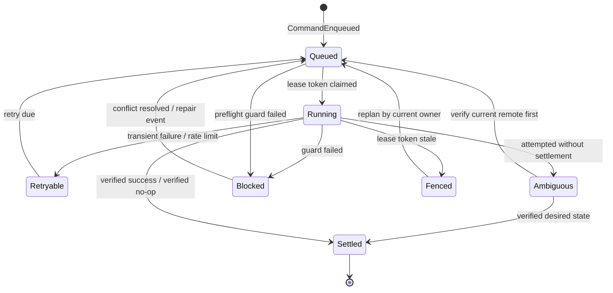
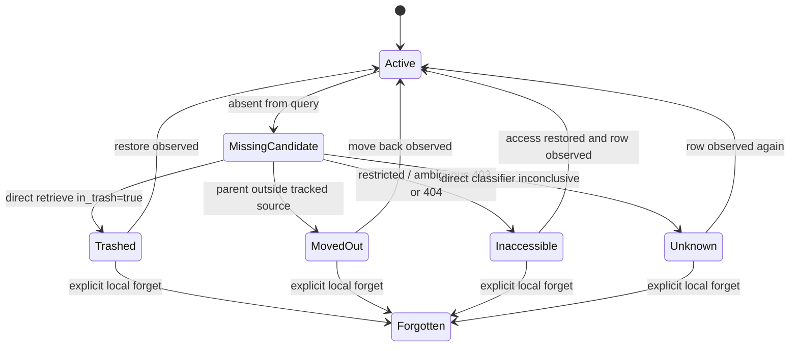
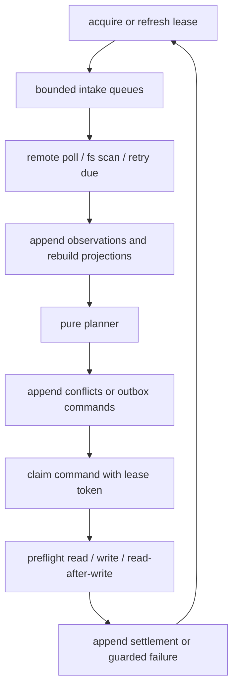

# Notion Datasource Sync Spec

This document specifies the Notion datasource sync system. It builds on [requirements.md](./requirements.md).

## Status

Draft -- the package is not implemented yet. The design is based on live Notion experiments, local SQLite/event-store experiments, NotionMD adapter experiments, and current `effect-utils` Notion package boundaries.

## Scope

This spec defines:

- the package boundaries for the Notion sync stack,
- the SQLite event/outbox/projection control plane,
- canonical data-source, schema, row, property, body-pointer, tombstone, and conflict models,
- Notion API compatibility, capability, pagination, and query contracts,
- the planner, guarded write, conflict, schema, delete, and watch semantics,
- the CLI and daemon shape,
- the verification strategy and guard matrix.

This spec does not define:

- the `.nmd` file format, which lives in `@overeng/notion-md`,
- JSX block rendering, which lives in `@overeng/notion-react`,
- raw Notion HTTP transport details, which live in the Notion client layer,
- hosted webhook or Notion Worker deployment as a correctness requirement.

## Package Shape

Requirement trace: R01-R05, R53-R56, R67-R70.

```
@overeng/notion-effect-schema
  raw wire schemas, exact decoders, branded IDs

@overeng/notion-effect-client
  versioned Notion API gateway, pagination, retries, rate limits

@overeng/notion-domain
  canonical domain types and hashers shared by sync packages

@overeng/notion-sync-core
  SQLite event log, projections, outbox, conflicts, leases, migrations

@overeng/notion-md
  .nmd page-body adapter implementing PageBodySyncPort

@overeng/notion-datasource-sync
  data-source binding, planner, daemon, CLI commands, Notion gateway adapter

@overeng/notion-cli
  raw/debug/schema/codegen commands and datasource-sync command surface
```

The exact package split may be staged. `@overeng/notion-domain` and `@overeng/notion-sync-core` may start as internal modules of `@overeng/notion-datasource-sync`, but their public imports must already follow the extractable boundaries above. Datasource sync must not depend on private NotionMD internals.

### Runtime Ports

Requirement trace: R02-R04, R53-R56, R67-R73.

```ts
type NotionDataSourceGateway = {
  readonly apiContract: NotionApiContract
  readonly preflightCapabilities: (input: CapabilityPreflightInput) => Effect<CapabilityPreflightResult, NotionGatewayError>
  readonly retrieveDataSource: (id: DataSourceId) => Effect<DataSourceSnapshot, NotionGatewayError>
  readonly queryRows: (input: QueryRowsInput) => Stream<QueryRowsPage, NotionGatewayError>
  readonly retrievePage: (id: PageId) => Effect<PageSnapshot, NotionGatewayError>
  readonly retrievePageProperty: (input: RetrievePagePropertyInput) => Stream<PagePropertyItemPage, NotionGatewayError>
  readonly patchPageProperties: (command: PatchPagePropertiesCommand) => Effect<NotionRequestId, NotionGatewayError>
  readonly patchDataSourceSchema: (command: PatchDataSourceSchemaCommand) => Effect<NotionRequestId, NotionGatewayError>
  readonly trashPage: (command: TrashPageCommand) => Effect<NotionRequestId, NotionGatewayError>
  readonly restorePage: (command: RestorePageCommand) => Effect<NotionRequestId, NotionGatewayError>
}

type PageBodySyncPort = {
  readonly observe: (input: ObserveBodyInput) => Effect<BodyPointer, BodySyncError>
  readonly planLocalChange: (input: BodyLocalChangeInput) => Effect<BodyIntent | BodyConflict, BodySyncError>
  readonly push: (command: BodyPushCommand) => Effect<BodyPushResult, BodySyncError>
  readonly repair: (input: BodyRepairInput) => Effect<BodyPointer | BodyConflict, BodySyncError>
}

type WorkspacePolicy = {
  readonly schemaOwnership: 'userManaged' | 'appOwned'
  readonly filesystemDelete:
    | { readonly _tag: 'candidateOnly' }
    | { readonly _tag: 'trustedRemoteTrash'; readonly requiresExplicitCommand: boolean }
  readonly pathPolicy: PathPolicy
}

type PathPolicy = {
  readonly strategy: 'title-slug-with-row-id-suffix'
  readonly bodyExtension: '.nmd'
  readonly caseFold: boolean
  readonly unicodeNormalization: 'NFC'
}

type LocalWorkspacePort = {
  readonly scan: (root: AbsolutePath) => Stream<LocalArtifactObservation, LocalStorageError>
  readonly claimPath: (claim: PathClaimPlan) => Effect<PathClaimResult, LocalStorageError>
  readonly materialize: (plan: MaterializePlan) => Effect<MaterializeResult, LocalStorageError>
}

type NotionApiContract = {
  readonly apiVersion: '2026-03-11'
  readonly clientVersion: string
  readonly supportedCapabilities: readonly CapabilityName[]
}

type QueryRowsInput = {
  readonly dataSourceId: DataSourceId
  readonly queryContract: QueryContract
  readonly startCursor: QueryCursor | null
}

type QueryRowsPage = {
  readonly apiVersion: NotionApiVersion
  readonly requestId: NotionRequestId
  readonly queryContractHash: Hash
  readonly rows: readonly RowPageSnapshot[]
  readonly nextCursor: QueryCursor | null
  readonly hasMore: boolean
  readonly cappedAtLimit: boolean
}

type QueryContract = {
  readonly apiVersion: '2026-03-11'
  readonly filter: CanonicalNotionFilter | null
  readonly sorts: readonly CanonicalNotionSort[]
  readonly pageSize: PositiveInt
  readonly highWatermark: DateTimeUtc | null
  readonly membershipScope: 'all-data-source-rows' | 'explicit-filter'
}

type PagePropertyItemPage = {
  readonly apiVersion: NotionApiVersion
  readonly requestId: NotionRequestId
  readonly pageId: PageId
  readonly propertyId: PropertyId
  readonly items: readonly PagePropertyItem[]
  readonly nextCursor: QueryCursor | null
  readonly hasMore: boolean
}
```

Ports return decoded domain values, not raw JSON. Raw Notion payloads may be retained only through the store retention policy.

### API Version Contract

Requirement trace: R67-R70.

The supported Notion contract is `Notion-Version: 2026-03-11`.

| Concern | Spec decision |
| --- | --- |
| Request version | Every gateway request sends `2026-03-11` and records it in the request span and safe diagnostics. |
| Older versions | Older versions are unsupported unless an explicit compatibility profile has fake-service coverage and a live smoke proof. |
| Newer versions | Newer versions start blocked by `ApiVersionCompatibilityMissing` until decode and live compatibility proofs are added. |
| Trash field | Canonical lifecycle uses `in_trash`; legacy `archived` is decode drift for supported surfaces. |
| Meeting notes | Canonical block/type naming uses `meeting_notes`; legacy `transcription` is decode drift unless a compatibility profile maps it. |
| Block append | Gateway command shapes use `position`, not legacy `after`. |

Decode drift is surface-scoped. An unsupported payload for one property, block, or data-source feature blocks that surface and writes a typed guard state without corrupting unrelated projections.

## Authority Model

Requirement trace: R06-R13, R21-R29, R67-R73.

| Surface | Authoritative source | Local representation | Write rule |
| --- | --- | --- | --- |
| Current remote schema | Notion after observation | `schema_projection` | Re-read before schema-affecting writes |
| Current remote row properties | Notion after observation | `row_projection`, `property_shadow` | Re-read relevant row/properties before writes |
| Current remote page body | NotionMD adapter after observation | `body_pointer` | Delegate body guards to `PageBodySyncPort` |
| Local sync intent | SQLite event log | `sync_event`, `outbox` | Commit intent before command execution |
| Conflicts | SQLite event log/projection | `conflict_projection` | Resolve by appending events |
| Tombstones | SQLite event log/projection | `tombstone_projection` | Create only after direct classification |
| File paths | SQLite path claims + filesystem | `path_claim_projection` | Never overwrite another page claim |
| API/capability contract | Notion client + live preflight | `api_contract_projection`, `capability_projection` | Block unsupported version/capability drift |
| Query completeness | Notion query pages after complete scan | `query_scan_checkpoint` | Advance only after terminal page |
| Watch ownership | SQLite lease | `lease_projection` | Fence stale daemons |

SQLite is the local control plane. It is not a substitute for fresh Notion reads before unsafe writes.

Local authority has three invariants:

| Invariant | Enforcement |
| --- | --- |
| Intent-before-effect | A local edit becomes accepted only when its `LocalIntentAccepted` event commits. |
| Effect-after-outbox | Network writes execute only from committed outbox commands. |
| Projection-from-events | Projection rows are derived from the event log and can be discarded/rebuilt. |

## SQLite Store

Requirement trace: R06-R13, R62, R67-R73.

```
sqlite store
  sync_root                 local root binding, settings, store identity
  sync_event                append-only domain events
  projection_metadata       replay version, digest, schema version
  data_source_projection    current observed datasource state
  schema_projection         property-id keyed schema
  row_projection            row membership and row lifecycle
  property_shadow           per-row/property base/current/local hashes
  body_pointer              NotionMD-managed body state pointers
  outbox                    pending/attempted/settled remote commands
  conflict_projection       open/resolved/superseded/ignored conflicts
  tombstone_projection      trash/move/inaccessible/unknown classifications
  path_claim                local file path ownership
  api_contract_projection   Notion API version and compatibility proof
  capability_projection     integration capability preflight results
  query_scan_checkpoint     query contract, cursor, completeness, high-water mark
  page_property_checkpoint  complete property-item pagination state
  lease                     daemon writer leases and fencing tokens
  checkpoint                replay compaction and high-water marks
  raw_payload_retention     opt-in/TTL sanitized payload references
  migration_history         forward-only store migrations
```

### Event Envelope

Requirement trace: R07-R12.

```ts
type SyncEventEnvelope = {
  readonly eventId: EventId
  readonly rootId: SyncRootId
  readonly sequence: bigint
  readonly codecVersion: EventCodecVersion
  readonly family: EventFamily
  readonly eventType: string
  readonly idempotencyKey: IdempotencyKey
  readonly surface: SurfaceKey | null
  readonly causedByEventIds: readonly EventId[]
  readonly payloadHash: Hash
  readonly payload: VersionedJson
  readonly observedAt: DateTimeUtc
}
```

Store constraints:

| Constraint | Purpose |
| --- | --- |
| `UNIQUE(root_id, sequence)` | deterministic replay order |
| `UNIQUE(root_id, idempotency_key)` | duplicate observation/intent suppression |
| `UNIQUE(root_id, payload_hash, event_type, idempotency_key)` | crash-safe event retry |
| `CHECK(payload.apiVersion = supported_event_version)` at decode time | explicit event evolution |

`payload_hash` is computed over canonical encoded payload bytes. Projection digests are computed from `(projector_version, sequence, event_id, payload_hash)` and stored in `projection_metadata`.

Store open hardening:

| Setting | Required value |
| --- | --- |
| `PRAGMA journal_mode` | `WAL` |
| `PRAGMA foreign_keys` | `ON` before migrations and writes |
| `PRAGMA busy_timeout` | configured non-zero timeout for daemon and CLI writers |
| event codec | explicit `codecVersion`; unknown versions open read-only for diagnostics |
| migration mode | forward-only; failed migration leaves store closed for writes |

Checkpoint compaction is forbidden while any outbox command is pending, running, retryable, ambiguous, or leased; while any conflict is open; while any tombstone is unclassified; or while any projection digest mismatch is unresolved.

### Event Families

| Family | Examples | Projection effect |
| --- | --- | --- |
| `RemoteObserved` | schema observed, row observed, row missing candidate, body pointer observed | Updates remote-current projections |
| `CompatibilityChecked` | API version accepted, capability preflight passed/failed, query contract changed | Updates compatibility projections |
| `QueryScanRecorded` | page observed, row cursor advanced, property cursor advanced, scan completed, scan capped/interrupted | Updates query checkpoints |
| `LocalIntentAccepted` | property edit, body edit pointer, schema migration intent, local delete intent | Creates durable local intent |
| `CommandEnqueued` | patch row, patch schema, trash row, restore row, materialize body | Adds outbox work |
| `CommandAttempted` | request started, retry scheduled, transient failure, permanent failure, fenced stale attempt | Updates attempt state |
| `CommandSettled` | verified success, verified no-op | Advances projections and clears pending intent |
| `ConflictDetected` | same property, body-body, delete-vs-edit, schema drift, path collision | Opens conflict |
| `ConflictResolved` | choose local, choose remote, manual value, ignore, forget | Appends resolution and follow-up commands |
| `TombstoneClassified` | trashed, moved-out, moved-between-tracked-sources, inaccessible, unknown | Updates tombstone projection |
| `RepairObserved` | projection drift, orphan object, missing sidecar, stale lease | Drives repair commands |
| `StorageMigrated` | SQLite schema migration, projection rebuild, checkpoint compaction | Records control-plane evolution |

Events are immutable. Projections are disposable and must be rebuildable. Store migrations may create new projection tables or replay events with a new `projector_version`; they must not rewrite old events.

### Projection Contracts

Requirement trace: R08, R12, R62, R67-R73.

| Projection | Primary key | Derived facts | Rebuild guard |
| --- | --- | --- | --- |
| `schema_projection` | `(root_id, data_source_id, property_id)` | current name, type, type config hash, writable/computed class | digest must ignore display-name-only changes for row values |
| `row_projection` | `(root_id, page_id)` | data-source membership, lifecycle, page parent, last observed timestamp | query absence cannot change lifecycle without tombstone event |
| `property_shadow` | `(root_id, page_id, property_id)` | last clean base hash, current remote hash, pending local hash | pending local hash must reference an accepted intent event and survives remote observations |
| `body_pointer` | `(root_id, page_id)` | adapter state ref, base/current hashes, truncation/unknown block flags | adapter result must be decoded before projection update |
| `outbox` | `(root_id, command_id)` | command state, attempt count, lease token, settlement event | settled commands are terminal |
| `conflict_projection` | `(root_id, conflict_id)` | conflict state and competing surfaces/events | resolution must point to a `ConflictResolved` event |
| `tombstone_projection` | `(root_id, page_id)` | missing candidate or direct classifier result | candidate expires into repair, not delete |
| `path_claim` | `(root_id, relative_path)` | owning page, claim reason, release event | a path has at most one active owner |
| `api_contract_projection` | `(root_id, api_version)` | accepted API version, client version, live smoke proof event | writes blocked when proof is missing |
| `capability_projection` | `(root_id, capability)` | preflight result, request ID, checked time | data failures are facts only after capability passes |
| `query_scan_checkpoint` | `(root_id, data_source_id, query_contract_hash)` | cursor chain, terminal page, high-water mark, completeness | incomplete scans cannot classify absence |
| `page_property_checkpoint` | `(root_id, page_id, property_id)` | cursor chain, terminal page, completeness, unshared relation state | incomplete values cannot contribute clean hashes |

Projection rebuild is the test oracle: dropping every projection table and replaying `sync_event` must produce the same projection digest and command eligibility as an incremental run.

Pending local intent shadows remote observations. A `RemoteObserved` event may update `remoteHash`, move the surface into conflict, or prove the pending intent already landed remotely, but it must not overwrite, drop, or mutate the pending local target hash. Pending local target state changes only through `CommandSettled`, `ConflictResolved`, explicit abandonment, or a new accepted local intent that supersedes the prior one.

### Outbox Lifecycle

Requirement trace: R09-R11, R21-R24, R46, R62.



Outbox commands are deterministic data:

```ts
type OutboxCommand = {
  readonly commandId: CommandId
  readonly commandKey: IdempotencyKey
  readonly rootId: SyncRootId
  readonly intentEventId: EventId
  readonly surface: SurfaceKey
  readonly command:
    | PatchPagePropertiesCommand
    | PatchDataSourceSchemaCommand
    | TrashPageCommand
    | RestorePageCommand
    | BodyPushCommand
  readonly baseHash: Hash
  readonly desiredHash: Hash
  readonly preflight: readonly GuardName[]
}
```

The executor sequence is:

1. claim a queued command with the current lease token,
2. read the current remote surface and schema,
3. run preflight guards against `baseHash`,
4. revalidate the local lease immediately before the remote write,
5. write remotely outside a SQLite transaction,
6. read the remote surface again,
7. append exactly one settlement event if the observed hash equals `desiredHash`.

If a command has an attempt record without a settlement record, restart marks it ambiguous before any retry. Ambiguous commands must re-read the current remote surface and schema first. They settle as `verified no-op` when the observed hash already equals `desiredHash`, replan when the observed hash proves a disjoint remote change, or open conflict when the outcome cannot be attributed safely.

If a remote write succeeds and the process crashes before settlement, retrying the command must settle as `verified no-op` when read-after-write already shows `desiredHash`. If two attempts race, the first verified settlement event is terminal and later attempts append `fenced stale attempt` or are ignored by idempotency.

Lease fencing protects SQLite settlement, not Notion itself. A stale process cannot settle a command with an old token; if it wrote remotely after losing the lease, the current owner observes the changed remote hash and replans or opens a conflict.

## Canonical Domain Model

Requirement trace: R14-R20.

```ts
type DataSourceBinding = {
  readonly dataSourceId: DataSourceId
  readonly databaseId: DatabaseId | null
  readonly localRoot: AbsolutePath
  readonly storePath: AbsolutePath
  readonly policy: WorkspacePolicy
}

type PropertyIdentity = {
  readonly id: PropertyId
  readonly name: string
  readonly type: PropertyType
  readonly typeConfigHash: Hash
  readonly writeClass: 'writable' | 'computed' | 'unsupported'
}

type RowSurface = {
  readonly pageId: PageId
  readonly parentDataSourceId: DataSourceId
  readonly propertyHashes: Record<PropertyId, Hash>
  readonly bodyPointer: BodyPointer | null
  readonly lifecycle: RowLifecycle
}

type PropertySurface = {
  readonly pageId: PageId
  readonly propertyId: PropertyId
  readonly baseHash: Hash
  readonly remoteHash: Hash
  readonly localHash: Hash | null
  readonly availability:
    | 'complete'
    | 'computed'
    | 'unsupported'
    | 'paginated-incomplete'
    | 'relation-target-inaccessible'
    | 'related-data-source-unshared'
}

type BodyPointer = {
  readonly adapter: 'notion-md'
  readonly path: RelativePath
  readonly baseHash: Hash
  readonly currentHash: Hash
  readonly truncated: boolean
  readonly unknownBlockIds: readonly BlockId[]
  readonly unknownBlockCause: 'truncation' | 'permission' | 'unsupported' | 'unknown' | null
}

type FileReference = {
  readonly kind: 'external' | 'notion-hosted' | 'unsupported'
  readonly stableRef: string | null
  readonly name: string | null
  readonly expiresAt: DateTimeUtc | null
}
```

Display names are never row-value identity. Property IDs and canonical value hashes drive rename-safe planning. Expiring Notion file URLs may appear in transient observations but must canonicalize to `FileReference` without persisting the signed URL.

Relation, people, rich-text, title, and rollup values are hashable only after their paginated page-property stream reaches `hasMore=false`. If a related data source is not shared with the integration, the value is `related-data-source-unshared` and cannot be silently treated as an empty relation.

Body pointers preserve public markdown endpoint safety metadata. `unknownBlockCause` remains `unknown` unless the adapter can prove truncation, permission loss, or an unsupported block type; ambiguous unknown blocks block body writes.

## Path And Local Workspace Semantics

Requirement trace: R04, R06, R27, R38-R39, R63.

Default local path derivation is stable and row-identity preserving:

| Rule | Decision |
| --- | --- |
| file name | normalized title slug plus `--{page_id_short}.nmd` suffix |
| identity | page ID suffix is mandatory even when the title is unique |
| canonical path | root-relative POSIX-style path after Unicode NFC normalization |
| case collisions | detected according to `pathPolicy.caseFold`; conflicts are stored in `path_claim` |
| unsafe segments | empty, dot, dot-dot, separator, control-character, and reserved segments are rejected or escaped before claim |
| symlinks | materialization and scans must not follow symlinks outside `localRoot` |

Path claims, not file names, are the source of truth. Renames append path-claim events; they do not change row identity.

## Planning Flow

Requirement trace: R21-R29, R48-R51.

```
local events / fs scan       remote observations
          \                  /
           v                v
        projection rebuild / refresh
                  |
                  v
           planner guard matrix
                  |
        +---------+----------+
        |                    |
        v                    v
   conflict events       outbox commands
        |                    |
        v                    v
  user resolution       guarded executor
                             |
                  read -> write -> read -> settle
```

Planning is pure over projections plus fresh observations. Execution performs effects only after commands are enqueued.

Planner outputs are closed tagged unions:

```ts
type PlanDecision =
  | { readonly _tag: 'AppendEvents'; readonly events: readonly SyncEventPayload[] }
  | { readonly _tag: 'EnqueueCommands'; readonly commands: readonly OutboxCommand[] }
  | { readonly _tag: 'OpenConflict'; readonly conflict: ConflictPayload }
  | { readonly _tag: 'BlockedByGuard'; readonly guard: GuardName; readonly surface: SurfaceKey; readonly detail: SafeDiagnostic }
```

Disjoint merge is allowed only when all edited surfaces have independent base hashes:

| Local surface | Remote surface | Default decision |
| --- | --- | --- |
| property A | property B | enqueue both property patches after schema preflight |
| property | body | enqueue property patch and delegate body refresh/push to `PageBodySyncPort` |
| schema rename | row value by same property ID | accept rename, preserve value hashes |
| schema type/config affecting property | same property value | open schema drift conflict |
| trash/delete | any local edit | open delete-vs-edit conflict |
| body | body | delegate to body adapter; persist adapter conflict if returned |

## Remote Query And Property Completeness

Requirement trace: R16, R19, R36-R37, R43-R44, R67-R73.

Remote membership and row hashing require two different completeness proofs:

| Proof | Source | Required terminal condition | Failure behavior |
| --- | --- | --- | --- |
| Query scan completeness | data-source query pages | cursor chain reaches `hasMore=false` before the 10,000-result cap hides rows | do not advance completeness checkpoint or classify absence |
| Property value completeness | page-property item pages | every paginated property needed for hashing reaches `hasMore=false` | mark property incomplete and block clean hash/write decisions |

`QueryContract` is part of the checkpoint identity. A scan with a different filter, sort, page size, API version, high-watermark rule, or membership scope starts a new checkpoint and cannot reuse old absence evidence.

Query policy:

| Case | Decision |
| --- | --- |
| unsorted query | allowed for bounded full scans only; not a stable incremental proof |
| `last_edited_time` sort | optimization for polling; repair scans still verify known pages and completeness |
| `filter_properties` omits edited/hash-relevant properties | fetch omitted values through page-property pagination before hashing |
| linked data source or unsupported wiki/special data source | block with unsupported guard |
| filtered query with `membershipScope='explicit-filter'` | absence may mean outside the sync scope only after direct retrieval |
| filtered query with `membershipScope='all-data-source-rows'` | absence is never delete/move evidence |

The 10,000-result query cap is a hard completeness boundary. Large bindings must use complete partitioned query contracts or stay blocked by `QueryResultCapExceeded`.

## Guard Matrix

Requirement trace: R21-R29, R30-R41, R66-R73.

| Guard | Scenario | Behavior | State written |
| --- | --- | --- | --- |
| `ApiVersionUnsupported` | Gateway is configured below `2026-03-11` | Stop requests except compatibility diagnostics | `CompatibilityChecked` failed |
| `ApiVersionCompatibilityMissing` | Gateway/API version changed without fake and live smoke proof | Block mutating commands | `CompatibilityChecked` blocked |
| `DecodeDriftUnsupported` | Supported surface contains changed/unknown payload shape | Block affected surface only | `ConflictDetected` or blocked observation |
| `CapabilityPreflightFailed` | Integration lacks read/query/update/schema/trash/restore/parent access | Treat failures as capability issues, not data facts | `CompatibilityChecked` failed |
| `UnsupportedRemoteShape` | Exact schema decode fails | Stop affected sync surface; retain raw-safe diagnostic | `ConflictDetected` or blocked observation |
| `ComputedPropertyWrite` | Local intent targets formula/rollup/system property | Reject before outbox | `ConflictDetected` when user action is needed |
| `PropertyValueIncomplete` | Page retrieve contains truncated/paginated property value | Fetch property item pages; block clean hash until complete | blocked observation |
| `RelatedDataSourceUnshared` | Relation/rollup depends on unshared related source | Block relation write or mark unavailable | `ConflictDetected` |
| `StaleSurfaceBase` | Local command base hash differs from current remote surface | Replan if disjoint, otherwise conflict; no write | `ConflictDetected` or no-op replan |
| `PageTimestampWakeupOnly` | `last_edited_time` changed | Re-read body/properties/schema; do not infer conflict by timestamp precision | `RemoteObserved` only |
| `SchemaDriftAffectsIntent` | Pending property edit depends on changed property config | Conflict or migration plan | `ConflictDetected` |
| `DestructiveSchemaMigrationRequired` | Property delete/type conversion/option deletion | Require explicit migration command | blocked dry-run or migration intent |
| `OptionDeletionLosesValues` | Removed select option is used by rows | Block until migration impact accepted | blocked migration plan |
| `BodyLossyRemote` | Markdown response truncated or has unknown blocks | Block body write; preserve/diagnose | `ConflictDetected` from body port |
| `MarkdownUnknownBlocksAmbiguous` | Markdown returns unknown block IDs without provable cause | Block body write; preserve metadata | `ConflictDetected` from body port |
| `MarkdownSelectionAmbiguous` | `update_content` target is missing or matches multiple ranges | Use safer mode if proven, otherwise conflict | `ConflictDetected` from body port |
| `MarkdownWouldDeleteChildren` | Markdown patch would delete child pages/databases | Require explicit destructive-body operation; never auto-enable deletion | blocked body command |
| `MarkdownSyncedPageUnsupported` | Public markdown update cannot update synced page | Block body write and surface adapter state | `ConflictDetected` from body port |
| `BodyAdapterConflict` | NotionMD reports body merge/push conflict | Persist as datasource conflict projection | `ConflictDetected` |
| `PathClaimCollision` | Two pages map to same local path | Conflict; no overwrite | `ConflictDetected` |
| `QueryAbsenceUnclassified` | Row missing from datasource query | Direct page retrieve before tombstone | `RemoteObserved` missing candidate |
| `PaginationIncomplete` | Query or page-property pagination stops before terminal page | Do not checkpoint completeness or hash clean value | `QueryScanRecorded` incomplete |
| `QueryContractChanged` | Filter/sort/page size/high-watermark contract changes | Start new checkpoint; old absence evidence is invalid | `CompatibilityChecked` or `QueryScanRecorded` |
| `QueryResultCapExceeded` | Data-source query reaches the 10,000-result cap | Fail closed unless a complete partitioned query contract exists | `QueryScanRecorded` capped |
| `FilteredAbsenceNotProof` | Row absent from filtered query/view | Do not classify delete/move unless scoped binding and direct retrieve agree | blocked tombstone candidate |
| `LinkedDataSourceUnsupported` | Binding points at public-API-unsupported linked data source | Block init/pull with diagnostic | `CompatibilityChecked` failed |
| `PermissionAmbiguous` | Known page retrieve returns restricted/ambiguous 403/404 | Fail closed; no delete/forget | `TombstoneClassified` inaccessible/unknown |
| `DeleteVsEdit` | One side edits while the other deletes/trashes | Conflict | `ConflictDetected` |
| `MoveOutNotDelete` | Page parent leaves tracked datasource | Mark moved-out; do not trash | `TombstoneClassified` moved-out |
| `UnavailableRelationTarget` | Relation target inaccessible or missing | Conflict/block relation write | `ConflictDetected` |
| `ExpiringFileUrl` | File value contains signed URL | Do not store as durable identity | sanitized `RemoteObserved` |
| `ReadAfterWriteMismatch` | Fresh read after write does not match desired hash | Do not settle as success; retry or conflict | `CommandAttempted` retry/permanent failure |
| `AmbiguousCommandOutcome` | Attempt exists without settlement after crash/cancel | Re-read before retry; settle no-op, replan, or conflict | ambiguous outbox state |
| `PendingIntentShadowViolation` | Remote observation would overwrite pending local target state | Reject projection mutation; require repair | `RepairObserved` |
| `BodyAdapterNonBodyMutation` | Body adapter writes row properties/schema/title/trash/icon/cover/page metadata | Reject result unless explicit delegated surface command exists | `ConflictDetected` or blocked adapter result |
| `FilesystemDeleteAutoTrashBlocked` | Watch observes local file deletion without trusted explicit policy | Create delete candidate only; no remote trash command | `LocalIntentAccepted` candidate or diagnostic |
| `CursorSameBucketIncomplete` | Poll cycle ends inside same timestamp bucket without a stable boundary | Keep prior high-water mark and schedule continuation | `QueryScanRecorded` incomplete |
| `OwnMaterializationWriteSuppressed` | Watch sees filesystem writes produced by current materialization event | Suppress local edit intent; keep path/object verification | no local intent |
| `CompactionUnsafe` | Checkpoint compaction requested with pending/leased/ambiguous/open state | Refuse compaction | blocked maintenance command |
| `PathEscapesRoot` | Normalized path or symlink traversal leaves `localRoot` | Reject scan/materialization and open repair/conflict | `RepairObserved` or `ConflictDetected` |
| `LeaseFenceMismatch` | Stale daemon tries to settle command | Reject settlement | `CommandAttempted` fenced stale attempt |
| `OutboxFirstSettlementWins` | Duplicate command attempts complete | Keep first verified settlement | terminal `CommandSettled` |
| `CheckpointDigestMismatch` | Projection digest differs after replay | Stop mutating commands; require repair | `RepairObserved` |
| `StoreMigrationBlocked` | Store schema is newer/unknown or migration fails | Stop store open for writes | migration error, no projection mutation |
| `QueueBackpressureExceeded` | Daemon queues exceed configured bound | Pause intake and surface stuck work | `RepairObserved` or daemon diagnostic |
| `RawPayloadRetentionUnsafe` | Raw payload would persist private body/signed URL | Redact or reject retention | sanitized retention row or blocked raw capture |

Every guard must appear in the E2E plan with at least one verification level.

## Schema Semantics

Requirement trace: R30-R35.

| Change | Default policy | Required proof |
| --- | --- | --- |
| Remote rename | Accept as observation | Same property ID; row value hashes unchanged |
| Local rename | Allowed if explicit | Read current schema, patch, read back same property ID |
| Add property | Allowed if explicit | Read current schema, patch, fresh schema hash |
| Delete property | Migration only | List affected rows and values before write |
| Type conversion | Migration only | Show value conversion table and lossy/null conversions |
| Select option add | Allowed if explicit | Read-after-write option ID/name state |
| Select option delete | Migration only | Detect rows that currently use removed option |

Schema ownership is explicit per binding:

| Ownership | Schema write policy |
| --- | --- |
| `userManaged` | Never automatically converge schema. Local schema changes require explicit migration commands. |
| `appOwned` | Additive convergence may be automatic only when the current schema hash matches the expected base and all schema guards pass. |

Automatic schema convergence is allowed only for `appOwned` sources and only after the same guard checks pass. `userManaged` is the default when a binding is created for an existing data source.

Schema migration commands have two phases:

| Phase | Event/command | Required contents |
| --- | --- | --- |
| Plan | `LocalIntentAccepted.SchemaMigrationPlanned` | current schema hash, desired schema hash, affected property IDs, row impact summary |
| Apply | `CommandEnqueued.PatchDataSourceSchema` | Notion patch, base schema hash, desired schema hash, destructive approval token when needed |

The row impact summary must be computed from fresh observations for destructive changes. If any affected row is unavailable, the migration is blocked rather than estimated.

## Body Adapter Semantics

Requirement trace: R02, R17, R23-R29, R67-R70.

Datasource sync treats public markdown operations as body-adapter internals, but the adapter contract must surface enough state for safe planning:

| Markdown condition | Datasource-sync behavior |
| --- | --- |
| `GET /pages/:page_id/markdown` returns `truncated=true` | body surface is lossy; body writes blocked |
| `unknown_block_ids` is non-empty | body writes blocked unless adapter proves the operation preserves those blocks |
| `update_content` target missing or repeated | do not rely on selection; use a verified safer operation or open conflict |
| patch would delete child pages/databases | block unless an explicit destructive-body command supplies deletion approval |
| synced page cannot be updated | persist body conflict/unsupported state; property sync remains independent |

`PageBodySyncPort` is body-only by contract. It may read page identity and body metadata needed to guard Markdown operations, but it must not write row properties, schema, title, trash state, icon, cover, parent, lock state, or other page metadata. If a body operation needs a non-body surface change, datasource-sync must append an explicit event and outbox command for that surface and record the body operation as delegated context.

The body adapter must not set `allow_deleting_content` as part of ordinary sync, conflict resolution, or repair. Destructive body operations are separate explicit commands with dry-run output.

Staging note: the current package intentionally keeps NotionMD as a fail-closed boundary. `PageBodySyncPort` can model body hashes and safety metadata, but it cannot yet carry the local `.nmd` body content or path evidence that NotionMD needs to perform real extraction/rendering. Until that public adapter API exists, datasource-sync must treat an absent body adapter as unsupported: no body materialization, no body push execution, no outbox settlement for body commands, and no non-body mutation may be inferred from body sync.

## Delete, Move, And Restore Semantics

Requirement trace: R36-R41, R71-R73.



Local file deletion creates a delete candidate by default, not a remote-trash intent. A remote-trash intent may be accepted only when SQLite still owns the row, the body sidecar proves identity, and either an explicit CLI command requested trash or the binding policy is `trustedRemoteTrash` with explicit command approval. Watch mode never auto-applies remote trash from a bare filesystem delete under the default `candidateOnly` policy. Deleting sidecar state is repairable projection damage, not remote delete intent.

Filtered absence is not a tombstone candidate unless the binding explicitly scopes membership to the filter and a direct page retrieve confirms the lifecycle. Query scans that are incomplete, capped, interrupted, or based on a changed query contract cannot produce absence candidates.

Direct classifier outcomes:

| Direct retrieve result | Tombstone state | Allowed automatic action |
| --- | --- | --- |
| page exists in tracked data source | active | clear missing candidate |
| page exists and `in_trash=true` | trashed | materialize tombstone; allow restore |
| page exists under different parent | moved-out | preserve local artifacts; no remote trash |
| page exists under another tracked data source | moved-between-tracked-sources | transfer membership by data-source ID |
| 403/restricted | inaccessible | fail closed |
| ambiguous 404 | unknown | fail closed |

## Watch Daemon

Requirement trace: R42-R47, R56, R64, R67-R73.

The daemon owns one sync root lease at a time. It multiplexes:

- filesystem events,
- scheduled remote polls,
- explicit queued local intents,
- periodic repair scans,
- retry timers for transient outbox failures.

Remote polling uses `high_watermark - overlap`, then dedupes by canonical materialized hashes. Sorting by `last_edited_time` is an optimization, not a completeness proof. Query absence emits candidates only after a complete query checkpoint; the tombstone classifier performs direct page retrieval.

Daemon loop:



Queue policy:

| Queue | Bound behavior |
| --- | --- |
| filesystem events | coalesce by path, suppress own materialization writes, and rescan root when overflowed |
| remote observations | coalesce by page ID and keep newest observed timestamp plus hashes |
| outbox retries | honor Notion retry-after before retry due time |
| repair work | low priority; never blocks settlement of already accepted intents unless store integrity is suspect |

The daemon and one-shot commands share the same planner and executor. Watch mode adds scheduling, coalescing, cancellation, and lease heartbeats only.

Poll cursor rules:

| Case | Cursor behavior |
| --- | --- |
| complete cycle with terminal page | advance high-water mark to the last fully drained timestamp bucket |
| partial cycle, cancellation, crash, or page error | keep prior high-water mark and persist incomplete cursor evidence |
| multiple rows share the boundary timestamp | continue until the whole same-timestamp bucket is drained before advancing |
| materialization writes from this process | tag writes with operation ID and suppress matching filesystem events as local edit intent |

Own-write suppression only suppresses intent creation. The daemon may still verify materialized files, object references, and path claims.

The default Notion limiter is per connection and targets no more than 3 requests per second. A 429 response with `Retry-After` schedules retries at or after the returned delay; it does not create a conflict or data fact.

Connection webhooks may enqueue dirty entity hints into the same intake queue. Webhook hints are at-most-once, aggregated, unordered, and possibly stale, so they never update projections directly; every hinted entity is re-read through the gateway before planning. Workers webhooks receive external-service events into a Notion Worker and are not a Notion workspace change stream.

Default intervals:

| Mode | Poll interval | Repair scan | Overlap |
| --- | --- | --- | --- |
| Development | 30 seconds | 10 minutes | 5 minutes minimum |
| Normal | 2 minutes | 30 minutes | 5 minutes minimum |
| Low priority | 5-15 minutes | 60 minutes | 5 minutes minimum |

Lease tokens are monotonically increasing per `sync_root`. Heartbeats extend only the current token. A process with an expired token may finish in-flight network I/O, but it cannot append settlement events.

## CLI Shape

Requirement trace: R48-R52, R67-R73.

| Command | Primary flags | Purpose |
| --- | --- | --- |
| `init` | `--data-source-id`, `--root`, `--store` | Bind a local root to a Notion data source, verify API/capabilities, and create the SQLite store |
| `pull` | `--since`, `--full-scan`, `--dry-run` | Observe remote schema/rows/body pointers and materialize local projections |
| `status` | `--json`, `--porcelain` | Show local edits, remote drift, conflicts, tombstones, outbox state |
| `push` | `--dry-run`, `--conflict-policy` | Plan and apply local intents to Notion with guards |
| `sync` | `--dry-run`, `--max-attempts` | Pull, plan, push, settle, and refresh |
| `watch` | `--mode`, `--foreground`, `--json-events` | Run the local daemon |
| `conflicts list` | `--json` | List open conflicts |
| `conflicts resolve` | `--strategy`, `--manual-value` | Append conflict resolution events and follow-up commands |
| `migrate store` | `--to`, `--dry-run` | Execute forward-only SQLite migrations |
| `migrate schema` | `--plan`, `--dry-run`, `--apply` | Plan or apply explicit Notion schema migrations |
| `doctor` | `--repair-plan`, `--json`, `--capabilities` | Verify store health, API contract, capabilities, query checkpoints, projections, path claims, leases, and artifacts |
| `repair` | `--projection`, `--paths`, `--body-artifacts` | Rebuild projections or regenerate missing local artifacts |
| `forget` | `--page-id`, `--path`, `--dry-run` | Remove local tracking without remote mutation |
| `restore` | `--page-id`, `--dry-run` | Restore trashed/moved state when supported and verified |

Mutating commands support `--dry-run`. Dry-run performs reads and planning but does not append `LocalIntentAccepted`, `CommandEnqueued`, or settlement events.

Structured output uses one envelope:

```ts
type CliResult = {
  readonly command: string
  readonly rootId: SyncRootId
  readonly apiVersion: NotionApiVersion
  readonly status: 'clean' | 'changed' | 'blocked' | 'conflict' | 'error'
  readonly plannedEvents: readonly SafeEventSummary[]
  readonly plannedCommands: readonly SafeCommandSummary[]
  readonly conflicts: readonly SafeConflictSummary[]
  readonly guards: readonly GuardFailureSummary[]
  readonly telemetryTraceId: string | null
}
```

Human output is a rendering of this envelope; it is not a separate source of truth.

`doctor --capabilities` performs read, query, update, schema, trash, restore, parent-access, markdown, and page-property pagination preflights against disposable or explicitly selected test objects. Until capability preflight passes, 403/404/update failures are reported as capability failures rather than delete, move, or conflict facts.

## Telemetry

Requirement trace: R52, R57-R59, R67-R73.

All spans use safe, low-cardinality names and an allowlist of attributes.

| Span | Required attributes |
| --- | --- |
| `notion.datasource.cli` | command, result, dry_run, api_version |
| `notion.datasource.daemon.pass` | root_id_hash, mode, result |
| `notion.datasource.sqlite.transaction` | operation, event_count, projection_version |
| `notion.datasource.planner.decision` | surface_kind, decision, guard, query_contract_hash |
| `notion.datasource.outbox.attempt` | command_kind, attempt, result, lease_token_generation |
| `notion.datasource.conflict` | conflict_kind, surface_kind, result |
| `notion.datasource.migration` | migration_kind, from_version, to_version, result |
| `notion.api.request` | endpoint_kind, notion_request_id, api_version, result, retry_count |

Telemetry never includes raw page titles, private workspace names, full body text, raw property values, tokens, signed URLs, or local absolute paths. IDs exposed in spans are hashed unless they are already intended as non-sensitive command IDs.

## Verification

Requirement trace: R60-R73.

The authoritative verification plan is [e2e-plan.md](./e2e-plan.md). The short form is:

- pure unit tests for canonicalization, planners, guards, and conflict classifiers,
- Effect integration tests against fake Notion, fake body adapter, and fake filesystem services,
- SQLite integration tests for replay, crash recovery, migrations, outbox, and leases,
- filesystem tests for local paths, sidecars, object storage, and deletion semantics,
- daemon tests for local and remote event coalescing,
- live Notion tests for API semantics, capability preflight, current API-version behavior, and completeness boundaries that cannot be proven locally.

`src/e2e/realistic-workflows.e2e.test.ts` is the credential-free realistic workflow slice. It composes the fake gateway, SQLite store, one-shot sync, body port, and workspace ports to prove initial materialization/idempotency, remote drift plus local write, pending-intent conflict durability, fail-closed capability/schema drift, and local filesystem delete/repair behavior. This slice does not replace L6 live Notion proof for API semantics or the broader daemon and platform filesystem suites.

## Design Questions

- **DQ1 Connection webhooks:** Hosted Notion connection webhooks may feed dirty entity hints into daemon intake. Because delivery is at-most-once, aggregated, unordered, and possibly stale, every hint must be followed by fresh API reads before planning.
- **DQ2 Workers:** Notion Workers syncs are optional Notion-hosted external-source projections. Current Worker syncs create and manage Worker-owned databases and do not replace arbitrary existing datasource sync, local filesystem reconciliation, SQLite authority, or outbox settlement.
- **DQ3 Package split staging:** The conceptual `notion-domain` and `notion-sync-core` layers may initially live inside `@overeng/notion-datasource-sync` if APIs remain separated and extractable.
- **DQ4 File upload support:** Observed Notion file URLs are temporary references. Editable file-byte sync may use durable File Upload API IDs only after additional live E2E proof for upload, expiry, and replacement behavior.
