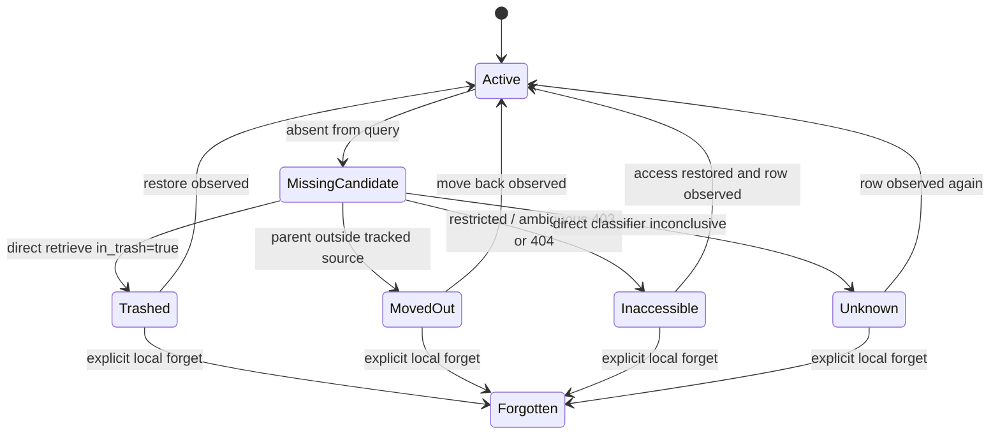

# Planner & Guards Spec

Sub-system slice of [spec.md](../../spec.md). Serves [requirements](./requirements.md).

Requirement trace: PLAN-R01-PLAN-R13, PLAN-T01-PLAN-T02.

This slice specifies the planner, its guard matrix, and delete/move/restore
semantics. The Authority Model table is cross-cutting and lives in the top-level
[spec.md](../../spec.md); this slice references it rather than copying it. The
guard matrix below is the master copy: other slices reference it instead of
redefining guards.

## Planning Flow

```
local events / fs scan       remote observations
          \                  /
           v                v
        projection rebuild / refresh
                  |
                  v
           planner guard matrix
                  |
        +---------+----------+
        |                    |
        v                    v
   conflict events       outbox commands
        |                    |
        v                    v
  user resolution       guarded executor
                             |
                  read -> write -> read -> settle
```

Planning is pure over projections plus fresh observations. Execution performs
effects only after commands are enqueued.

Planner outputs are closed tagged unions:

```ts
type PlanDecision =
  | { readonly _tag: 'AppendEvents'; readonly events: readonly SyncEventPayload[] }
  | { readonly _tag: 'EnqueueCommands'; readonly commands: readonly OutboxCommand[] }
  | { readonly _tag: 'OpenConflict'; readonly conflict: ConflictPayload }
  | {
      readonly _tag: 'BlockedByGuard'
      readonly guard: GuardName
      readonly surface: SurfaceKey
      readonly detail: SafeDiagnostic
    }
```

Disjoint merge is allowed only when all edited surfaces have independent base hashes:

| Local surface                         | Remote surface                | Default decision                                                            |
| ------------------------------------- | ----------------------------- | --------------------------------------------------------------------------- |
| property A                            | property B                    | enqueue both property patches after schema preflight                        |
| property                              | body                          | enqueue property patch and delegate body refresh/push to `PageBodySyncPort` |
| schema rename                         | row value by same property ID | accept rename, preserve value hashes                                        |
| schema type/config affecting property | same property value           | open schema drift conflict                                                  |
| trash/delete                          | any local edit                | open delete-vs-edit conflict                                                |
| body                                  | body                          | delegate to body adapter; persist adapter conflict if returned              |

## Guard Matrix

This is the master copy of the guard matrix. Every guard must appear in the
top-level verification contract with at least one verification level.

| Guard                                | Scenario                                                                       | Behavior                                                                                             | State written                                  |
| ------------------------------------ | ------------------------------------------------------------------------------ | ---------------------------------------------------------------------------------------------------- | ---------------------------------------------- |
| `ApiVersionUnsupported`              | Gateway is configured below `2026-03-11`                                       | Stop requests except compatibility diagnostics                                                       | `CompatibilityChecked` failed                  |
| `ApiVersionCompatibilityMissing`     | Gateway/API version changed without fake and live smoke proof                  | Block mutating commands                                                                              | `CompatibilityChecked` blocked                 |
| `DecodeDriftUnsupported`             | Supported surface contains changed/unknown payload shape                       | Block affected surface only                                                                          | `ConflictDetected` or blocked observation      |
| `CapabilityPreflightFailed`          | Integration lacks read/query/update/schema/trash/restore/parent access         | Treat failures as capability issues, not data facts                                                  | `CompatibilityChecked` failed                  |
| `UnsupportedRemoteShape`             | Exact schema decode fails                                                      | Stop affected sync surface; retain raw-safe diagnostic                                               | `ConflictDetected` or blocked observation      |
| `ComputedPropertyWrite`              | Local intent targets formula/rollup/system property                            | Reject before outbox                                                                                 | `ConflictDetected` when user action is needed  |
| `PropertyValueIncomplete`            | Page retrieve contains truncated/paginated property value                      | Fetch property item pages; block clean hash until complete                                           | blocked observation                            |
| `RelatedDataSourceUnshared`          | Relation/rollup depends on unshared related source                             | Block relation write or mark unavailable                                                             | `ConflictDetected`                             |
| `StaleSurfaceBase`                   | Local command base hash differs from current remote surface                    | Replan if disjoint, otherwise conflict; no write                                                     | `ConflictDetected` or no-op replan             |
| `PageTimestampWakeupOnly`            | `last_edited_time` changed                                                     | Re-read body/properties/schema; do not infer conflict by timestamp precision                         | `RemoteObserved` only                          |
| `SchemaDriftAffectsIntent`           | Pending property edit depends on changed property config                       | Conflict or migration plan                                                                           | `ConflictDetected`                             |
| `DestructiveSchemaMigrationRequired` | Property delete/type conversion/option deletion                                | Require explicit migration command                                                                   | blocked dry-run or migration intent            |
| `OptionDeletionLosesValues`          | Removed select option is used by rows                                          | Block until migration impact accepted                                                                | blocked migration plan                         |
| `BodyLossyRemote`                    | Markdown response truncated or has unknown blocks                              | Block body write; preserve/diagnose                                                                  | `ConflictDetected` from body port              |
| `MarkdownUnknownBlocksAmbiguous`     | Markdown returns unknown block IDs without provable cause                      | Block body write; preserve metadata                                                                  | `ConflictDetected` from body port              |
| `MarkdownSelectionAmbiguous`         | `update_content` target is missing or matches multiple ranges                  | Use safer mode if proven, otherwise conflict                                                         | `ConflictDetected` from body port              |
| `MarkdownWouldDeleteChildren`        | Markdown patch would delete child pages/databases                              | Require explicit destructive-body operation; never auto-enable deletion                              | blocked body command                           |
| `MarkdownSyncedPageUnsupported`      | Public markdown update cannot update synced page                               | Block body write and surface adapter state                                                           | `ConflictDetected` from body port              |
| `BodyAdapterConflict`                | NotionMD reports body merge/push conflict                                      | Persist as datasource conflict projection                                                            | `ConflictDetected`                             |
| `PathClaimCollision`                 | Two pages map to same local path                                               | Conflict; no overwrite                                                                               | `ConflictDetected`                             |
| `QueryAbsenceUnclassified`           | Row missing from datasource query                                              | Direct page retrieve before tombstone                                                                | `RemoteObserved` missing candidate             |
| `PaginationIncomplete`               | Query or page-property pagination stops before terminal page                   | Do not checkpoint completeness or hash clean value                                                   | `QueryScanRecorded` incomplete                 |
| `QueryContractChanged`               | Filter/sort/page size/membership contract changes                              | Start new checkpoint; old absence evidence is invalid                                                | `CompatibilityChecked` or `QueryScanRecorded`  |
| `IncrementalAbsenceNotProof`         | Known row omitted by a high-watermark poll                                     | Keep row projection active; wait for full scan/direct classifier evidence                            | no tombstone event                             |
| `QueryResultCapExceeded`             | Data-source query reaches the 10,000-result cap                                | Fail closed unless a complete partitioned query contract exists                                      | `QueryScanRecorded` capped                     |
| `FilteredAbsenceNotProof`            | Row absent from filtered query/view                                            | Do not classify delete/move unless scoped binding and direct retrieve agree                          | blocked tombstone candidate                    |
| `LinkedDataSourceUnsupported`        | Binding points at public-API-unsupported linked data source                    | Block init/pull with diagnostic                                                                      | `CompatibilityChecked` failed                  |
| `PermissionAmbiguous`                | Known page retrieve returns restricted/ambiguous 403/404                       | Fail closed; no delete/forget                                                                        | `TombstoneClassified` inaccessible/unknown     |
| `DeleteVsEdit`                       | One side edits while the other deletes/trashes                                 | Conflict                                                                                             | `ConflictDetected`                             |
| `RowsDeleteUnsupported`              | `DELETE FROM rows WHERE ...` is attempted                                      | Reject the statement; archive/restore must be explicit `_in_trash` edits and forget remains CLI-only | SQLite statement abort                         |
| `MoveOutNotDelete`                   | Page parent leaves tracked datasource                                          | Mark moved-out; do not trash                                                                         | `TombstoneClassified` moved-out                |
| `UnavailableRelationTarget`          | Relation target inaccessible or missing                                        | Conflict/block relation write                                                                        | `ConflictDetected`                             |
| `ExpiringFileUrl`                    | File value contains signed URL                                                 | Do not store as durable identity                                                                     | sanitized `RemoteObserved`                     |
| `ReadAfterWriteMismatch`             | Fresh read after write does not match desired hash                             | Do not settle as success; retry or conflict                                                          | `CommandAttempted` retry/permanent failure     |
| `AmbiguousCommandOutcome`            | Attempt exists without settlement after crash/cancel                           | Re-read before retry; settle no-op, replan, or conflict                                              | ambiguous outbox state                         |
| `PendingIntentShadowViolation`       | Remote observation would overwrite pending local target state                  | Reject projection mutation; require repair                                                           | `RepairObserved`                               |
| `BodyAdapterNonBodyMutation`         | Body adapter writes row properties/schema/title/trash/icon/cover/page metadata | Reject result unless explicit delegated surface command exists                                       | `ConflictDetected` or blocked adapter result   |
| `FilesystemDeleteAutoTrashBlocked`   | Watch observes local file deletion without trusted explicit policy             | Create delete candidate only; no remote trash command                                                | `LocalIntentAccepted` candidate or diagnostic  |
| `CursorSameBucketIncomplete`         | Poll cycle ends inside same timestamp bucket without a stable boundary         | Keep prior high-water mark and schedule continuation                                                 | `QueryScanRecorded` incomplete                 |
| `OwnMaterializationWriteSuppressed`  | Watch sees filesystem writes produced by current materialization event         | Suppress local edit intent; keep path/object verification                                            | no local intent                                |
| `CompactionUnsafe`                   | Checkpoint compaction requested with pending/leased/ambiguous/open state       | Refuse compaction                                                                                    | blocked maintenance command                    |
| `PathEscapesRoot`                    | Normalized path or symlink traversal leaves `localRoot`                        | Reject scan/materialization and open repair/conflict                                                 | `RepairObserved` or `ConflictDetected`         |
| `LeaseFenceMismatch`                 | Stale daemon tries to settle command                                           | Reject settlement                                                                                    | `CommandAttempted` fenced stale attempt        |
| `OutboxFirstSettlementWins`          | Duplicate command attempts complete                                            | Keep first verified settlement                                                                       | terminal `CommandSettled`                      |
| `CheckpointDigestMismatch`           | Projection digest differs after replay                                         | Stop mutating commands; require repair                                                               | `RepairObserved`                               |
| `StoreMigrationBlocked`              | Store schema is newer/unknown or migration fails                               | Stop store open for writes                                                                           | migration error, no projection mutation        |
| `QueueBackpressureExceeded`          | Daemon queues exceed configured bound                                          | Pause intake and surface stuck work                                                                  | `RepairObserved` or daemon diagnostic          |
| `RawPayloadRetentionUnsafe`          | Raw payload would persist private body/signed URL                              | Redact or reject retention                                                                           | sanitized retention row or blocked raw capture |

SQL row deletion is rejected by `RowsDeleteUnsupported`. Archive/restore use
explicit `_in_trash` edits. `forget` (drop local tracking, no remote effect)
stays a CLI-only operation and is not reachable through SQL. There is no API
path to permanent deletion.

## Delete, Move, And Restore Semantics



Local file deletion creates a delete candidate by default, not a remote-trash
intent. A remote-trash intent may be accepted only when SQLite still owns the
row, the body sidecar proves identity, and either an explicit CLI command
requested trash or the binding policy is `trustedRemoteTrash` with explicit
command approval. Watch mode never auto-applies remote trash from a bare
filesystem delete under the default `candidateOnly` policy. Deleting sidecar
state is repairable projection damage, not remote delete intent.

An explicit `DELETE FROM rows WHERE ...` against the public replica is distinct
from a bare filesystem delete: it is rejected immediately, so SQL delete cannot
mean archive, forget, or permanent removal.

Filtered absence is not a product tombstone candidate. Query scans that are
incomplete, capped, interrupted, filtered, or based on an internal changed query
contract cannot produce product absence candidates.

Direct classifier outcomes:

| Direct retrieve result                        | Tombstone state               | Allowed automatic action                  |
| --------------------------------------------- | ----------------------------- | ----------------------------------------- |
| page exists in tracked data source            | active                        | clear missing candidate                   |
| page exists and `in_trash=true`               | trashed                       | materialize tombstone; allow restore      |
| page exists under different parent            | moved-out                     | preserve local artifacts; no remote trash |
| page exists under another tracked data source | moved-between-tracked-sources | transfer membership by data-source ID     |
| 403/restricted                                | inaccessible                  | fail closed                               |
| ambiguous 404                                 | unknown                       | fail closed                               |
