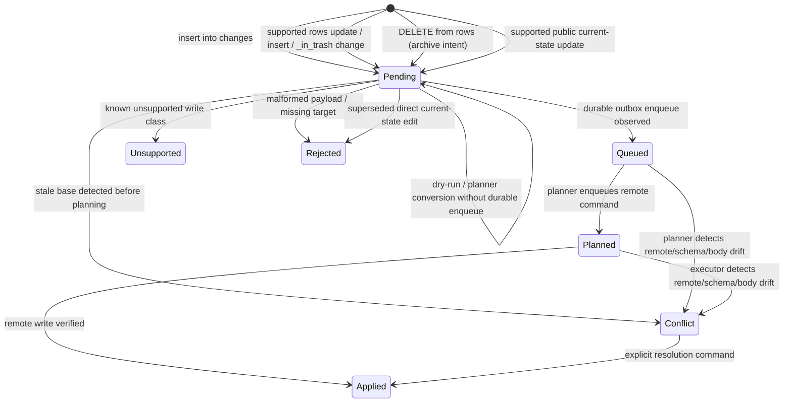

# Replica API Spec

Sub-system slice of [spec.md](../../spec.md). Serves [requirements](./requirements.md).

Requirement trace: REPLICA-R01, REPLICA-R02, REPLICA-R03, REPLICA-R04, REPLICA-R05, REPLICA-R06, REPLICA-R07, REPLICA-R08, REPLICA-R09.

The authoritative user-facing write-support matrix (keyed by SQL operation) lives in [capability-gaps.md](../../capability-gaps.md#by-sql-operation).

## Public SQLite Replica

`<database-id>.sqlite` is the local Notion database replica exposed to users and
automation. By default, one SQLite artifact maps to one Notion database. The
filename is the Notion database ID, not the display name. It is analogous to the
`.nmd` files in `@overeng/notion-md`: local tools operate on this artifact,
while CLI sync reconciles it with Notion.

```text
workspace/
  <database-id>.sqlite
  <another-database-id>.sqlite
```

The public replica has a canonical user schema plus read-only debug surfaces:

| Surface             | Key shape                           | Purpose                                                                                        |
| ------------------- | ----------------------------------- | ---------------------------------------------------------------------------------------------- |
| `rows`              | `(_page_id)` plus local pending IDs | Canonical writable 1:1 data table for the Notion database                                      |
| `schema`            | `(database_id, data_source_id)`     | Read-only view for replica binding, metadata, schema hashes, and sync identity                 |
| `schema_properties` | `(property_id)`                     | Read-only view for property ID/name/type/write-class to `rows` column mapping                  |
| `changes`           | `(change_id)`                       | Public local change requests, planner status, and settlement evidence                          |
| `conflicts`         | `(conflict_id)`                     | Open/resolved conflicts projected for user inspection                                          |
| `sync_status`       | `(database_id)`                     | Replica counts, pending counts, checkpoints, guards, doctor state, read-only migration preview |
| `debug_*`           | view-specific                       | Read-only diagnostics over normalized rows, cells, outbox, hashes                              |

`rows` is the default user-facing table. Columns are generated from the latest
observed Notion data-source schema, ordered as Notion properties first and `_`
system columns last. `schema_json` is not present in `rows`; users inspect
schema through `schema` and `schema_properties`.
`schema_properties` records the stable mapping from each Notion property id to
its current `rows` column, display name, Notion type, ordinal, and write class.
Display names are convenient SQL labels only; property ids remain authoritative
for planning, hashing, conflict detection, and settlement.

`schema` and `schema_properties` are read-only. The replica has no SQL write
path for schema: `ALTER TABLE rows ...` (DDL) is rejected, and there is no
`kind=schema` write intent in the public `changes` table. The file may surface a
read-only migration preview through `sync_status` / `debug_*`, but applying
schema changes is CLI-only. Schema migration semantics, ownership, and the
two-phase plan/apply contract live in
[../schema-migration/spec.md](../schema-migration/spec.md).

Observation uses the live retrieved data-source schema by default. Explicit
schema-property JSON is an advanced fake/debug override; it is not required for
`sync --from-notion`, watch observation, or normal established sync.

`debug_*` views are derived from private `_nds_*` projections. They are
rebuildable diagnostics, not writable surfaces. Notion UI views may appear in
debug inventory, but they are never row membership or deletion authority.

Private `_nds_*` tables store lossless canonical values, scalar helper values,
base/current/local hashes, outbox state, and migration/checkpoint data. They are
not public API. Read visibility is broader than write eligibility: computed,
relation, people, file, and unsupported values remain visible when observed,
while direct `rows` writes are accepted only for modeled writable classes with
complete values. Updating supported scalar/property columns on `rows` is the
ordinary direct local edit path. The replica resolves the row column through
`schema_properties`, converts the SQL value to canonical Notion-shaped JSON,
updates local desired state, and queues a guarded public `changes` row. Remote
writes must be derived from validated Notion-shaped payloads, not from helper
columns alone.

Direct current-state edits are captured with local CDC triggers. `rows` is the
public intent entry surface, `changes` is the public intent ledger, and the
private `_nds_*` event log is the durable local authority the planner converts
into outbox commands. Direct edits use final-state semantics, not replay
semantics: repeated edits for the same cell coalesce to one effective pending
change with the latest desired value, and row lifecycle toggles supersede
earlier pending direct lifecycle changes when the current local row state no
longer matches them. Invalid direct cell payloads are rejected before `rows`,
`debug_*`, `_nds_*`, or `changes` state changes. There is no legacy
local-change compatibility surface in the pre-launch storage contract.

Public schema versions are separate:

| Version                     | Scope                                            |
| --------------------------- | ------------------------------------------------ |
| `replica_api_version`       | Stable generic public tables and intent contract |
| `generated_view_version`    | Rebuildable per-data-source convenience views    |
| `sync_store_schema_version` | Private `_nds_*` event/outbox/projection schema  |

Replica rebuild drops derived public current-state rows/views, replays private
events/projections, and preserves or rehydrates user-visible pending intents and
conflicts. A corrupted public projection may be rebuilt. Corrupted or tampered
private `_nds_*` state fails closed and must not infer remote writes from public
rows alone.

## Write Intent Contract

Users write desired data changes by mutating `rows` or by inserting explicit
rows into `changes`. Local SQL writes never call Notion directly.

```ts
type NotionCellChange = {
  readonly changeId: string
  readonly dataSourceId: DataSourceId
  readonly pageId: PageId
  readonly propertyId: PropertyId
  readonly valueJson: CanonicalPropertyValueJson
  readonly baseHash: Hash | undefined
  readonly status: LocalChangeStatus
}

type NotionRowChange =
  | {
      readonly changeId: string
      readonly kind: 'row_archive' | 'row_restore'
      readonly dataSourceId: DataSourceId
      readonly pageId: PageId
      readonly baseHash: Hash | undefined
    }
  | {
      readonly changeId: string
      readonly kind: 'row_create'
      readonly dataSourceId: DataSourceId
      readonly valueJson: VersionedJson
    }

type NotionBodyChange = {
  readonly changeId: string
  readonly pageId: PageId
  readonly bodyPath: WorkspaceRelativePath | undefined
  readonly localBodyHash: Hash
  readonly localBodyContent: string | undefined
  readonly baseHash: Hash
  readonly status: LocalChangeStatus
}

type NotionMetadataChange = {
  readonly changeId: string
  readonly dataSourceId: DataSourceId
  readonly resourceType: 'data_source' | 'database'
  readonly titlePlainText: string | undefined
  readonly descriptionPlainText: string | undefined
  readonly baseHash: Hash
  readonly status: LocalChangeStatus
}

type NotionConflictResolution = {
  readonly resolutionId: string
  readonly conflictId: SyncEventId
  readonly action:
    | 'choose_remote'
    | 'abandon_local'
    | 'retry_after_refresh'
    | 'choose_local'
    | 'manual_value'
  readonly valueJson: CanonicalPropertyValueJson | undefined
  readonly status: LocalChangeStatus
}
```

Body changes captured from `.nmd` files are first-class local desired state even
when they were not inserted manually into `changes`. Before any remote body
materialization can overwrite a changed `.nmd`, datasource-sync must either
project the body edit into the public intent lifecycle, preserve it as
recoverable conflict material, or reject materialization with a repair/path
diagnostic. A projection rebuild may update private base/remote body pointers,
but it must not make a captured body edit invisible to later scans.

`rows` is the primary writable product API for row data. All ordinary row edit
use cases are in scope for `rows`; explicit `changes` rows exist for advanced
intent surfaces and observability, not as a competing primary row API. Schema is
not a public write surface: `schema`/`schema_properties` are read-only, there is
no `kind=schema` row in the public `changes` table, and `NotionSchemaChange` is
not a public write intent. Schema changes are detected, guarded, and applied
CLI-only through `migrate schema` (see
[../schema-migration/spec.md](../schema-migration/spec.md)). The current
executable subset is scalar/property `UPDATE rows SET ...`, `INSERT INTO rows`
for row creation, archive/restore through `UPDATE rows SET _in_trash = 1/0`,
explicit `changes` equivalents, body pushes that pass body-adapter safety and
content-hash verification, data-source and database title/description metadata
edits verified by post-write metadata hashes, and conflict-resolution choices
routed through the store-backed command surface. `DELETE FROM rows` enqueues a
remote ARCHIVE (trash) intent, identical to `UPDATE rows SET _in_trash = 1`;
remote destructive lifecycle changes are represented as explicit archive/restore
intents. Notion trash is reversible, so DELETE maps to the strongest reversible
remote op rather than failing closed. `forget` (drop local tracking with no
remote effect) stays CLI-only and is not reachable through SQL, because DELETE
now means archive. There is no API path to permanent deletion, so archive is the
maximum destructive effect reachable from the file. `changes`, `conflicts`, and
`sync_status` are public observability surfaces for accepted intent, conflict
state, settlement, guards, and pending work. `_nds_*` remains private
implementation state and is not a user extension API. Data-source metadata CDC
is precise about authority: the live adapter patches the owning database
metadata because the public data-source update shape does not expose top-level
description, then verifies the resulting data-source metadata hash. Database
metadata CDC exposes the database/container authority separately through
private/debug projections and requires `database_id` plus the owning data source
metadata hash for read-after-write settlement. External URL file attachments are
supported through explicit `changes` staging for empty writable `files`
properties; local uploads, signed Notion URLs, replacement, deletion,
preserving existing file arrays, and direct current-state `files` cell edits
require file-upload lifecycle proof before promotion. Direct `people` cell edits
also fail closed before visible mutation until deterministic user identity
projection and full page-property pagination are modeled. Relation writes may
remove, reorder, or add targets only from complete paginated bases; added
targets must already be present in private/debug relation diagnostics for the
same data source and property. Notion UI view inventory is projected read-only
through `debug_*`; Notion view writes through `changes` and unsupported
conflict-resolution actions require their own surface proof before promotion.

Intent lifecycle:



The current replica table stores lifecycle as `pending`, `queued`, `planned`,
`applied`, `conflict`, `unsupported`, or `rejected`. Conversion from the public
replica to planner input must not make a change invisible to later scans.
`queued` is reserved for changes that remain retriable/visible and correspond
to durable planner/outbox progress; dry-run and plain conversion leave valid
changes pending. Unsupported, stale, malformed, and superseded local changes
must not be promoted to `queued` or `planned`.

Dry-run is true no-write for the public replica and private `_nds_*` store. It
may read public `changes` and current private projections, but it must not
settle intents, mutate replica state, append events, enqueue outbox commands,
materialize bodies, or mutate Notion.
