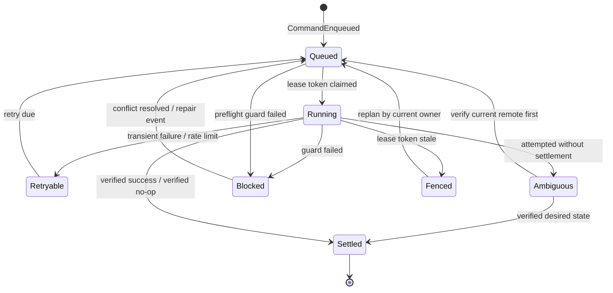

# Sync Orchestration Spec

Sub-system slice of [spec.md](../../spec.md). Serves [requirements](./requirements.md).

Requirement trace: SYNC-R01 (was R23), SYNC-R02 (was R24), XC-R02, XC-R04.

This sub-system owns established reconciliation and the outbox executor: the
deterministic, lease-fenced components that capture local desired state, observe
remote state, plan base/local/remote decisions, and turn committed outbox
commands into verified remote writes. The outbox projection table itself is
defined by the sync-store sub-system; see
[../sync-store/spec.md](../sync-store/spec.md) for the `outbox` projection
contract.

## Established Reconciliation

Established commands (`sync`, `push`, and `sync --watch`) are local-capture-first
to satisfy XC-R04:

```text
capture local desired state
-> observe remote state
-> plan base/local/remote decisions
-> execute verified outbox commands
-> guarded materialization
-> refresh status
```

Local desired state includes public SQLite `rows`/`changes` intents and
NotionMD `.nmd` body observations, including path, page identity, base hash,
local body hash, and local body content or recoverable content reference.
Capturing local desired state must happen before any operation that can
overwrite user-authored local artifacts. Remote observation may refresh private
base/remote projections before planning, but it must not materialize remote
body content into `.nmd` paths or otherwise overwrite local artifacts until
guarded materialization runs after planning.

`sync --from-notion` is the initial adoption exception: it has no established
local desired state for that workspace and remains remote-to-local only. Once a
workspace is established, all sync modes use the local-capture-first invariant.

Guarded materialization may write a remote-observed artifact only when one of
these proofs holds:

| Local target state                                        | Materialization behavior                                      |
| --------------------------------------------------------- | ------------------------------------------------------------- |
| target is unchanged from captured/base state              | materialize remote state                                      |
| target matches this process's own materialization token   | verify/update sidecars without creating a local edit intent   |
| target contains uncaptured or changed local desired state | preserve it and plan push/conflict/repair; do not overwrite   |
| target identity/path claim is ambiguous                   | fail closed with repair/path conflict; do not overwrite       |

The planner decides whether captured local desired state becomes an outbox
command, a conflict, an unsupported change, or a rejected malformed intent. The
materializer only reflects decisions that have already preserved local content
or proven it safe to overwrite.

## Outbox Lifecycle



Outbox commands are deterministic data:

```ts
type OutboxCommand = {
  readonly commandId: CommandId
  readonly commandKey: IdempotencyKey
  readonly rootId: SyncRootId
  readonly intentEventId: EventId
  readonly surface: SurfaceKey
  readonly command:
    | PatchPagePropertiesCommand
    | PatchDataSourceSchemaCommand
    | TrashPageCommand
    | RestorePageCommand
    | BodyPushCommand
  readonly baseHash: Hash
  readonly desiredHash: Hash
  readonly preflight: readonly GuardName[]
}
```

## Executor Sequence

The executor sequence is:

1. claim a queued command with the current lease token,
2. read the current remote surface and schema,
3. run preflight guards against `baseHash`,
4. revalidate the local lease immediately before the remote write,
5. write remotely outside a SQLite transaction,
6. read the remote surface again,
7. append exactly one settlement event if the observed hash equals `desiredHash`.

Steps 2-3 satisfy SYNC-R01: the executor re-reads the current remote surface and
schema and validates `baseHash` before any write that could conflict or destroy
data. Steps 6-7 satisfy SYNC-R02: a successful write is settled only after a
fresh read and canonical hash comparison prove the remote state equals
`desiredHash`.

## Ambiguous Command Handling

If a command has an attempt record without a settlement record, restart marks it
ambiguous before any retry. Ambiguous commands must re-read the current remote
surface and schema first. They settle as `verified no-op` when the observed hash
already equals `desiredHash`, replan when the observed hash proves a disjoint
remote change, or open conflict when the outcome cannot be attributed safely.

If a remote write succeeds and the process crashes before settlement, retrying
the command must settle as `verified no-op` when read-after-write already shows
`desiredHash`. If two attempts race, the first verified settlement event is
terminal and later attempts append `fenced stale attempt` or are ignored by
idempotency.

## Lease Fencing

Lease fencing protects SQLite settlement, not Notion itself. A stale process
cannot settle a command with an old token; if it wrote remotely after losing the
lease, the current owner observes the changed remote hash and replans or opens a
conflict. The lease lifecycle and fencing tokens are owned by the
[watch-daemon sub-system](../watch-daemon/spec.md); the executor only consumes
the current token and refuses to settle under a stale one.
