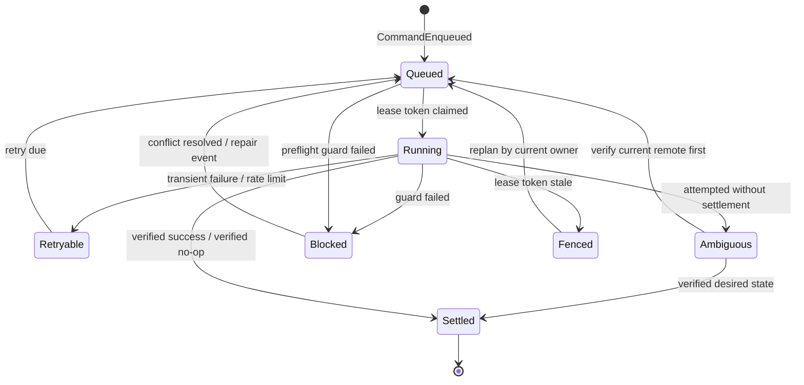

# Sync Store Spec

Sub-system slice of [spec.md](../../spec.md). Serves [requirements](./requirements.md).

Requirement trace: STORE-R01, STORE-R02, STORE-R03, STORE-R04, STORE-R05, STORE-R06, STORE-R07, STORE-R08.

## SQLite Store

The private store is embedded in the same `<database-id>.sqlite` file as the
public replica. All private tables are prefixed `_nds_`; no split store or
alternate storage-layout mode exists.

```
<database-id>.sqlite private store
  _nds_sync_root                 local root binding, settings, store identity
  _nds_sync_event                append-only domain events
  _nds_projection_metadata       replay version, digest, schema version
  _nds_data_source_projection    current observed datasource state
  _nds_schema_projection         property-id keyed schema
  _nds_row_projection            row membership and row lifecycle
  _nds_property_shadow           per-row/property base/current/local hashes
  _nds_body_pointer              NotionMD-managed body state pointers
  _nds_outbox                    pending/attempted/settled remote commands
  _nds_conflict_projection       open/resolved/superseded/ignored conflicts
  _nds_tombstone_projection      trash/move/inaccessible/unknown classifications
  _nds_path_claim                local file path ownership
  _nds_api_contract_projection   Notion API version and compatibility proof
  _nds_capability_projection     integration capability preflight results
  _nds_query_scan_checkpoint     query contract, cursor, completeness, high-water mark
  _nds_page_property_checkpoint  complete property-item pagination state
  _nds_lease                     daemon writer leases and fencing tokens
  _nds_checkpoint                replay compaction and high-water marks
  _nds_raw_payload_retention     opt-in/TTL sanitized payload references
  _nds_migration_history         forward-only store migrations
```

### Event Envelope

```ts
type SyncEventEnvelope = {
  readonly eventId: EventId
  readonly rootId: SyncRootId
  readonly sequence: bigint
  readonly codecVersion: EventCodecVersion
  readonly family: EventFamily
  readonly eventType: string
  readonly idempotencyKey: IdempotencyKey
  readonly surface: SurfaceKey | null
  readonly causedByEventIds: readonly EventId[]
  readonly payloadHash: Hash
  readonly payload: VersionedJson
  readonly observedAt: DateTimeUtc
}
```

Store constraints:

| Constraint                                                           | Purpose                                  |
| -------------------------------------------------------------------- | ---------------------------------------- |
| `UNIQUE(root_id, sequence)`                                          | deterministic replay order               |
| `UNIQUE(root_id, idempotency_key)`                                   | duplicate observation/intent suppression |
| `UNIQUE(root_id, payload_hash, event_type, idempotency_key)`         | crash-safe event retry                   |
| `CHECK(payload.apiVersion = supported_event_version)` at decode time | explicit event evolution                 |

`payload_hash` is computed over canonical encoded payload bytes. Projection digests are computed from `(projector_version, sequence, event_id, payload_hash)` and stored in `projection_metadata`.

Store open hardening:

| Setting               | Required value                                                           |
| --------------------- | ------------------------------------------------------------------------ |
| `PRAGMA journal_mode` | `WAL`                                                                    |
| `PRAGMA foreign_keys` | `ON` before migrations and writes                                        |
| `PRAGMA busy_timeout` | configured non-zero timeout for daemon and CLI writers                   |
| event codec           | explicit `codecVersion`; unknown versions open read-only for diagnostics |
| migration mode        | forward-only; failed migration leaves store closed for writes            |

Checkpoint compaction is forbidden while any outbox command is pending, running, retryable, ambiguous, or leased; while any conflict is open; while any tombstone is unclassified; or while any projection digest mismatch is unresolved.

## Event Families

| Family                 | Examples                                                                                              | Projection effect                              |
| ---------------------- | ----------------------------------------------------------------------------------------------------- | ---------------------------------------------- |
| `RemoteObserved`       | schema observed, row observed, row missing candidate, body pointer observed                           | Updates remote-current projections             |
| `CompatibilityChecked` | API version accepted, capability preflight passed/failed, query contract changed                      | Updates compatibility projections              |
| `QueryScanRecorded`    | page observed, row cursor advanced, property cursor advanced, scan completed, scan capped/interrupted | Updates query checkpoints                      |
| `LocalIntentAccepted`  | property edit, body edit pointer, schema migration intent, local delete intent                        | Creates durable local intent                   |
| `CommandEnqueued`      | patch row, patch schema, trash row, restore row, materialize body                                     | Adds outbox work                               |
| `CommandAttempted`     | request started, retry scheduled, transient failure, permanent failure, fenced stale attempt          | Updates attempt state                          |
| `CommandSettled`       | verified success, verified no-op                                                                      | Advances projections and clears pending intent |
| `ConflictDetected`     | same property, body-body, delete-vs-edit, schema drift, path collision                                | Opens conflict                                 |
| `ConflictResolved`     | choose local, choose remote, manual value, ignore, forget                                             | Appends resolution and follow-up commands      |
| `TombstoneClassified`  | trashed, moved-out, moved-between-tracked-sources, inaccessible, unknown                              | Updates tombstone projection                   |
| `RepairObserved`       | projection drift, orphan object, missing sidecar, stale lease                                         | Drives repair commands                         |
| `StorageMigrated`      | SQLite schema migration, projection rebuild, checkpoint compaction                                    | Records control-plane evolution                |

Events are immutable. Projections are disposable and must be rebuildable. Store migrations may create new projection tables or replay events with a new `projector_version`; they must not rewrite old events.

## Projection Contracts

| Projection                 | Primary key                                      | Derived facts                                                           | Rebuild guard                                                                               |
| -------------------------- | ------------------------------------------------ | ----------------------------------------------------------------------- | ------------------------------------------------------------------------------------------- |
| `schema_projection`        | `(root_id, data_source_id, property_id)`         | current name, type, type config hash, writable/computed class           | digest must ignore display-name-only changes for row values                                 |
| `row_projection`           | `(root_id, page_id)`                             | data-source membership, lifecycle, page parent, last observed timestamp | query absence cannot change lifecycle without tombstone event                               |
| `property_shadow`          | `(root_id, page_id, property_id)`                | last clean base hash, current remote hash, pending local hash           | pending local hash must reference an accepted intent event and survives remote observations |
| `body_pointer`             | `(root_id, page_id)`                             | adapter state ref, base/current hashes, truncation/unknown block flags  | adapter result must be decoded before projection update                                     |
| `outbox`                   | `(root_id, command_id)`                          | command state, attempt count, lease token, settlement event             | settled commands are terminal                                                               |
| `conflict_projection`      | `(root_id, conflict_id)`                         | conflict state and competing surfaces/events                            | resolution must point to a `ConflictResolved` event                                         |
| `tombstone_projection`     | `(root_id, page_id)`                             | missing candidate or direct classifier result                           | candidate expires into repair, not delete                                                   |
| `path_claim`               | `(root_id, relative_path)`                       | owning page, claim reason, release event                                | a path has at most one active owner                                                         |
| `api_contract_projection`  | `(root_id, api_version)`                         | accepted API version, client version, live smoke proof event            | writes blocked when proof is missing                                                        |
| `capability_projection`    | `(root_id, capability)`                          | preflight result, request ID, checked time                              | data failures are facts only after capability passes                                        |
| `query_scan_checkpoint`    | `(root_id, data_source_id, query_contract_hash)` | cursor chain, terminal page, high-water mark, completeness              | incomplete scans cannot classify absence                                                    |
| `page_property_checkpoint` | `(root_id, page_id, property_id)`                | cursor chain, terminal page, completeness, unshared relation state      | incomplete values cannot contribute clean hashes                                            |

Projection rebuild is the test oracle: dropping every projection table and replaying `sync_event` must produce the same projection digest and command eligibility as an incremental run.

Pending local intent shadows remote observations. A `RemoteObserved` event may update `remoteHash`, move the surface into conflict, or prove the pending intent already landed remotely, but it must not overwrite, drop, or mutate the pending local target hash. Pending local target state changes only through `CommandSettled`, `ConflictResolved`, explicit abandonment, or a new accepted local intent that supersedes the prior one.

## Outbox Projection And State Model

The `outbox` projection is the durable record of pending/attempted/settled
remote commands. Network writes execute only from committed outbox commands and
never inside a SQLite transaction. The outbox state model is:



Outbox commands are deterministic data:

```ts
type OutboxCommand = {
  readonly commandId: CommandId
  readonly commandKey: IdempotencyKey
  readonly rootId: SyncRootId
  readonly intentEventId: EventId
  readonly surface: SurfaceKey
  readonly command:
    | PatchPagePropertiesCommand
    | PatchDataSourceSchemaCommand
    | TrashPageCommand
    | RestorePageCommand
    | BodyPushCommand
  readonly baseHash: Hash
  readonly desiredHash: Hash
  readonly preflight: readonly GuardName[]
}
```

The executor read/write/read/settle sequence that drives these state
transitions, including lease fencing, ambiguous-command recovery, and
first-settlement-wins semantics, is specified in
[../sync-orchestration/spec.md](../sync-orchestration/spec.md). Lease fencing
protects SQLite settlement, not Notion itself.
