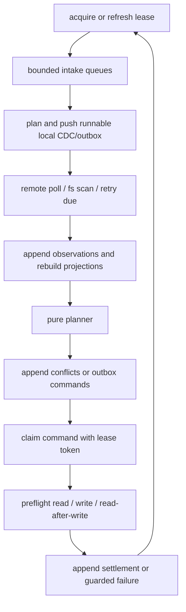

# Watch Daemon Spec

Sub-system slice of [spec.md](../../spec.md). Serves [requirements](./requirements.md).

Requirement trace: DAEMON-R01, DAEMON-R02, DAEMON-R03, DAEMON-R04, DAEMON-R05, DAEMON-R06, DAEMON-R07, DAEMON-R08, DAEMON-R09, DAEMON-R10.

The daemon backs `sync --watch`. It runs the same planner and executor as
one-shot commands; watch mode adds scheduling, coalescing, cancellation, and
lease heartbeats only (DAEMON-R01). The webhook receiver is part of this
sub-system: there is no separate webhook component. The daemon owns one sync
root lease at a time and multiplexes:

- filesystem events,
- scheduled remote polls,
- explicit queued local intents,
- periodic repair scans,
- retry timers for transient outbox failures.

## Polling And Absence

Remote polling uses the latest complete checkpoint high-watermark with an
inclusive overlap window, then dedupes by canonical materialized hashes
(DAEMON-R02). Sorting by `last_edited_time` is an optimization, not a
completeness proof. Incremental polls may update rows that appear in the result,
but omission from an incremental poll is not evidence of deletion, movement, or
permission loss (DAEMON-R08). Query absence emits candidates only after a
complete full-membership query checkpoint (DAEMON-R03); the tombstone classifier
performs direct page retrieval.

## Daemon Loop

## Queue Policy

| Queue               | Bound behavior                                                                                      |
| ------------------- | --------------------------------------------------------------------------------------------------- |
| filesystem events   | coalesce by path, suppress own materialization writes, and rescan root when overflowed              |
| remote observations | coalesce by page ID and keep newest observed timestamp plus hashes                                  |
| outbox retries      | honor Notion retry-after before retry due time                                                      |
| repair work         | low priority; never blocks settlement of already accepted intents unless store integrity is suspect |

The daemon must process local SQLite CDC from public `rows` on
every cycle before or alongside remote polling. If public SQLite CDC or runnable
outbox work exists, the daemon performs a local-first guarded push pass before
the remote pull so outbound latency is not gated by a full table scan
(DAEMON-R07). That pass uses the same executor preflight and read-after-write
settlement as normal sync (see [../sync-orchestration/spec.md](../sync-orchestration/spec.md)).
A daemon that only observes Notion remote drift is incomplete: pending local row
edits, row creates, and lifecycle changes must flow
through the shared planner, private `_nds_*` outbox, verification, and public
observability surfaces. Queues are bounded; the daemon honors Notion rate limits
and surfaces stuck commands (DAEMON-R04).

## Poll Cursor Rules

| Case                                              | Cursor behavior                                                                           |
| ------------------------------------------------- | ----------------------------------------------------------------------------------------- |
| complete cycle with terminal page                 | advance high-water mark to the last fully drained timestamp bucket                        |
| partial cycle, cancellation, crash, or page error | keep prior high-water mark and persist incomplete cursor evidence                         |
| multiple rows share the boundary timestamp        | continue until the whole same-timestamp bucket is drained before advancing                |
| steady-state cycle after complete checkpoint      | reuse persisted high-water mark for an inclusive incremental poll                         |
| row absent from high-watermark poll               | keep existing projection active; do not record query absence or tombstone candidate       |
| scheduled full reconcile                          | run complete full-membership scan before using query absence as tombstone evidence        |
| materialization writes from this process          | tag writes with operation ID and suppress matching filesystem events as local edit intent |

Own-write suppression only suppresses intent creation. The daemon may still
verify materialized files, object references, and path claims. Periodic repair
scans detect missed events, projection drift, orphaned files, unresolved
tombstone candidates, and drift hidden by incremental polling windows
(DAEMON-R06).

If the data-source query payload contains the complete row property values
needed for hashing, observation uses those inline values and avoids per-row page
retrieval, falling back to page retrieval only when inline payloads are missing
or incomplete (DAEMON-R09).

The default Notion limiter is per connection and targets no more than 3 requests
per second. A 429 response with `Retry-After` schedules retries at or after the
returned delay; it does not create a conflict or data fact.

## Webhook Intake

Connection webhooks may enqueue dirty entity hints into the same intake queue.
Webhook hints are at-most-once, aggregated, unordered, and possibly stale, so
they never update projections directly; every hinted entity is re-read through
the gateway before planning (DAEMON-R10). `sync --watch --webhook manual` starts
a local receiver and reports its callback URL for externally managed relays.
`sync --watch --webhook tailscale` starts the same receiver and attempts to
expose it through Tailscale Funnel, degrading back to polling unless
`--webhook-required` is set. The receiver enqueues durable SQLite signals and
wakes the daemon after successful enqueue. Workers webhooks receive
external-service events into a Notion Worker and are not a Notion workspace
change stream.

## Default Intervals

| Mode         | Poll interval | Repair scan | Overlap           |
| ------------ | ------------- | ----------- | ----------------- |
| Development  | 30 seconds    | 10 minutes  | 5 minutes minimum |
| Normal       | 2 minutes     | 30 minutes  | 5 minutes minimum |
| Low priority | 5-15 minutes  | 60 minutes  | 5 minutes minimum |

## Lease Tokens

Lease tokens are monotonically increasing per `sync_root`. Only one logical
writer may settle commands for a sync root at a time; stale leases are fenced
(DAEMON-R05). Heartbeats extend only the current token. A process with an expired
token may finish in-flight network I/O, but it cannot append settlement events.
The executor that consumes these tokens lives in the
[sync-orchestration sub-system](../sync-orchestration/spec.md).
