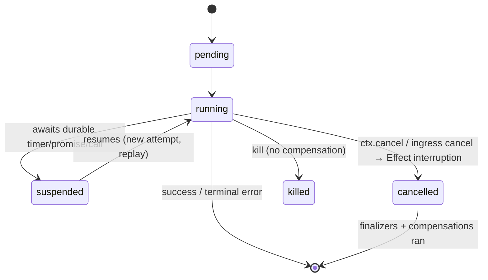

# Cancellation and lifecycle

[← Handbook index](./README.md)

When an invocation is cancelled (via `Restate.cancel`, ingress, or the admin API),
the cancellation surfaces inside the handler as an Effect **interruption** at the
next durable await point. Ordinary Effect finalizers run before the attempt
unwinds — `acquireRelease` releases, `onInterrupt` fires, saga compensations run. The
boundary then maps the interruption to a `CancelledError`: neither a domain failure
nor a defect, and **not retried**. This is verified end-to-end by
[`src/cancellation.integration.test.ts`](../../src/cancellation.integration.test.ts);
the example is [`examples/10-cancellation.ts`](../../examples/10-cancellation.ts).

```ts
import { Effect } from 'effect'
import { Restate } from '@overeng/restate-effect'

const body = Effect.gen(function* () {
  yield* Effect.acquireRelease(
    acquireResource,
    () => releaseResource, // runs on success, error, OR cancellation
  )
  yield* Restate.sleep(60_000, 'long-wait') // cancel interrupts here
}).pipe(Effect.scoped)
```

## The lifecycle

An invocation moves through server-owned states; the binding surfaces the
cancel/interrupt edges into Effect.



- **`cancelled`**: a cooperative cancel → Effect interruption at the next await
  point; `onInterrupt` / `acquireRelease` finalizers and saga compensations run.
  `CancelledError extends TerminalError`. `explicitCancellation: true` opts a service
  into manual propagation.
- **`killed`**: a hard kill — compensations do **not** run.
- **`Request.attemptCompletedSignal`** (an `AbortSignal`) fires per attempt for
  attempt-scoped cleanup (e.g. releasing a DB handle). Because the same logical
  invocation may get a *new* attempt later, attempt-scoped cleanup must be
  idempotent.

The binding surfaces `Restate.cancel` (cancel another invocation) and
`Restate.onCancellation` (observe this invocation's cancellation, under
`explicitCancellation`); it does **not** own the state machine — `restate-server`
does.

```ts
// Cancel ANOTHER invocation cooperatively (the target surfaces an interruption
// so its finalizers run). Requires `RestateContext` — call it from a handler.
export const cancelOther = (invocationId: string) => Restate.cancel(invocationId)
```

## Sagas and compensation

This interruption mechanism is what a first-class saga helper will be built on.
Today you express compensations by hand with `Restate.run` + Effect finalizers, and
each compensation must itself be a durable step (a `Restate.run`) so it survives
replay. See [the error boundary](./schema-and-errors.md#observing-a-durable-steps-outcome-sagas)
for `Restate.runExit`, the observe-and-compensate building block. The first-class
`withCompensation` combinator is deferred (see [Verification + migration](./verification.md)).

## Graceful shutdown is the same mechanism

The endpoint itself is a scoped Layer: under `serve` + `NodeRuntime.runMain`, SIGTERM
interrupts the fiber, closing the HTTP/2 server and running every scoped application
finalizer in one atomic shutdown path. An in-flight handler is interrupted at its
next durable await point, exactly as a cancellation. See [The endpoint](./endpoint.md).

## See also

- [Determinism](./determinism.md) — durable await points (where interruption surfaces).
- [The endpoint and serving](./endpoint.md) — the shutdown path.
- [Schema I/O and the typed error boundary](./schema-and-errors.md) — `runExit` for compensation.
