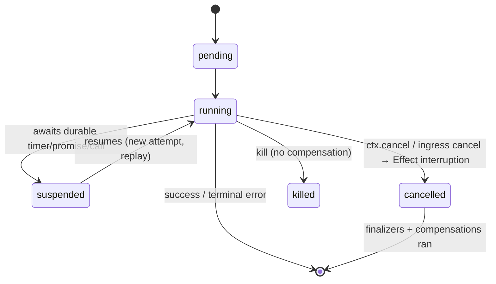

# Spec: restate-effect

This document specifies how `@overeng/restate-effect` realizes its constraints.
It builds on [requirements.md](./requirements.md). Terms are in
[glossary.md](./glossary.md); the hard-to-reverse rationale is in
[decisions/](./decisions/), cited by relative path. Rationale is not repeated
inline.

## Status

Draft. The POC (commit `61c8d8cf`) proved the core pillars — Schema serde,
per-invocation runtime boundary, durable `ctx.run`/`ctx.sleep`, the endpoint
scoped Layer, and tagged-error → `TerminalError` mapping — using a combined
`RestateService.make`. This spec describes the TARGET design, in which decision
[0010](./decisions/0010-separated-contract-impl.md) supersedes the combined
`make` with separated `contract` + `implement`. Sections note where the POC
differs.

## Scope

Defines: the contract/implement authoring API for all three constructs; the
per-invocation Effect runtime boundary; the typed capability-marker context
model; the Schema↔Restate serde; the error boundary and typed ingress decode;
the determinism layer (journaled Clock/Random + explicit durable waits) and lint;
deterministic concurrency combinators; cancellation ↔ interruption and the
invocation lifecycle; the Schema annotation namespace; retry surfacing; the
endpoint Layer and `serve`; the ingress (incl. idempotency / attach / output /
awakeable resolution) and in-handler typed clients; the OTel bridge; deployment
evolution; and the testing harness.

Does not define: the Restate engine semantics themselves (see
[glossary.md](./glossary.md) and Restate's own docs); the deferred features
listed under [Deferred](#deferred-designed-for-later).

## Architecture

```
                         author time                           run time
  ┌───────────────────────────────────────┐     ┌──────────────────────────────────┐
  │ contract(name, { handler: {            │     │  restate-server (Journal, State, │
  │   input, success, error, state? } })   │     │  Replay, retries, timers)        │
  │            │                           │     └───────────────┬──────────────────┘
  │            ├──► typed ingress client   │          h2c protocol│ (discovery + invoke)
  │            └──► in-handler clients      │                     ▼
  │ implement(contract, { handler: eff })  │     ┌──────────────────────────────────┐
  │            │                           │     │ endpoint Layer (scoped h2c serve)│
  │            ▼                           │     │   materialize(impl, runtime)     │
  │     server-side Layer ─────────────────┼────►│     per-invocation boundary:     │
  └───────────────────────────────────────┘     │       decode → provide ctx +     │
                                                 │       capability markers + det.  │
   shared AppLayer (clients, config) ───────────►│       layer → run Effect →       │
   built once → Runtime<R>                       │       encode | toTerminal        │
                                                 └──────────────────────────────────┘
```

Two artifacts per service: a **contract** (shareable, client-side, no server
deps; satisfies R09) and an **implementation** (server-side Layer). The endpoint
materializes implementations against a shared runtime and runs each invocation
through one boundary (R30).

Module layout (subpath exports):

```
.            core: constructs, combinators, serde, error boundary, endpoint, clients
./otel       OpenTelemetry bridge (opt-in deps)          (R03, R23–R25)   PLANNED
./testing    Docker-free native-server harness Layer     (R26–R28d)       PLANNED
```

`./otel` and `./testing` are PLANNED subpath exports: the modules do not yet
exist, so the `package.json` exports declaration is added together with the
modules (declaring an export for a non-existent module breaks the build). Until
then `package.json` exposes only `.`.

---

## 1. Authoring API: contract and implement

Traces: R07, R09, R10. See
[decisions/0010](./decisions/0010-separated-contract-impl.md),
[decisions/0008](./decisions/0008-typed-client-inference.md).

A construct is authored in two parts. `contract` produces a typed, shareable
artifact carrying handler names and their I/O/error Schemas in its TYPE
(mirroring Restate's phantom `ServiceDefinition<P, M>`); `implement` binds each
handler name to an Effect and produces the server-side Layer.

### 1.1 Services (stateless)

```ts
const Greeter = RestateService.contract('greeter', {
  greet: { input: GreetInput, success: GreetSuccess, error: EmptyName },
})

const GreeterLive = RestateService.implement(Greeter, {
  greet: ({ name }) =>
    Effect.gen(function* () {
      if (name === '') return yield* new EmptyName({})
      const prefix = (yield* Greeting).prefix
      const id = yield* Restate.run(
        'gen-id',
        Effect.sync(() => crypto.randomUUID()),
      )
      return { message: `${prefix} ${name}`, id }
    }),
})
// GreeterLive : Layer<RestateImpl<"greeter">, never, Greeting>
```

The handler Effect is `Effect<Success, Error, R | <capabilities>>`. `R` is
satisfied from the shared application Layer; capabilities (section 3) are
provided per invocation. `error` is the only thing the `E` channel may carry
(R11). The id is generated with `crypto.randomUUID()` INSIDE `Restate.run`, where
the call is journaled once and replays verbatim (section 6.3); generated OUTSIDE a
`run`, an id would instead use the journaled `Random` (R20).

For the single-package case, `RestateService.define(name, specs, impl)` combines
`contract` + `implement` in one expression (R36); the separable `contract`
artifact is still available for cross-package clients.

### 1.2 Virtual Objects (keyed, typed State)

```ts
const Cart = RestateObject.contract('cart', {
  state: { items: Schema.Array(Item), total: Schema.Number }, // typed State (R06)
  handlers: {
    add: { input: Item, success: Schema.Void }, // exclusive (default)
    total: { input: Schema.Void, success: Schema.Number, shared: true }, // read-only
  },
})

const CartLive = RestateObject.implement(Cart, {
  add: (item) =>
    Effect.gen(function* () {
      const items = (yield* State.get('items')) ?? []
      yield* State.set('items', [...items, item]) // needs StateWrite (R04)
    }),
  total: () => State.get('total').pipe(Effect.map((t) => t ?? 0)), // StateRead only
})
```

`add` is exclusive (gets `StateWrite` + `StateRead` + `ObjectKey`); `total` is
`shared: true` (gets `StateRead` + `ObjectKey` only). `State.set` in `total`
does not typecheck (R04, R05).

### 1.3 Workflows (one `run`, durable promises)

```ts
const Onboard = RestateWorkflow.contract('onboard', {
  state: { status: Schema.Literal('pending', 'approved', 'rejected') },
  payload: { input: OnboardInput, success: Schema.Void, error: OnboardError },
  signals: { approve: { input: Approval } }, // write-only shared handlers
  queries: { status: { success: Schema.String } }, // read-only shared handlers
})

const OnboardLive = RestateWorkflow.implement(Onboard, {
  run: (input) =>
    Effect.gen(function* () {
      yield* State.set('status', 'pending') // StateWrite + DurablePromise + …
      const decision = yield* Restate.race([
        DurablePromise.get<Approval>('approved').descriptor, // descriptor, issued in order
        Restate.sleep('7 days').descriptor,
      ]).pipe(Effect.map(Option.fromNullable)) // map the RESULT, not the branch
      yield* State.set('status', Option.isSome(decision) ? 'approved' : 'rejected')
    }),
  approve: (a) => DurablePromise.resolve('approved', a), // signal (shared, write)
  status: () => State.get('status'), // query (shared, read)
})
```

The `run` handler is provided `{ StateRead, StateWrite, DurablePromise,
ObjectKey }` directly (no composite `WorkflowScope` marker — see
[decisions/0002](./decisions/0002-typed-capability-contexts.md)); a `signal` is a
shared write handler and a `query` is a shared read handler.
`DurablePromise.resolve` outside a workflow handler does not typecheck (R04).
Durable promises support `get` / `resolve` / `reject` / `peek`; a `reject`
drives the `'rejected'` state observable via the `status` query (R34). The race
maps its RESULT (not a branch) after a single await (R19,
[decisions/0005](./decisions/0005-deterministic-concurrency.md)).

### 1.4 Construct selection

| Construct      | Key             | State          | Concurrency                                     |
| -------------- | --------------- | -------------- | ----------------------------------------------- |
| Service        | none            | none           | unbounded                                       |
| Virtual Object | per key         | typed, durable | exclusive serialized per key; shared concurrent |
| Workflow       | per workflow ID | typed, durable | one `run` exactly-once; signals concurrent      |

---

## 2. Per-invocation runtime boundary

Traces: R30, R07, R12, R13. POC reference: `Endpoint.materialize`,
`Endpoint.toTerminal`.

The shared application runtime is built once from the application Layer
(`Effect.runtime<R>()` captured at endpoint acquisition). Each SDK handler call
runs one boundary:

```
SDK calls handler(ctx, raw)
  1. decode      : effectSerde(input, 'ingress').deserialize(raw)  — TerminalError(400) on invalid (R16)
  2. provide     : RestateContext = ctx
                 + capability markers for this construct/kind  (R05)
                 + determinism layer (Clock/Random + frozen base) (R17)
                 + attempt-completed signal → interruption      (R31)
                 + (./otel) inbound span-context bridge          (R23)
  3. run         : Runtime.runPromiseExit(runtime)(handlerEffect)
  4a. Success    : effectSerde(success).encode(value) → return
  4b. Failure    : toTerminal(cause, errorSchema)               (R12, R13, R15, R31)
```

`toTerminal` maps the Effect `Cause`:

- A typed failure matching the declared `error` Schema → `TerminalError`. The
  encoded error AND its `_tag` go in the `message` BODY (the only channel an
  ingress caller's `responseText` can read); `errorCode` is per-error, derived
  from the error's `terminal`/`retryable` annotation (default 500); `_tag` is
  ALSO mirrored into `metadata` best-effort for server-side consumers (server
  ≥1.6). No retry, propagates to caller (R12,
  [decisions/0011](./decisions/0011-restate-schema-annotations.md)).
- A `retryable`-annotated domain error (or `Restate.retryable`) → non-terminal
  throw → Restate retries.
- A Restate suspension (`isSuspendedError`) → re-thrown as-is, never terminalized
  (R15).
- An Effect INTERRUPTION (from a Restate cancellation bridged in step 2) → NOT
  terminalized and NOT blindly retried; finalizers/compensations have already run
  at the interruption point (R31, section 5a).
- Any other defect → squashed cause re-thrown so the SDK retries (R13).

The per-invocation `ctx` and capability markers are provided per call and never
placed in the long-lived application Layer (R30). The CONTRACT carries its typed
handler map in a phantom type param (preserved on the public surface); only the
internal `materialize` boundary widens to `any` (invisible to users) — it does
NOT erase the contract's public type (see
[decisions/0008](./decisions/0008-typed-client-inference.md)).

`materialize` / `implement` take the application `R` (`AppR`) as an EXPLICIT type
param (from the `Runtime<AppR>` they run against), NEVER inferred from the handler
bodies — else the union over per-handler residual `R` over-infers and the residual
capability `R` fails to collapse. With `AppR` explicit, each handler's residual is
exactly its capability markers, which per-kind `provideService` discharges
(VALIDATED, DQ3; see [decisions/0002](./decisions/0002-typed-capability-contexts.md)).

---

## 3. Typed capability-marker context model

Traces: R04, R05, R06. See
[decisions/0002](./decisions/0002-typed-capability-contexts.md).

Restate gates operations through a nominal context hierarchy; the binding mirrors
it as capability-marker services in the Effect `R` channel rather than one
untyped context.

Markers are FLAT and INDEPENDENT — there is no composite `WorkflowScope`. Effect
`R` is intersection semantics: a combinator requiring `StateRead` is only
satisfied by `StateRead` itself, never by an umbrella marker that "contains" it.
The `run` boundary therefore provides the concrete set directly.

```
RestateContext (Tag → raw restate.Context)   always provided
   markers provided per construct / handler kind (flat, independent):
   ┌─────────────────────┬──────────────────────────────────────────────────┐
   │ service handler     │ (RestateContext)                                 │
   │ object exclusive    │ + ObjectKey + StateRead + StateWrite             │
   │ object shared       │ + ObjectKey + StateRead                          │
   │ workflow run        │ + ObjectKey + StateRead + StateWrite + DurablePromise │
   │ workflow shared     │ + ObjectKey + StateRead + DurablePromise         │
   └─────────────────────┴──────────────────────────────────────────────────┘
```

Each durable combinator carries the capability it needs in `R`:

| Combinator                                     | Requires         | Backed by                                  |
| ---------------------------------------------- | ---------------- | ------------------------------------------ |
| `Restate.run`, `Restate.sleep`                 | `RestateContext` | `ctx.run` / `ctx.sleep`                    |
| `State.get`, `State.stateKeys`                 | `StateRead`      | `ctx.get` / `ctx.stateKeys`                |
| `State.set`, `State.clear`                     | `StateWrite`     | `ctx.set` / `ctx.clear`                    |
| `Awakeable.make`                               | `RestateContext` | `ctx.awakeable`                            |
| `Awakeable.resolve` / `.reject`                | `RestateContext` | `ctx.resolveAwakeable` / `rejectAwakeable` |
| `DurablePromise.get`/`resolve`/`reject`/`peek` | `DurablePromise` | `ctx.promise(name).*`                      |
| `ctx.key` accessor                             | `ObjectKey`      | `ctx.key`                                  |

Calling `State.set` (requires `StateWrite`) in a shared handler (provides only
`StateRead`) is a compile error (R04). State combinators are key- and
value-typed against the contract's `state` schema (R06). `materialize` provides
exactly the markers legal for the construct and handler kind (R05).

`Restate.run` SCRUBS the durable capabilities from its inner effect's `R`
(`Exclude<R, RestateContext | StateRead | StateWrite | DurablePromise |
ObjectKey>`), so a nested `ctx.*` / `State.get` / `Restate.sleep` inside a `run`
closure is a COMPILE error — mirroring Restate's "no nested `ctx.*` inside `run`"
rule.

> `Context.Tag` does not model inheritance, so markers are independent services,
> not a subtype lattice — this is why the hierarchy is expressed as a set of
> provided markers per handler kind, and why a composite `WorkflowScope` marker
> would not discharge the individual `StateRead`/`StateWrite`/… requirements.

> **VALIDATED (DQ3):** discharging the right markers per handler over a
> HETEROGENEOUS `implement` record (exclusive + shared in one call) COMPILES
> against real `effect` + `restate-sdk` types — a `State.set` in a shared handler
> is a handler-LOCAL error (not a whole-record error, not erased to `any`), with
> per-kind `provideService` discharging each handler's residual `R` to the app
> `R`. Flat markers are kept; the distinct-context-Tags fallback also compiles but
> is strictly worse (intersection `R` forces a `getExclusive`/`getShared` split)
> and is not needed. Requires the explicit-app-`R` discipline (section 2).

---

## 4. Serde: Effect Schema ↔ Restate `Serde`

Traces: R07, R08, R16. POC reference: `Serde.ts` (proven, 6/6 tests).

`effectSerde(schema, slot)` bridges an Effect `Schema<A, I>` to a Restate
`Serde<A>`. `slot` is `'ingress'` for ingress/handler INPUT (a caller-facing
slot) or `'internal'` for a State value, `ctx.run` result, or awakeable /
durable-promise payload:

```ts
effectSerde(schema, slot) = {
  contentType: schema |> Restate.serde annotation ?? 'application/json',  // R08, 0011
  jsonSchema:  schema |> Restate.serde annotation ?? JSONSchema.make(schema),
  serialize:   (a) => encode(JSON.stringify(Schema.encodeSync(schema)(a))),
  deserialize: (b) => Schema.decodeUnknownSync(schema)(JSON.parse(decode(b))),
}
```

One `effectSerde` governs every Restate-managed slot of that type — handler I/O,
State, `ctx.run` results, awakeable payloads, durable promises, ingress (A03) —
but a `ParseError` is classified by SLOT (R16):

- `slot === 'ingress'` → `TerminalError(400)`: a malformed input is a
  deterministic bad request; retrying cannot help.
- `slot === 'internal'` → DEFECT / retry: a decode failure on an internal slot is
  corrupt-journal infrastructure (the bytes were written by a previous attempt or
  another handler), so a 400 to the current caller would be wrong. It propagates
  as a defect Restate retries (R13).

An already-terminal nested error is not double-wrapped. Per-slot serdes are built
ONCE at contract/`materialize` time and memoized, not rebuilt per durable op.

The `Restate.serde` annotation (when present on the value schema) overrides the
default `application/json` content type and `JSONSchema.make` (see
[decisions/0011](./decisions/0011-restate-schema-annotations.md)). A
`sensitive`/`redacted` annotation is applied here as a field-level Schema
TRANSFORM (encrypt-at-encode / decrypt-at-decode), read once on the pre-transform
property signatures — NOT a whole-value codec (which has no field structure).

> `serialize`/`deserialize` are synchronous, so the schema must produce a sync
> validate (true for non-effectful schemas). Effectful/async transforms break the
> sync serde contract and are unsupported.

`@restatedev/restate-sdk-core`'s `serde.schema(Schema.standardSchemaV1(...))`
(Standard Schema) is a viable alternative seam, but the custom serde is used for:
slot-aware error classification (400 only for ingress input, not internal slots);
content-type control via the `Restate.serde` annotation; and no async-validate
ambiguity (the sync contract is explicit). The 400 is not the only reason.

---

## 5. Error boundary

Traces: R11–R16. See
[decisions/0003](./decisions/0003-error-boundary-model.md). POC reference:
`Endpoint.toTerminal`, `RestateError.ts`.

```
Effect outcome                                  Restate outcome
──────────────────────────────────────────────────────────────────────────
success                              → encode  → return value
failure ∈ declared error Schema,     → encode  → TerminalError(code,
  terminal-annotated (default)                    body = {_tag, …fields})  no retry
  · code from terminal/retryable annotation (default 500); _tag also in metadata
failure ∈ declared error Schema,     → throw   → RetryableError           retries
  retryable-annotated  (retryAfter?)
Restate.retryable(eff, {retryAfter}) → throw   → RetryableError           retries
defect (incl. durable-combinator     → throw   → normal error             retries
  infra failures, orDie by default)
interrupt (Restate cancellation)     → (finalizers ran) → not terminal, not retried
suspension (isSuspendedError)        → rethrow  → (not a failure)          resumes
```

- The handler `E` channel carries only declared business errors (R11). The
  binding's own bridge failures (`Restate.run`/`sleep`/serde/endpoint/ingress)
  are a single tagged `RestateError` (`reason` discriminator), defects by default
  (`orDie`), so they leave the domain channel and Restate retries them (R13).
- The encoded error AND its `_tag` travel in the `TerminalError` `message` BODY —
  `TerminalError(message, options)` has no separate body channel, and an ingress
  caller only sees `status` + `responseText` (the message), so `metadata` is
  invisible to ingress. `metadata._tag` is a best-effort extra for server-side
  consumers only (server ≥1.6). The errorCode is per-error (404/409/… expressible)
  via the error's `terminal`/`retryable` annotation
  ([decisions/0011](./decisions/0011-restate-schema-annotations.md)).
- Observing a durable-combinator failure for compensation is opt-in: a handler
  may `catchTag('RestateError', …)` instead of letting it die.
- The ingress client's decode helper reverses the transport: it
  `JSON.parse`s the `responseText` (the message body) and re-`Schema.decode`s it
  back into the original tagged error, so callers `catchTag` typed errors (R14,
  section 9.1).

### 5a. Cancellation ↔ interruption

A Restate cancellation surfaces as an Effect INTERRUPTION at the next await point,
so `onInterrupt` / `acquireRelease` finalizers and saga compensations run before
the attempt unwinds (R31, sections 12 and 15). The boundary does NOT terminalize an
interruption and does NOT blindly retry it — an interruption is neither a domain
failure nor a defect. The attempt's `Request.attemptCompletedSignal`
(`AbortSignal`) is bridged to attempt-scoped finalization (e.g. releasing a DB
handle), with the caveat that the same logical invocation may get a NEW attempt
later, so attempt-scoped cleanup must be idempotent. `CancelledError extends
TerminalError`; `explicitCancellation` (R35) opts a service into manual
cancellation propagation. See the invocation-lifecycle section.

---

## 6. Determinism layer

Traces: R17–R20. See [decisions/0004](./decisions/0004-determinism-layer.md),
[decisions/0005](./decisions/0005-deterministic-concurrency.md). POC reference:
`RestateContext.run` / `.sleep`.

### 6.1 Clock / Random + explicit durable waits

The boundary (section 2, step 2) provides journaled time/random over the handler
runtime — but durable waits are EXPLICIT, not a transparent `Clock.sleep` remap:

| Effect read                       | Backed by               | Effect                                                                   |
| --------------------------------- | ----------------------- | ------------------------------------------------------------------------ |
| `Clock.currentTimeMillis` (async) | `ctx.date`              | reads journaled time                                                     |
| `Clock.unsafeCurrentTime*` (sync) | per-attempt frozen base | seeded once from `ctx.date.now()` at entry; does not advance mid-attempt |
| `Random`                          | `ctx.rand`              | seeded, journaled (`ctx.rand.random` / `uuidv4`)                         |

`Clock.unsafeCurrentTimeMillis` / `unsafeCurrentTimeNanos` are synchronous and
cannot call the async `ctx.date`, so they read a per-attempt frozen monotonic
base seeded once at handler entry. Time not advancing mid-attempt is the
deterministically-correct behavior: a replayed attempt must observe the same time
(R17).

Durable waits are EXPLICIT combinators — the binding does NOT remap `Clock.sleep`
to `ctx.sleep` (T02, R18):

| Combinator        | Backed by                  | Use                             |
| ----------------- | -------------------------- | ------------------------------- |
| `Restate.sleep`   | `ctx.sleep`                | durable timer                   |
| `Restate.timeout` | `RestatePromise.orTimeout` | durable race against a deadline |
| `Restate.race`    | `RestatePromise.race`      | durable race of descriptors     |

A bare in-handler `Effect.sleep` stays non-durable (pure in-handler timing only).
Remapping `Clock.sleep` was rejected because `Effect.timeout` is internally a race
against `Clock.sleep` + interruption — it would suspend/interleave
nondeterministically — and because library/AppLayer sleeps would silently journal
durable timers ([decisions/0004](./decisions/0004-determinism-layer.md)).

### 6.2 Deterministic concurrency

Parallel durable operations must journal in source order or replay diverges.

```
sequential (Effect.gen)         : safe, no special handling
pure in-handler concurrency     : allowed (Effect.all over non-durable effects)
durable concurrency             : Restate.all / Restate.race / Restate.any  (R19)
raw fiber over durable ops      : guarded / lint-flagged
```

`Restate.all` / `race` / `any` take durable-op DESCRIPTORS, not opaque Effects:

```
Restate.all([descriptorA, descriptorB, …])
  1. issue descriptors SYNCHRONOUSLY in array order → RestatePromise[]   (fixes journal order)
  2. RestatePromise.all(promises)                    → one RestatePromise
  3. Effect.tryPromise(() => awaitOnce(combined)).pipe(Effect.map(...))   (await exactly once, map after)
```

A descriptor is a tagged value per durable op (`run`, `call`, `sleep`,
`awakeable`, `promiseGet`, …) carrying what is needed to issue it. This is
deliberately NOT `Effect.all` over `[Effect.tryPromise(ctx.run…), …]`: that path
never calls `RestatePromise.all`, and Effect's own thunk-scheduling — not the
source order — would decide the journal order. Each `RestatePromise` is awaited
EXACTLY ONCE; transforms apply via `.map` to the RESULT after awaiting, never
`.then`-chained pre-await (the SDK overloads `.then` to detect suspension points).
Post-combinator mapping applies to the result, not the branches
([decisions/0005](./decisions/0005-deterministic-concurrency.md)).

CONFIRMED (DQ2) against the real SDK: `RestatePromise.all`/`race`/`any` take a
`readonly RestatePromise<unknown>[]` backed by a leaf/descriptor model, and `.then`
is the SDK's progress/suspension seam (hence the `.map`-not-`.then` invariant); the
descriptor type shape rejects an arbitrary `Effect[]` and recovers a precise
tuple/union.

### 6.3 Nondeterminism lint

An oxlint rule flags raw nondeterminism in handler bodies — `Date.now()`,
`new Date()`, `Math.random()`, `crypto.randomUUID()`, and un-journaled I/O —
OUTSIDE `Restate.run` and the journaled Clock/Random, as an advisory backstop;
the journaled layer + explicit combinators are the primary guarantee (R20).
INSIDE a `Restate.run` closure nondeterminism is fine: the `run` result is
journaled once, so a `crypto.randomUUID()` or the journaled `Random` is recorded on
the first real execution and replayed verbatim. (`ctx.rand` inside `ctx.run` is not
SDK-enforced in restate-sdk 1.14.5 — the guard is a no-op — and is harmless anyway,
being journaled-seeded; the lint keeps nondeterminism inside `run` or the journaled
sources, it does not police the inside of a `run` closure.)

---

## 7. Retry surfacing

Traces: R21, R22. See [decisions/0006](./decisions/0006-restate-owns-retries.md).

Durable retries are Restate's. The binding never wraps a durable operation in
`Effect.retry` / `Effect.repeat` (R21). Restate's controls are surfaced as typed
options:

- `retryPolicy` on service/handler builders: `maxAttempts`, `initialInterval`,
  `maxInterval`, `exponentiationFactor`, `onMaxAttempts: 'pause' | 'kill'`.
- `RunOptions` on `Restate.run`: per-step `maxRetryAttempts`, `maxRetryDuration`,
  intervals, factor; on giving up, `ctx.run` converts to a terminal failure.
- `Restate.retryable(effect, { retryAfter? })` / a `RetryableError` as the
  explicit retryable signal (R22).

`Effect.retry` / `Schedule` remain available for pure, non-durable computation
only (lint/doc enforced).

The `name` arg of `Restate.run` is load-bearing for trace identity and journal
labeling; duplicate names are legal but trace-confusing, so the binding should
encourage distinct names per durable step.

Service/handler option surfacing (R35): `enableLazyState`, `journalRetention`,
`idempotencyRetention`, `inactivityTimeout`, `abortTimeout`, `ingressPrivate`,
`workflowRetention`, and `explicitCancellation` are exposed as typed options on
the contract/builder. `journalRetention` / `idempotencyRetention` /
`workflowRetention` may also derive from a `Restate.retention` annotation
([decisions/0011](./decisions/0011-restate-schema-annotations.md)).

---

## 8. Endpoint and serving

Traces: R29, R30. POC reference: `Endpoint.layer` / `Endpoint.serve`.

The endpoint is a scoped `Layer`. Acquisition captures the shared runtime,
materializes each implementation, builds the h2c (Node HTTP/2 cleartext) server,
and starts listening; the finalizer closes the server (R29).

Three distinct ports are in play; do not conflate them:

| Port             | Owner                 | Default | Role                                       |
| ---------------- | --------------------- | ------- | ------------------------------------------ |
| ingress          | `restate-server`      | 8080    | external entry point (callers → server)    |
| admin            | `restate-server`      | 9070    | health, deployment registration, State API |
| handler ENDPOINT | this binding's server | 9080    | discovery + invoke (server → handlers)     |

The binding owns ONLY the handler-endpoint port (the SDK server it serves);
8080/9070 belong to `restate-server`. (The testing harness uses OS port-0 for all
of them — section 11.)

```ts
serve({ services: [GreeterLive, CartLive], port: 9080 }).pipe(
  Effect.provide(AppLayer), // shared application services, built once
  NodeRuntime.runMain, // SIGTERM → Fiber.interrupt → finalizers
)
```

`serve = Layer.launch(layer(opts))`. Under `NodeRuntime.runMain`, SIGTERM
interrupts the fiber, running the server-close finalizer and every scoped
application finalizer in the same scope — one atomic shutdown path (R29). The SDK
exposes no endpoint-level close; the binding owns the `http2.Http2Server` inside
`Effect.acquireRelease` to provide it.

The endpoint serves h2c (HTTP/2 cleartext, prior-knowledge) via
`http2.createServer(createEndpointHandler({ services }))`. `createEndpointHandler`
takes a `bidirectional?: boolean` (undefined = auto-detect by HTTP version); the
binding leaves it UNSET. VERIFIED (DQ7) end-to-end against native restate-server
1.6.2: with `bidirectional` unset the discovery probe and SDK negotiate full
`BIDI_STREAM`, and a real `ctx.sleep` suspend → persist → resume worked over h2c
prior-knowledge (no TLS/ALPN). `bidirectional: true` is redundant; `false` degrades
to request/response and loses in-stream suspension — so the binding leaves it unset.

---

## 9. Typed clients

Traces: R10, R14. See [decisions/0008](./decisions/0008-typed-client-inference.md).
From a contract alone (no hand-declared handler shape), the binding derives
fully typed clients.

### 9.1 External ingress client

`@restatedev/restate-sdk-clients`'s ingress wrapped as an Effect service:

```ts
const ingress = yield * RestateIngress
const result = yield * ingress.call(Greeter, 'greet', { name: 'Sarah' })
//    result : GreetSuccess          (Schema-validated args + typed success)

// typed error decode (R14): re-decode the terminal body into the tagged error
yield *
  ingress
    .call(Greeter, 'greet', { name: '' })
    .pipe(Effect.catchTag('EmptyName', () => Effect.succeed(fallback)))
```

Arguments are encoded through the contract's input serde; the result is decoded
through the success serde; a `TerminalError` body is re-decoded through the error
serde into the original tagged error so the caller `catchTag`s it rather than a
raw transport error (R14). Cross-language callers get the encoded JSON body plus
`_tag` only (T06).

A handler whose contract sets `ingressPrivate: true` is NOT callable from the
ingress client — the client TYPE omits it (R35), so an ingress-private handler
call is a compile error, not a runtime rejection.

#### 9.1.1 Idempotency, attach, and output

```ts
// idempotency key from the annotated input field (0011), not a call-site option
const handle = yield * ingress.send(Notifier, 'notify', { key: 'abc-123', body })

// attach / result: get-output by invocation id OR idempotency key
const out = yield * ingress.result(Notifier, 'notify', { idempotencyKey: 'abc-123' })
//    out : NotifySuccess | <decoded terminal error>

// workflow ingress surface: submit / attach / output (run is NOT directly callable)
const sub = yield * ingress.submit(Onboard, 'wf-1', input) // WorkflowSubmission
const result = yield * ingress.attach(Onboard, 'wf-1') // typed success | decoded error
```

The idempotency key is the value of the input field carrying the
`Restate.idempotencyKey` annotation — the SINGLE source; the call-site
`{ idempotencyKey }` send option is dropped
([decisions/0011](./decisions/0011-restate-schema-annotations.md)). `attach` /
`result` resolve a running invocation by invocation id OR idempotency key and
return the typed success or the DECODED terminal error (same decode helper as
R14). For a Workflow, the ingress surface is `submit` / `attach` / `output`; the
`run` handler is OMITTED from the direct call surface (R32).

#### 9.1.2 Awakeable external completion

```ts
// in a handler:
const { id, promise } = yield * Awakeable.make(PaymentResult) // id branded, typed payload
const payment = yield * Restate.await(promise) // suspends until resolved

// from ingress (or another handler):
yield * ingress.resolveAwakeable(id, payment) // typed via payload serde
yield * ingress.rejectAwakeable(id, 'declined')
```

`Awakeable.make` returns a typed `{ id, promise }` with the id branded; the
payload is serialized via the payload serde. Resolution may come from an
in-handler caller OR from ingress (R33). See the glossary note.

### 9.2 In-handler service-to-service clients

`ctx.serviceClient` / `objectClient` / `workflowClient` (request/response,
suspends) and `*SendClient` (one-way) exposed as Effect combinators, typed from
the target contract:

```ts
yield * Restate.call(Greeter, 'greet', { name }) // request/response
yield * Restate.send(Notifier, 'notify', payload) // one-way (idempotency from field)
yield * Restate.send(Reminder, 'fire', payload, { delay: '60 seconds' }) // delayed
```

Idempotency keys (from the annotated input field) dedupe across calls; calls and
sends are journaled, so a caller crash recovers the result from the journal
rather than re-issuing.

---

## 10. OpenTelemetry bridge (`./otel`)

Traces: R23–R25, R03. See [decisions/0007](./decisions/0007-otel-bridge.md).

```
[external caller traceparent]
        │ W3C extract (server)
        ▼
restate-server:  ingress_invoke ── invoke         (server spans)
        │ injects traceparent into attemptHeaders
        ▼
openTelemetryHook:  attempt <target> ── run (<name>)   (replay-aware, one per attempt / real run)
        │ context.with(attemptContext)
        ▼  bridge: trace.getActiveSpan().spanContext() → Tracer.withSpanContext
Effect spans (Effect.withSpan on boundary ops)
```

- The binding attaches `@restatedev/restate-sdk-opentelemetry`'s
  `openTelemetryHook` to every service. The hook owns the attempt and `ctx.run`
  spans, inbound W3C extraction, replay event suppression, and
  `recordException`-skip on suspension. The Effect layer MUST NOT re-emit them
  (R24).
- A single GLOBAL `TracerProvider` is shared with Effect via
  `@effect/opentelemetry`'s `NodeSdk.layer`, AND a global context manager
  (`AsyncLocalStorageContextManager` / AsyncHooks) MUST be registered, so the
  hook's `trace.getActiveSpan()` resolves the attempt span at handler entry.
  Without the global context manager, `getActiveSpan()` returns `undefined` and
  the inbound bridge is fed nothing → orphaned Effect spans. This is a PROVEN-required
  step: empirically `NodeSdk.layer@0.63` registers NEITHER the global provider NOR
  a context manager, and `Tracer.layerGlobal` only sets the provider (no context
  manager) — INSUFFICIENT. The `./otel` layer MUST therefore itself call
  `provider.register()` (installs the global provider AND a default
  `AsyncLocalStorageContextManager`) OR `trace.setGlobalTracerProvider(provider)` +
  `context.setGlobalContextManager(new AsyncLocalStorageContextManager().enable())`.
  A hard prerequisite the binding owns (see
  [decisions/0007](./decisions/0007-otel-bridge.md)).
- At handler entry the boundary reads `trace.getActiveSpan()?.spanContext()` and
  applies `Tracer.withSpanContext`, parenting all in-handler Effect spans under
  the attempt span → one coherent trace (R23).
- Exactly-once emission (R24) is PRIMARILY achieved by routing custom span events
  / metric increments through `Restate.run` closures (which run once on real
  execution, skipped on replay). The `isReplaying` service is ALSO exposed (and
  usable by user code), but it reads an unstable internal SDK symbol
  (`Symbol.for("@restatedev/restate-sdk/hooks.isProcessing")`) — version-fragile,
  so `Restate.run` is the load-bearing seam, not the flag (R25).

These deps live behind `./otel` so the core stays dependency-light (R03, A09).

---

## 11. Testing harness (`./testing`)

Traces: R26, R26a–d, R27, R28. See
[decisions/0009](./decisions/0009-effect-native-testing-harness.md). POC
reference: `test/restate-server.ts`. `./testing` is a PLANNED subpath export
(declared in `package.json` only when the module lands).

A scoped `Layer` that, on acquire, boots a native `restate-server` (no Docker) on
ephemeral ports against an isolated temp base dir, waits for the admin health
endpoint, builds and serves the endpoint, and registers the deployment; on
release it shuts the server down and removes the base dir.

```ts
it.effect('greet round-trips', () =>
  Effect.gen(function* () {
    const harness = yield* RestateTestHarness // scoped Layer
    const result = yield* harness.ingress.call(Greeter, 'greet', { name: 'Sarah' })
    expect(result.message).toBe('Hello Sarah')
    const status = yield* harness.stateOf(Onboard, 'wf-1').get('status') // typed State
  }).pipe(
    Effect.provide(RestateTestHarness.layer({ services: [GreeterLive], appLayer: AppLayer })),
  ),
)
```

### 11.1 Typed State inspect/seed (R26b)

`harness.stateOf(contract, key)` returns a typed proxy with
`get` / `getAll` / `set` / `setAll`, key- AND value-typed against the contract's
`state` block, serialized via `effectSerde` and driven over the Admin API. This
is stable public API (mirrors the testcontainers `StateProxy`, but typed against
the contract instead of a free `TState` generic). Used to seed pre-conditions and
assert post-conditions without going through a handler.

### 11.2 Determinism-hunting modes + lifecycle contract (R26a, R27)

Two typed options mirror `RestateTestEnvironment`, the primary tools for catching
RT0016:

- `alwaysReplay` — force replay at every suspension (surfaces journal-shape
  divergence T07 introduces).
- `disableRetries` — surface failures immediately instead of retrying.

These MUST be consumer-available. RESOLVED (DQ5) against native restate-server
1.6.2 — both are server-global env vars (verified via `--dump-config` + a handler
re-entering under replay; lifted from `@restatedev/restate-sdk-testcontainers`):

| Mode             | Env vars                                                                                              | Config-file keys                                          |
| ---------------- | ----------------------------------------------------------------------------------------------------- | --------------------------------------------------------- |
| `alwaysReplay`   | `RESTATE_WORKER__INVOKER__INACTIVITY_TIMEOUT=0s`                                                      | `[worker.invoker] inactivity-timeout`                     |
| `disableRetries` | `RESTATE_DEFAULT_RETRY_POLICY__MAX_ATTEMPTS=1` + `RESTATE_DEFAULT_RETRY_POLICY__ON_MAX_ATTEMPTS=kill` | `[default-retry-policy] max-attempts` / `on-max-attempts` |

The harness also supports MULTI-deployment registration, so a test can register
two endpoint versions and assert replay/upgrade across them (T07, A11).

Lifecycle contract (R27, sharpened over the POC):

- EPHEMERAL ports for ALL listeners — server ingress, admin, AND the SDK handler
  endpoint — via OS port-0, never fixed (the POC's 8080/9070/9080 are
  disallowed). The native server's ingress/admin bind addresses are set per
  instance via `RESTATE_INGRESS__BIND_ADDRESS` / `RESTATE_ADMIN__BIND_ADDRESS`
  (verified), the harness-isolation mechanism behind R27. An isolated temp base
  dir per instance.
- Startup: poll a defined health target with a defined timeout; on failure, dump
  the buffered server output as diagnostics (promote the POC's buffer-on-failure
  behavior into the contract).
- Finalizer ordering, all in ONE scope: close the SDK endpoint → SIGTERM then
  SIGKILL the server → remove the base dir.

### 11.3 Test layering (R26c)

The two CORE guarantees are server-free testable; only true end-to-end paths need
the integration job:

| Layer       | Needs server?       | Covers                                                                                                                           |
| ----------- | ------------------- | -------------------------------------------------------------------------------------------------------------------------------- |
| unit        | no                  | serde round-trips, `toTerminal`, pure combinators, annotation read-back                                                          |
| contract    | no                  | error-transport round-trip (decode helper over a constructed `TerminalError`); OTel exactly-once via an in-memory `SpanExporter` |
| integration | yes (native server) | real invoke/replay, State, awakeables, durable promises                                                                          |

### 11.4 Consumer workflow (R26d)

A consumer imports `./testing`; the harness `Layer` ACCEPTS the consumer's
`AppLayer` (so handler `R` is satisfied inside the spawned endpoint) and exposes
the typed ingress client + `stateOf`; tests use `@effect/vitest` `it.effect`.

Property-based testing is first-class: serde round-trips (`decode(encode(x)) ≡ x`
over an `Arbitrary` derived from the schema) and deterministic-replay tests (run a
handler, replay it under `alwaysReplay`, assert identical journal/result).

Awakeable / durable-promise example: seed State via `stateOf` → `submit` a
workflow → `resolveAwakeable` via ingress → `attach` and assert completion.

CI (R28, sharpened): a dedicated, SERIALIZED integration job mirroring the
existing `test-integration-notion` lane
(`nix/devenv-modules/tasks/local/notion-integration-test.nix` + the genie job).
`restate-server` from `nix/restate.nix` is on `$PATH` via `RESTATE_SERVER_BIN`,
with `allowUnfreePredicate` scoped to `restate`; generous timeout; graceful SKIP
when the binary is absent. Open question: whether `alwaysReplay` runs in the
default lane or a scheduled lane (server-spawn cost tradeoff). The harness is
public API and must stay stable.

---

## 12. Invocation lifecycle

Traces: R31, R35. See section 5a.

An invocation moves through server-owned states; the binding surfaces the
cancel/interrupt edges into Effect:



- `cancelled`: a cooperative cancel → Effect INTERRUPTION at the next await point;
  `onInterrupt` / `acquireRelease` finalizers and saga compensations run (sections
  5a and 15). `CancelledError extends TerminalError`. `explicitCancellation: true`
  (R35) opts a service into manual propagation.
- `killed`: a hard kill; compensations do NOT run.
- `Request.attemptCompletedSignal` (AbortSignal) fires per attempt for
  attempt-scoped cleanup (idempotent, since a new attempt may follow).

The binding surfaces `ctx.cancel` (cancel another invocation) and the interruption
edge; it does NOT own the state machine (A01) — the `restate-server` does.

## 13. Schema annotation namespace

Traces: R12, R32, R35. See
[decisions/0011](./decisions/0011-restate-schema-annotations.md).

`Symbol`-keyed Effect-Schema annotations carry Restate facts on the schema, read
via `SchemaAST.getAnnotation` at one site each (mirroring
`@overeng/notion-effect-client`'s `schema-helpers.ts`, which walks
`ast.propertySignatures` and reads off `prop.type`):

| Annotation                             | On                   | Read at       | Drives                                     |
| -------------------------------------- | -------------------- | ------------- | ------------------------------------------ |
| `terminal` / `retryable({retryAfter})` | `Schema.TaggedError` | `toTerminal`  | per-error errorCode vs retryable throw     |
| `serde({contentType, jsonSchema})`     | value schema         | `effectSerde` | overrides `application/json` / JSON Schema |
| `retention({...})`                     | contract / construct | discovery     | journal/idempotency/workflow retention     |
| `idempotencyKey`                       | input struct field   | client        | the SINGLE idempotency-key source          |
| `sensitive` / `redacted`               | value field          | `effectSerde` | a TRANSFORM (encrypt/decrypt), not passive |

`sensitive` / `redacted` is a Schema TRANSFORM applied by `effectSerde`
(encrypt-at-encode / decrypt-at-decode), read ONCE on pre-transform property
signatures — a whole-value `JournalValueCodec` cannot enforce FIELD redaction
(post-serde bytes have no field structure), so redaction needs no codec in v1 and
the codec stays deferred. `stateKey` is DROPPED (the contract's `state` block is
the SSOT for State keys, R06).

AST gotchas: the annotation lives on `prop.type`, NOT the `PropertySignature`;
`getAnnotation` returns `None` SILENTLY if placed on the wrong node; `sensitive`
must be read before the transform consumes it. The implementation needs unit
tests over read-back (section 11.3).

## 14. Deployment evolution

Traces: T07, A11. See
[decisions/0004](./decisions/0004-determinism-layer.md).

A `Deployment` is immutable and versioned; the `restate-server` owns deployment
versioning and the replay/upgrade contract (A01, A11). The binding registers
deployments and may serve multiple versions; it does NOT route versions itself.

The determinism layer INCREASES the journal's sensitivity to ordinary Effect
refactors (T07): reordering durable ops, adding/removing a `Restate.run`, or
changing combinator order alters the journal shape and is a redeploy/replay
hazard the lint does NOT catch. The mitigation is testing, not a static
guarantee: the harness's multi-deployment registration (section 11.2) lets a test
replay an in-flight journal against a new endpoint version and assert it still
converges.

---

## 15. Saga / compensation (future)

Spec note, not v1 surface. See [decisions/0001](./decisions/0001-thin-faithful-restate-binding.md)
(faithful binding) and the [Deferred](#deferred-designed-for-later) list.

Restate ships no saga type; the pattern is built from primitives. The intended
Effect-native mechanism:

```
acquireRelease / onError finalizers, each compensation backed by Restate.run
    step succeeds → register compensation (a Restate.run that undoes it)
    later terminal error OR Effect interruption ↔ Restate cancel
        → run registered compensations in reverse (each a durable Restate.run)
```

The cancel ↔ interrupt mapping itself is NOT deferred — it is specified in section
5a (a Restate cancellation surfaces as an Effect interruption at the next await
point, finalizers/compensations run, the interruption is neither terminalized nor
retried). What this section defers is only the first-class `withCompensation`
helper that packages the register-and-unwind pattern; until then the saga is
expressible by hand with `Restate.run` + Effect finalizers, relying on the
section-5a guarantee. Compensations must themselves be durable steps
(`Restate.run`) so they survive replay.

---

## Deferred (designed for later)

Out of v1 scope, designed to slot in without reshaping the core:

- **Serverless targets** — Lambda / fetch / Cloudflare Workers endpoints
  (`createEndpointHandler` over the SDK's `/lambda` and `/fetch` subpaths, with a
  module-scope runtime and `dispose()` in the platform shutdown hook). v1 is
  node-h2c only (A08).
- **First-class saga helper** — a `withCompensation` combinator over the
  section 15 mechanism.
- **Scheduling / cron sugar** — typed wrappers over delayed `send` +
  self-reschedule.
- **`JournalValueCodec`** — the experimental endpoint-global WHOLE-VALUE byte
  layer below serde (compression / whole-value encryption). FIELD redaction is NOT
  part of this — that is a serde Schema transform (section 13,
  [decisions/0011](./decisions/0011-restate-schema-annotations.md)) and ships in
  v1; the codec stays fully deferred.
- **Admin / management wrappers** — typed wrappers over the admin API
  (registration, invocation cancel/kill/pause/resume, attach).

## Open design questions

A three-stream empirical de-risk (type-level prototypes vs real `effect` +
`restate-sdk`; SDK ground truth from the published `.d.ts`/source; native
restate-server 1.6.2, no Docker) resolved every DQ below. No residual
genuine-unknown design questions remain; DQ1 is a perf note and DQ6 carries a
single in-impl confirmation (the frozen-base sync clock).

- **DQ1 Durable-wait overhead (reframed):** With durable waits now explicit (R18,
  T02 — no transparent remap), the original "non-durable escape hatch" question is
  RESOLVED: a bare `Effect.sleep` is the non-durable path and `Restate.sleep` the
  durable one. The residual question is only whether `Restate.sleep` overhead
  matters for very short durable waits — a perf note, not a design fork. (See
  [decisions/0004](./decisions/0004-determinism-layer.md).)
- **DQ2 Pure-vs-durable concurrency guard — RESOLVED.** The descriptor type shape
  rejects an arbitrary `Effect[]` and recovers a precise tuple/union, confirmed
  against the real `RestatePromise.all`/`race`/`any` signatures (`readonly
RestatePromise<unknown>[]`, leaf/descriptor model) and the `.then`-is-suspension
  /`.map`-the-result invariant. The typed descriptor is the primary guard; the lint
  rule against a fan-out handler stays the advisory backstop (section 6.2).
- **DQ3 Capability-marker discharge over a mixed record — RESOLVED.** Discharging
  markers per handler kind over a HETEROGENEOUS `implement` record (exclusive +
  shared in one call) COMPILES against real `effect` + `restate-sdk` types and
  yields a handler-LOCAL error (a `State.set` in a shared handler; not a
  whole-record error, not erased to `any`), with per-kind `provideService`
  collapsing each handler's residual `R` to the app `R`. Flat markers are kept; the
  distinct-context-Tags fallback compiles but is strictly worse and is not needed.
  Requires the explicit-app-`R` discipline (section 2). (See
  [decisions/0002](./decisions/0002-typed-capability-contexts.md).)
- **DQ4 Contract → client inference — RESOLVED.** The phantom `Contract<Name,
HandlerMap>` + `const` type params + `InputOf`/`SuccessOf`/`ErrorOf` indexed
  accessors recover the EXACT per-handler types (proven with `Equals<>`) without
  erasing to `Record<string, …>`; wrong-input / unknown-method / wrong-success all
  error. The Phase-1 gate (paired with DQ3) passes. (See
  [decisions/0008](./decisions/0008-typed-client-inference.md).)
- **DQ5 Native-server replay/retry modes — RESOLVED.** Both are server-global env
  vars on native restate-server 1.6.2 (verified via `--dump-config` + replay
  re-entry; section 11.2): `alwaysReplay` =
  `RESTATE_WORKER__INVOKER__INACTIVITY_TIMEOUT=0s`; `disableRetries` =
  `RESTATE_DEFAULT_RETRY_POLICY__MAX_ATTEMPTS=1` +
  `RESTATE_DEFAULT_RETRY_POLICY__ON_MAX_ATTEMPTS=kill`. (See
  [decisions/0009](./decisions/0009-effect-native-testing-harness.md).)
- **DQ6 Frozen monotonic base — design validated end-to-end; confirm in impl.**
  Determinism is validated end-to-end against native restate-server 1.6.2: a
  `Restate.run` side effect fires exactly once across replays and journaled
  `ctx.date.now()` reads are replay-stable (section 6.1). The frozen-base sync
  `unsafeCurrentTime*` design is sound; only the frozen-base sync clock itself
  stays to confirm against a representative handler in impl. (See
  [decisions/0004](./decisions/0004-determinism-layer.md).)
- **DQ7 h2c prior-knowledge handshake — RESOLVED.** `http2.createServer(
createEndpointHandler({ services }))` with `bidirectional` UNSET serves h2c
  prior-knowledge correctly against native restate-server 1.6.2 discovery: full
  `BIDI_STREAM` is negotiated and a real `ctx.sleep` suspend → persist → resume
  worked over h2c (no TLS/ALPN). `true` is redundant; `false` degrades to
  request/response — the binding leaves it unset (section 8).
