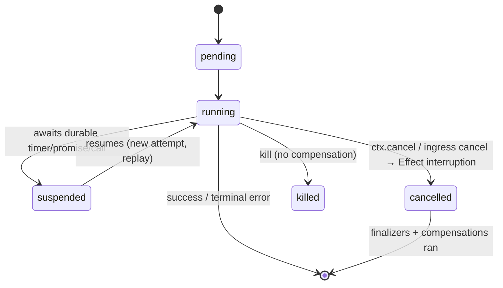

# Spec: 01-authoring

Specifies the authoring API, the typed capability-marker context, the
per-invocation runtime boundary, and the invocation lifecycle. Builds on
[../requirements.md](../requirements.md) + [./requirements.md](./requirements.md);
terms in [../glossary.md](../glossary.md); rationale in
[../.decisions/](../.decisions/). See the top-level
[../spec.md](../spec.md) for the architecture index.

Traces: R04, R05, R06, R09, R30, R34, R35, R36.

## 1. Authoring API: contract and implement

Traces: R09, R34, R36. See
[../.decisions/0010](../.decisions/0010-separated-contract-impl.md),
[../.decisions/0008](../.decisions/0008-typed-client-inference.md). (Typed I/O and
the serde live in [02-schema-serde](../02-schema-serde/spec.md); typed clients in
[05-clients](../05-clients/spec.md).)

A construct is authored in two parts. `contract` produces a typed, shareable
artifact carrying handler names and their I/O/error Schemas in its TYPE
(mirroring Restate's phantom `ServiceDefinition<P, M>`); `implement` binds each
handler name to an Effect and produces the server-side Layer.

### 1.1 Services (stateless)

```ts
const Greeter = RestateService.contract('greeter', {
  greet: { input: GreetInput, success: GreetSuccess, error: EmptyName },
})

const GreeterLive = RestateService.implement(Greeter, {
  greet: ({ name }) =>
    Effect.gen(function* () {
      if (name === '') return yield* new EmptyName({})
      const prefix = (yield* Greeting).prefix
      const id = yield* Restate.run(
        'gen-id',
        Effect.sync(() => crypto.randomUUID()),
      )
      return { message: `${prefix} ${name}`, id }
    }),
})
// GreeterLive : Layer<RestateImpl<"greeter">, never, Greeting>
```

The handler Effect is `Effect<Success, Error, R | <capabilities>>`. `R` is
satisfied from the shared application Layer; capabilities (section 3) are
provided per invocation. `error` is the only thing the `E` channel may carry
(R11, see [04-error-boundary](../04-error-boundary/spec.md)). The id is generated
with `crypto.randomUUID()` INSIDE `Restate.run`, where the call is journaled once
and replays verbatim (see
[03-effect-runtime](../03-effect-runtime/spec.md#nondeterminism--durability-lints));
generated OUTSIDE a `run`, an id would instead use the journaled `Random` (R20).

For the single-package case, `RestateService.define(name, specs, impl)` combines
`contract` + `implement` in one expression (R36); the separable `contract`
artifact is still available for cross-package clients.

### 1.2 Virtual Objects (keyed, typed State)

```ts
const Cart = RestateObject.contract('cart', {
  state: { items: Schema.Array(Item), total: Schema.Number }, // typed State (R06)
  handlers: {
    add: { input: Item, success: Schema.Void }, // exclusive (default)
    total: { input: Schema.Void, success: Schema.Number, shared: true }, // read-only
  },
})

const CartLive = RestateObject.implement(Cart, {
  add: (item) =>
    Effect.gen(function* () {
      const items = (yield* State.get('items')) ?? []
      yield* State.set('items', [...items, item]) // needs StateWrite (R04)
    }),
  total: () => State.get('total').pipe(Effect.map((t) => t ?? 0)), // StateRead only
})
```

`add` is exclusive (gets `StateWrite` + `StateRead` + `ObjectKey`); `total` is
`shared: true` (gets `StateRead` + `ObjectKey` only). `State.set` in `total`
does not typecheck (R04, R05).

### 1.3 Workflows (one `run`, durable promises)

```ts
const Onboard = RestateWorkflow.contract('onboard', {
  state: { status: Schema.Literal('pending', 'approved', 'rejected') },
  payload: { input: OnboardInput, success: Schema.Void, error: OnboardError },
  signals: { approve: { input: Approval } }, // write-only shared handlers
  queries: { status: { success: Schema.String } }, // read-only shared handlers
})

const OnboardLive = RestateWorkflow.implement(Onboard, {
  run: (input) =>
    Effect.gen(function* () {
      yield* State.set('status', 'pending') // StateWrite + DurablePromise + …
      const decision = yield* Restate.race([
        DurablePromise.for(Approval).getDescriptor('approved'), // descriptor, issued in order
        Restate.sleepDescriptor(7 * 24 * 60 * 60 * 1000), // 7 days, in millis
      ]).pipe(Effect.map(Option.fromNullable)) // map the RESULT, not the branch
      yield* State.set('status', Option.isSome(decision) ? 'approved' : 'rejected')
    }),
  approve: (a) => DurablePromise.resolve('approved', a), // signal (shared, write)
  status: () => State.get('status'), // query (shared, read)
})
```

The `run` handler is provided `{ StateRead, StateWrite, DurablePromise,
ObjectKey }` directly (no composite `WorkflowScope` marker — see
[../.decisions/0002](../.decisions/0002-typed-capability-contexts.md)); a `signal`
is a shared write handler and a `query` is a shared read handler.
`DurablePromise.resolve` outside a workflow handler does not typecheck (R04).
Durable promises support `get` / `resolve` / `reject` / `peek`. A `resolve` carries
a typed payload the awaiting `get` returns; a `reject` makes the awaiting `get` fail
TERMINALLY (R34) — the rejection arrives as a `TerminalError` the boundary
terminalizes VERBATIM (routed through `awaitDurable`), so the `run` ends terminally
rather than retrying. (A workflow that wants an OBSERVABLE `'rejected'` outcome
instead `resolve`s a domain "declined" payload and records it in State — see the
`approval` example.) The race maps its RESULT (not a branch) after a single await
(R19, [../.decisions/0005](../.decisions/0005-deterministic-concurrency.md); see
[03-effect-runtime](../03-effect-runtime/spec.md#deterministic-concurrency)).

### 1.4 Construct selection

| Construct      | Key             | State          | Concurrency                                     |
| -------------- | --------------- | -------------- | ----------------------------------------------- |
| Service        | none            | none           | unbounded                                       |
| Virtual Object | per key         | typed, durable | exclusive serialized per key; shared concurrent |
| Workflow       | per workflow ID | typed, durable | one `run` exactly-once; signals concurrent      |

---

## 2. Per-invocation runtime boundary

Traces: R30, R07, R12, R13. POC reference: `Endpoint.materialize`,
`Endpoint.toTerminal`. (The serde step is [02-schema-serde](../02-schema-serde/spec.md);
`toTerminal` / classification is [04-error-boundary](../04-error-boundary/spec.md).)

The shared application runtime is built once from the application Layer
(`Effect.runtime<R>()` captured at endpoint acquisition). Each SDK handler call
runs one boundary:

```
SDK calls handler(ctx, raw)
  1. decode      : effectSerde(input, 'ingress').deserialize(raw)  — TerminalError(400) on invalid (R16)
  2. provide     : RestateContext = ctx
                 + capability markers for this construct/kind  (R05)
                 + determinism layer (Clock/Random + frozen base) (R17)
                 + attempt-completed signal → interruption      (R31)
                 + (./otel) inbound span-context bridge          (R23)
  3. run         : Runtime.runPromiseExit(runtime)(handlerEffect)
  4a. Success    : effectSerde(success).encode(value) → return
  4b. Failure    : toTerminal(cause, errorSchema)               (R12, R13, R15, R31)
```

`toTerminal` maps the Effect `Cause` — see
[04-error-boundary](../04-error-boundary/spec.md#error-boundary) for the full
mapping (typed failure → `TerminalError`, retryable throw, suspension re-throw,
interruption, defect).

The per-invocation `ctx` and capability markers are provided per call and never
placed in the long-lived application Layer (R30). The CONTRACT carries its typed
handler map in a phantom type param (preserved on the public surface); only the
internal `materialize` boundary widens to `any` (invisible to users) — it does
NOT erase the contract's public type (see
[../.decisions/0008](../.decisions/0008-typed-client-inference.md)).

`materialize` / `implement` take the application `R` (`AppR`) as an EXPLICIT type
param (from the `Runtime<AppR>` they run against), NEVER inferred from the handler
bodies — else the union over per-handler residual `R` over-infers and the residual
capability `R` fails to collapse. With `AppR` explicit, each handler's residual is
exactly its capability markers, which per-kind `provideService` discharges
(VALIDATED, DQ3; see [../.decisions/0002](../.decisions/0002-typed-capability-contexts.md)).

---

## 3. Typed capability-marker context model

Traces: R04, R05, R06. See
[../.decisions/0002](../.decisions/0002-typed-capability-contexts.md).

Restate gates operations through a nominal context hierarchy; the binding mirrors
it as capability-marker services in the Effect `R` channel rather than one
untyped context.

Markers are FLAT and INDEPENDENT — there is no composite `WorkflowScope`. Effect
`R` is intersection semantics: a combinator requiring `StateRead` is only
satisfied by `StateRead` itself, never by an umbrella marker that "contains" it.
The `run` boundary therefore provides the concrete set directly.

```
RestateContext (Tag → raw restate.Context)   always provided
   markers provided per construct / handler kind (flat, independent):
   ┌─────────────────────┬──────────────────────────────────────────────────┐
   │ service handler     │ (RestateContext)                                 │
   │ object exclusive    │ + ObjectKey + StateRead + StateWrite             │
   │ object shared       │ + ObjectKey + StateRead                          │
   │ workflow run        │ + ObjectKey + StateRead + StateWrite + DurablePromise │
   │ workflow shared     │ + ObjectKey + StateRead + DurablePromise         │
   └─────────────────────┴──────────────────────────────────────────────────┘
```

Each durable combinator carries the capability it needs in `R`:

| Combinator                                     | Requires         | Backed by                                  |
| ---------------------------------------------- | ---------------- | ------------------------------------------ |
| `Restate.run`, `Restate.sleep`                 | `RestateContext` | `ctx.run` / `ctx.sleep`                    |
| `State.get`, `State.stateKeys`                 | `StateRead`      | `ctx.get` / `ctx.stateKeys`                |
| `State.set`, `State.clear`                     | `StateWrite`     | `ctx.set` / `ctx.clear`                    |
| `Awakeable.make`                               | `RestateContext` | `ctx.awakeable`                            |
| `Awakeable.resolve` / `.reject`                | `RestateContext` | `ctx.resolveAwakeable` / `rejectAwakeable` |
| `DurablePromise.get`/`resolve`/`reject`/`peek` | `DurablePromise` | `ctx.promise(name).*`                      |
| `ctx.key` accessor                             | `ObjectKey`      | `ctx.key`                                  |

Calling `State.set` (requires `StateWrite`) in a shared handler (provides only
`StateRead`) is a compile error (R04). State combinators are key- and
value-typed against the contract's `state` schema (R06). `materialize` provides
exactly the markers legal for the construct and handler kind (R05).

#### Optional / nullable State (absent key ⇒ `undefined`)

Restate State is a per-key K/V map; an ABSENT key reads back as `undefined`. A
state field may therefore be declared `Schema.optional(S)` (a nullable cursor —
e.g. a `highWatermark` watermark) and the combinator family models the "unset"
case end-to-end as `undefined`, NOT a present-but-`undefined` value:

```ts
const Cursor = State.for({ highWatermark: Schema.optional(Schema.Number) })
yield * Cursor.get('highWatermark') // Effect<number | undefined> — undefined when ABSENT
yield * Cursor.set('highWatermark', 42) // present value (round-tripped via the inner serde)
yield * Cursor.set('highWatermark', undefined) // REMOVES the key (≡ clear)
yield * Cursor.clear('highWatermark') // also removes the key
```

`State.for` stores the optional field's INNER (present-value) schema for serde
(`undefined` stripped), so a `set` only ever encodes a present `T`; writing
`undefined` REMOVES the key rather than encoding it (`set(key, undefined)` ≡
`clear(key)`), making read and write symmetric around the "absent ⇒ undefined"
rule. The same handling reaches the test surfaces: `RestateTestHarness.stateOf` /
`RestateTestEnv.stateOf` expose `get` (`undefined` when absent), `set` (with the
same `undefined`-removes semantics), and `clear`. This is ONE compiler-agreed
pattern under both `tsc` (`exactOptionalPropertyTypes`) and the bundler — a bare
top-level `Schema.UndefinedOr` handler I/O return is NOT (`JSONSchema.make` rejects
it at registration), so a NULLABLE projection belongs in State (or inside a struct
field), not a top-level handler return.

`Restate.run` SCRUBS the durable capabilities from its inner effect's `R`
(`Exclude<R, RestateContext | StateRead | StateWrite | DurablePromise |
ObjectKey>`), so a nested `ctx.*` / `State.get` / `Restate.sleep` inside a `run`
closure is a COMPILE error — mirroring Restate's "no nested `ctx.*` inside `run`"
rule.

> `Context.Tag` does not model inheritance, so markers are independent services,
> not a subtype lattice — this is why the hierarchy is expressed as a set of
> provided markers per handler kind, and why a composite `WorkflowScope` marker
> would not discharge the individual `StateRead`/`StateWrite`/… requirements.

> **VALIDATED (DQ3):** discharging the right markers per handler over a
> HETEROGENEOUS `implement` record (exclusive + shared in one call) COMPILES
> against real `effect` + `restate-sdk` types — a `State.set` in a shared handler
> is a handler-LOCAL error (not a whole-record error, not erased to `any`), with
> per-kind `provideService` discharging each handler's residual `R` to the app
> `R`. Flat markers are kept; the distinct-context-Tags fallback also compiles but
> is strictly worse (intersection `R` forces a `getExclusive`/`getShared` split)
> and is not needed. Requires the explicit-app-`R` discipline (section 2).

---

## 4. Invocation lifecycle

Traces: R31, R35. See
[04-error-boundary](../04-error-boundary/spec.md#cancellation--interruption).

An invocation moves through server-owned states; the binding surfaces the
cancel/interrupt edges into Effect:



- `cancelled`: a cooperative cancel → Effect INTERRUPTION at the next await point;
  `onInterrupt` / `acquireRelease` finalizers and saga compensations run (see
  [04-error-boundary](../04-error-boundary/spec.md#cancellation--interruption) and
  its saga section). `CancelledError extends TerminalError`. `explicitCancellation:
true` (R35) opts a service into manual propagation.
- `killed`: a hard kill; compensations do NOT run.
- `Request.attemptCompletedSignal` (AbortSignal) fires per attempt for
  attempt-scoped cleanup (idempotent, since a new attempt may follow).

The binding surfaces `ctx.cancel` (cancel another invocation) and the interruption
edge; it does NOT own the state machine (A01) — the `restate-server` does. An
OPERATOR drives these edges from OUTSIDE a handler via the `./admin` management
surface (`RestateAdmin.cancel` / `kill` / …, see [10-admin](../10-admin/spec.md)).

### 4.1 Surfaced service/handler options

Service/handler option surfacing (R35): `enableLazyState`, `journalRetention`,
`idempotencyRetention`, `inactivityTimeout`, `abortTimeout`, `ingressPrivate`,
`workflowRetention`, and `explicitCancellation` are exposed as typed options on
the contract/builder. `journalRetention` / `idempotencyRetention` /
`workflowRetention` may also derive from a `Restate.retention` annotation
([../.decisions/0011](../.decisions/0011-restate-schema-annotations.md); read at
discovery, see
[02-schema-serde](../02-schema-serde/spec.md#schema-annotation-namespace)).
`ingressPrivate` is reflected in the ingress client TYPE so an ingress-private
handler is not callable from the ingress client (see
[05-clients](../05-clients/spec.md)).
